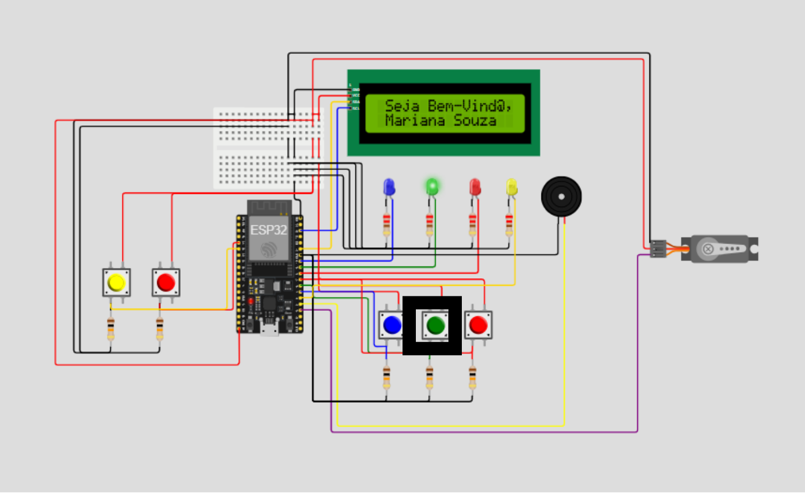
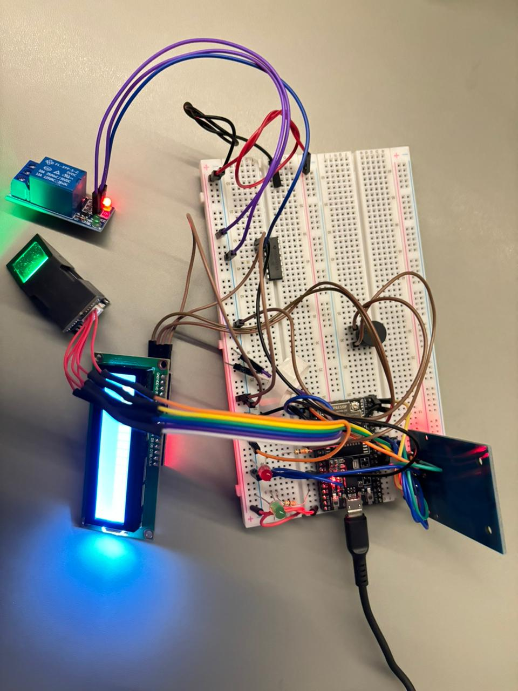
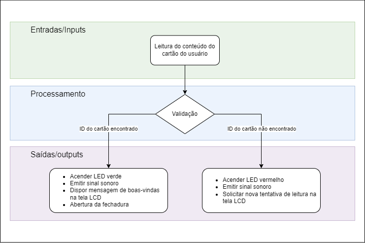

# Documentação IoTDoc - Módulo 4 - Inteli

## grupo: BiMu

### projeto: ESP-42

#### Componentes do grupo: [Davi Abreu](https://www.linkedin.com/in/davi-abreu-da-silveira/), [Davi Basã](https://www.linkedin.com/in/davi-basa/), [Filipe Zillo](https://www.linkedin.com/in/felipe-zillo-72b367247/), [Leonardo Ogata](https://www.linkedin.com/in/leonardo-ogata-983b032b5/), [Marco Ruas](https://www.linkedin.com/in/marcoruas/), [Rafael Barbosa](https://www.linkedin.com/in/rafael-barbosa-b4386b293/), [Wildisley Filho](https://www.linkedin.com/in/wildis-filho/).


## Sumário

### [1. Introdução](#c1)
   - [1.1. Objetivos](#c2)
   - [1.2. Proposta da solução](#c3)
   - [1.3. Justificativa](#c4)

### [2. Metodologia](#c5)

### [3. Desenvolvimento e Resultados](#c6)
   - [3.1. Domínio de Fundamentos de Negócio](#c7)
      - [3.1.1. Contexto da Indústria](#c8)
         - [3.1.1.2. Forças de Porter](#c9)
      - [3.1.2. Análise SWOT](#c10)
      - [3.1.3. Descrição da Solução a ser Desenvolvida](#c11)
         - [3.1.3.1. Qual é o problema a ser resolvido](#c12)
         - [3.1.3.2. Qual a solução proposta (visão de negócios)](#c13)
         - [3.1.3.3. Como a solução proposta deverá ser utilizada](#c14)
         - [3.1.3.4. Quais os benefícios trazidos pela solução proposta](#c15)
         - [3.1.3.5. Qual será o critério de sucesso e qual medida será utilizada para o avaliar](#c16)
      - [3.1.4. Value Proposition Canvas](#c17)
      - [3.1.5. Matriz de Riscos](#c18)
      - [3.1.6. Política de Privacidade de acordo com a LGPD](#c19)
         - [3.1.6.1. Informações gerais sobre a empresa / organização](#c20)
         - [3.1.6.2. Informações sobre o tratamento de dados](#c21)
         - [3.1.6.3. Quais são os dados coletados](#c22)
         - [3.1.6.4. Onde os dados são coletados](#c23)
         - [3.1.6.5. Para quais finalidades os dados serão utilizados](#c24)
         - [3.1.6.6. Onde os dados ficam armazenados](#c25)
         - [3.1.6.7. Qual o período de armazenamento dos dados (retenção)](#c26)
         - [3.1.6.8. Uso de cookies e/ou tecnologias semelhantes](#c27)
         - [3.1.6.9. Com quem esses dados são compartilhados (parceiros, fornecedores, subcontratados)](#c28)
         - [3.1.6.10. Informações sobre medidas de segurança adotadas pela empresa](#c29)
         - [3.1.6.11. Orientações sobre como a empresa/organização atende aos direitos dos usuários](#c30)
         - [3.1.6.12. Informações sobre como o titular de dados pode solicitar e exercer os seus direitos](#c31)
         - [3.1.6.13. Informações de contato do Data Protection Officer (DPO) ou encarregado de proteção de dados da organização](#c32)
      - [3.1.7. Bill of Material (BOM)](#c33)

   - [3.2. Domínio de Fundamentos de Experiência de Usuário](#c34)
      - [3.2.1. Personas](#c35)
      - [3.2.2. Jornada do Usuário e Storyboard](#c36)
         - [3.2.2.1. Jornada do Usuário](#c37)
         - [3.2.2.2. Storyboard](#c38)

   - [3.3. Solução Técnica](#c39)
      - [3.3.1. Requisitos Funcionais](#c40)
      - [3.3.2. Requisitos Não Funcionais](#c41)
      - [3.3.3. Arquitetura da Solução](#c42)
      - [3.3.4. Arquitetura do Protótipo](#c43)
      - [3.3.5. Arquitetura Refinada da Solução](#c44)

   - [3.4. Resultados](#c45)
      - [3.4.1. Protótipo Inicial do Projeto usando o Simulador Wokwi](#c46)
      - [3.4.2. Protótipo Físico do Projeto (offline)](#c47)
         - [3.4.2.1. Introdução e componentes utilizados](#c48)
         - [3.4.2.2. Funcionamento do sistema](#c49)
         - [3.4.2.3. Casos de teste](#c50)
      - [3.4.3. Protótipo do Projeto com MQTT e I2C](#c51)
         - [3.4.3.1. Tópicos MQTT](#c52)
         - [3.4.3.2. Código para os métodos MQTT](#c53)
         - [3.4.3.3. Casos de Uso](#c54)
         - [3.4.3.4. Situações de uso](#c55)
      - [3.4.4. Protótipo Físico do Projeto (online)](#c56)
         - [3.4.4.1. Introdução e Objetivos](#c57)
         - [3.4.4.2. Arquitetura do Protótipo Online](#c58)
         - [3.4.4.3. Configuração do Ambiente](#c59)
         - [3.4.4.4. Front-End da Aplicação](#c60)
         - [3.4.4.5. Fluxos de Funcionamento](#c61)
         - [3.4.4.6. Casos de Teste](#c62)
         - [3.4.4.7. Testes de Guerrilha](#c63)
         - [3.4.4.8. Conclusão](#c67)
      - [3.4.5. Protótipo Final do Projeto](#c64)

### [4. Conclusões e Recomendações](#c65)
   - [4.1. Resultados](#c68)
   - [4.2. Recomendações](#c68)

### [5. Referências](#c66)

<br>

# <a name="c1"></a>1. Introdução

&nbsp;&nbsp;&nbsp;&nbsp;O presente trabalho tem como objetivo descrever o processo de elaboração do projeto construído pelo Grupo 5 (BiMu) da Turma 14 do primeiro ano de graduação do [Inteli - Instituto de Tecnologia e Liderança](https://www.inteli.edu.br/) em parceria com o [Instituto Apontar](https://institutoapontar.org.br/). A parceria de projeto configura-se como parte do sistema de ensino do Inteli, no qual estudantes devem desenvolver projetos que solucionem problemas reais das empresas parceiras enquanto constroem habilidades de gestão de projetos, desenvolvimento de software e liderança através da combinação de teoria e prática ao longo de um período de 10 semanas.

&nbsp;&nbsp;&nbsp;&nbsp;Sobre o parceiro de projeto, o **Instituto Apontar** é uma organização não governamental focada no apoio a crianças e adolescentes de baixa renda com traços de [altas habilidades/ superdotação](https://cpa.ca/psychology-works-fact-sheet-giftedness-in-children-and-youth/). A ONG atua em escolas públicas da região metropolitana do Rio de Janeiro, tendo atendido mais de 670 estudantes por meio de ações para identificação de traços de altas habilidades, acompanhamento psicossocial, complementação e suplementação acadêmica, além de aprofundamento cultural para valorização e desenvolvimento das capacidades desses jovens.[[1]](#6-referências)

## <a name="c2"></a>1.1. Objetivos

&nbsp;&nbsp;&nbsp;&nbsp;O parceiro de projeto possui uma sede que abriga os setores administrativos da organização e onde são realizadas atividades com estudantes, como aulas de reforço ou suplementação escolar, além de espaços para estudos. Atualmente, o acesso ao interior do edifício e controle de entrada, como registros de horários de entrada e saída, por exemplo, é realizado de maneira manual por colaboradores da instituição. Dessa maneira, o Instituto possui pouco controle sobre as pessoas que estão em suas instalações, o que acaba por afetar a qualidade na prestação de seus serviços de apoio aos estudantes.

&nbsp;&nbsp;&nbsp;&nbsp; Nesse sentido, visando melhorar a qualidade dos serviços prestados pela ONG e ter uma visão mais ampla de como ocorrem os fluxos de pessoas dentro do imóvel, tem-se como objetivo automatizar o processo supracitado.[[2]](#6-referências)

&nbsp;&nbsp;&nbsp;&nbsp;Detalhes sobre o problema enfrentado pelo parceiro e sobre os objetivos do projeto estão disponíveis na [Seção 3.1.3.1.](#3131-qual-é-o-problema-a-ser-resolvido)

## <a name="c3"></a>1.2. Proposta da solução

&nbsp;&nbsp;&nbsp;&nbsp;Tendo em vista os objetivos do parceiro, propõem-se uma solução baseada em [IoT](<https://www.sap.com/brazil/products/artificial-intelligence/what-is-iot.html#:~:text=A%20Internet%20das%20Coisas%20(IoT,%C3%A9%20sin%C3%B4nimo%20da%20Ind%C3%BAstria%204.0.)>) que consiga coletar dados biométricos dos visitantes da sede da organização, permitindo melhor controle de entrada e geração de dados sobre permanência e frequência das pessoas no edifício do parceiro.

Detalhes sobre a proposta de solução para a questão do parceiro estão disponíveis na [Seção 3.1.3.2.](#3132-qual-a-solução-proposta-visão-de-negócios).

## <a name="c4"></a>1.3. Justificativa

&nbsp;&nbsp;&nbsp;&nbsp;Compreendendo as necessidades do parceiro, a solução tem dois pontos centrais na superação da problemática apresentada, sendo eles o uso de dados biométricos e a geração de dados sobre o fluxo de pessoas no prédio.

&nbsp;&nbsp;&nbsp;&nbsp;A priori, o uso de dados biométricos na solução almeja garantir a veracidade das informações coletadas no momento de registro de novos visitantes, visto a irreprodutibilidade desses dados. Os dados biométricos usados na solução se propõe a ser provenientes da impressão digital dos visitantes. Além disso, a solução busca ainda fornecer informações relevantes sobre como ocorrem os fluxos de pessoas na sede do parceiro, coletando dados sobre o tempo de permanência nas instalações do instituto e a frequência das visitas de cada visitante, armazenando-as para acesso do parceiro.

&nbsp;&nbsp;&nbsp;&nbsp;Dessa maneira, a solução se destaca não só por contribuir para a segurança e controle de fluxo de pessoas nas instalações do parceiro, mas também por permitir a tomada de decisões estratégicas sobre o espaço em questão por meio dos dados gerados e armazenados pelos seus sistemas.

&nbsp;&nbsp;&nbsp;&nbsp;Detalhes sobre justificativas das escolhas para projeto estão disponíveis ao longo da [Seção 3.1.3.](#313-descrição-da-solução-a-ser-desenvolvida)

# <a name="c5"></a>2. Metodologia

&nbsp;&nbsp;&nbsp;&nbsp;O desenvolvimento do sistema de controle de acesso e frequência do Instituto Apontar requer uma metodologia que permita organizar e compreender os diversos aspectos de um sistema distribuído. Para isso, adotou-se a metodologia RM-ODP (Reference Model for Open Distributed Processing), um modelo de referência amplamente utilizado para projetar sistemas complexos e distribuídos. Esse modelo organiza o processo de desenvolvimento em cinco perspectivas inter-relacionadas, cada uma abordando diferentes dimensões do sistema. Assim, a aplicação do RM-ODP facilita a definição de requisitos e o alinhamento entre as necessidades funcionais e as especificações técnicas do sistema, promovendo uma visão holística e estruturada.

Abaixo estão as cinco etapas da metodologia RM-ODP utilizadas neste projeto:

1. **Visão de Negócios (Enterprise Viewpoint)**  
   &nbsp;&nbsp;&nbsp;&nbsp;A Visão de Negócios foca nos objetivos e políticas organizacionais, estabelecendo as diretrizes de negócio e as necessidades do Instituto Apontar para o sistema de controle de acesso. Essa visão define o propósito geral do sistema e identifica as metas de segurança e gestão de acesso que ele precisa atender.[[27]](#6-referências)

2. **Visão de Informação (Information Viewpoint)**  
   &nbsp;&nbsp;&nbsp;&nbsp;Na Visão de Informação, detalha-se a estrutura e o fluxo de dados que o sistema irá processar. Ela abrange a modelagem das informações relacionadas aos usuários do Instituto, como dados de acesso, horários e identificações, e define como esses dados serão armazenados e acessados pelo sistema.[[27]](#6-referências)

3. **Visão de Computação (Computational Viewpoint)**  
   &nbsp;&nbsp;&nbsp;&nbsp;A Visão de Computação descreve os serviços e funções essenciais do sistema, incluindo a interação entre componentes de hardware e software. Aqui, são especificados os módulos e as interfaces que irão gerenciar os processos de autenticação, controle de acesso e atualização em tempo real dos dados de frequência.[[27]](#6-referências)

4. **Visão de Engenharia (Engineering Viewpoint)**  
   &nbsp;&nbsp;&nbsp;&nbsp;Na Visão de Engenharia, são definidos os aspectos físicos e estruturais do sistema, abrangendo os microcontroladores, sensores e a infraestrutura de rede. Essa visão lida com a disposição e integração dos elementos de hardware (por exemplo, câmeras e sensores de acesso) e a comunicação entre eles para garantir a operação eficaz do sistema.[[27]](#6-referências)

5. **Visão de Tecnologia (Technology Viewpoint)**  
   &nbsp;&nbsp;&nbsp;&nbsp;A Visão de Tecnologia aborda a escolha das ferramentas e tecnologias específicas, incluindo os dispositivos e o software necessário. Este ponto considera os requisitos técnicos para exibir os dados de acesso e frequência em tempo real.[[27]](#6-referências)

&nbsp;&nbsp;&nbsp;&nbsp;É importante informar que para simplificar a aplicação do modelo no contexto do Instituto Apontar, que é adotada no módulo 4 do Inteli, realizou-se uma adaptação no método RM-ODP. Substituímos as visões de Computação e Informação por visões de Requisitos Funcionais e Requisitos Não Funcionais, focando nos aspectos específicos de implementação e necessidades práticas do projeto. 

&nbsp;&nbsp;&nbsp;&nbsp;Essa adaptação traz clareza e agilidade ao processo, permitindo uma abordagem mais prática e focada nas necessidades reais do projeto. No entanto, a simplificação pode reduzir a profundidade técnica e limitar a escalabilidade futura do sistema, além de omitir detalhes essenciais de integração entre componentes. Apesar disso, a mudança facilita a definição dos objetivos e requisitos de forma direta, alinhando o sistema às necessidades funcionais e técnicas de maneira eficiente.

&nbsp;&nbsp;&nbsp;&nbsp;Por fim, a aplicação das cinco perspectivas do RM-ODP proporciona uma abordagem detalhada e abrangente para o desenvolvimento do sistema de controle de acesso e frequência do Instituto Apontar. Cada visão desempenha um papel específico e essencial na construção de uma solução robusta, desde a definição dos objetivos organizacionais até a seleção das tecnologias apropriadas. Ao adotar esta metodologia, garantimos que o sistema atende tanto às necessidades de segurança e gestão de acesso quanto aos requisitos técnicos de implementação, contribuindo para um controle eficiente e seguro dos fluxos de entrada e saída no instituto. [[28]](#6-referências)

# <a name="c6"></a>3. Desenvolvimento e Resultados

## <a name="c7"></a>3.1. Domínio de Fundamentos de Negócio

### <a name="c8"></a>3.1.1. Contexto da Indústria

&nbsp;&nbsp;&nbsp;No cenário de educação especializada e apoio a jovens com altas habilidades e superdotação (AH/SD), o Instituto Apontar se destaca como uma organização sem fins lucrativos que tem impactado significativamente a vida de milhares de alunos de baixa renda na cidade do Rio de Janeiro. Especializado no desenvolvimento de habilidades acadêmicas e socioemocionais desses jovens, o instituto utiliza uma abordagem inovadora que combina educação personalizada, acompanhamento psicossocial e programas culturais. Um dos maiores desafios enfrentados atualmente pelo Instituto Apontar é a implementação de um sistema automatizado de controle de acesso baseado em reconhecimento facial, visando melhorar a gestão de presença e otimizar a segurança de suas instalações.

&nbsp;&nbsp;&nbsp;O mercado de educação para jovens superdotados, especialmente para aqueles em situação de vulnerabilidade social, é relativamente pequeno, mas competitivo. Entre os principais concorrentes do Instituto Apontar estão o Instituto Rogério Steinberg (IRS), que oferece apoio acadêmico e social a jovens talentosos, e o Centro para Desenvolvimento do Potencial e Talento (CEDET), que foca no desenvolvimento de programas pedagógicos e psicológicos para crianças superdotadas. Outra organização de destaque é o Instituto Ayrton Senna, que atua em larga escala com o desenvolvimento de habilidades socioemocionais e inclusão social, impactando jovens em várias regiões do país. Essas organizações, embora atuem em áreas semelhantes, se diferenciam em seus enfoques e métodos de atendimento, criando um cenário competitivo que exige inovação constante. No entanto, a maior ameaça não são os outros institutos mas sim os horários das escolas que podem acabar atrapalhando os alunos a participarem das atividades do Instituto Apontar.

&nbsp;&nbsp;&nbsp;O modelo de negócio do Instituto Apontar é baseado em uma estrutura sem fins lucrativos, sustentada por doações diretas, incentivos fiscais como a Lei Rouanet, e parcerias estratégicas com escolas públicas e privadas. Além disso, o instituto se beneficia de trabalho voluntário e serviços pro bono que ajudam a manter a operação eficiente e acessível para os alunos. Com foco em impacto social, o Instituto Apontar desenvolve soluções educacionais que vão além do currículo tradicional, integrando tecnologia em seus processos internos, como o sistema de controle de acesso automatizado, que será implementado em breve. Este modelo permite ao instituto adaptar-se rapidamente às necessidades dos alunos, enquanto mantém a sustentabilidade de suas operações através de um fluxo constante de apoio financeiro e parcerias.

&nbsp;&nbsp;&nbsp;As tendências no setor de educação para jovens superdotados estão cada vez mais focadas na personalização do ensino e na integração de tecnologias inovadoras. A automação de processos, como o uso de reconhecimento facial para monitoramento de frequência, é uma das soluções que está sendo amplamente adotada por instituições educacionais. Além disso, o desenvolvimento de habilidades socioemocionais tem ganhado destaque como uma ferramenta importante para o sucesso acadêmico e pessoal desses jovens. A educação híbrida, que combina métodos de ensino presencial e remoto, também é uma tendência em crescimento, permitindo que instituições como o Instituto Apontar adaptem seus programas às necessidades individuais de cada aluno. Com essas tendências, o instituto está bem posicionado para continuar oferecendo soluções educacionais inovadoras e de alto impacto. [[1]](#6-referências)

&nbsp;&nbsp;&nbsp;Em um mercado especializado, o Instituto Apontar se consolida como uma referência no desenvolvimento de jovens com altas habilidades, especialmente aqueles de baixa renda. Ao adotar um modelo de negócio flexível, sustentado por doações e parcerias, e ao incorporar tendências tecnológicas e educacionais emergentes, o instituto não só acompanha as demandas do setor, como também lidera iniciativas inovadoras que transformam a vida de seus alunos. Dessa forma, o Instituto Apontar reafirma seu compromisso com a inclusão e o desenvolvimento de jovens superdotados, oferecendo soluções que promovem tanto o desenvolvimento acadêmico quanto o pessoal.

#### <a name="c9"></a>3.1.1.2. Forças de Porter

&nbsp;&nbsp;&nbsp;&nbsp;As 5 Forças de Porter é um framework criado por [Michael Porter](https://pt.wikipedia.org/wiki/Michael_Porter) de análise setorial que permite entender o nível de competitividade de um mercado. O modelo apresenta os atores envolvidos (concorrentes, fornecedores, compradores, novos entrantes e substitutos), como eles se relacionam e como influenciam o sucesso dos negócios. [[4]](#6-referências)

&nbsp;&nbsp;&nbsp;&nbsp;Sendo assim, aplicando tal ferramenta ao projeto, tem-se a figura 1 que resume os principais pontos da análise.

<br>
<div align="center">
<sub>Figura 1 - Cinco Forças de Porter</sub>
<br>
<br>

<br>
<br>
<sup>Fonte: Material produzido pelo grupo BiMu (2024)</sup>
</div>
<br>

&nbsp;&nbsp;&nbsp;&nbsp;Na parte superior esquerda da figura pode-se identificar a primeira força analisada, **ameaça de novos entrantes**, que se refere à possibilidade de novos concorrentes entrarem no mercado e ameaçarem as empresas já estabelecidas, afetando potencialmente a lucratividade, visibilidade, entre outros. Vários fatores podem influenciar essa ameaça, como barreiras de entrada (custos elevados, regulamentações, marcas fortes) e o acesso a canais de distribuição.

&nbsp;&nbsp;&nbsp;&nbsp;No caso do Instituto Apontar, parceiro de projeto, essa força foi considerada com potencial médio. O primeiro fator ponderado na análise foi a credibilidade e reputação da ONG, importantes fatores para atração de recursos, e, por consequência, o seu financiamento, são barreiras consideráveis nesse processo. Porém, por outro lado, a estruturação de uma ONG é relativamente simples nos termos da lei brasileira, mas requer conhecimento legal e burocrático

&nbsp;&nbsp;&nbsp;&nbsp;Ademais, ainda na questão de abertura da ONG, apesar de não ter fins lucrativos, ela é considerada uma OSC (Organização da Sociedade Civil). Partindo desse presuposto, o Brasil ocupa a 138° posição no ranking do Banco Mundial em abertura de empresas, sendo que 48% delas fecha em até cinco anos [[5]](#6-referências), ou seja, existem desafios concretos para se manter no mercado.

&nbsp;&nbsp;&nbsp;&nbsp;Por fim, podemos citar como pontos fortes do Instituto Apontar, nesse cenário de concorrentes, as suas parcerias, que trazem mais credibilidade e verbas para o instituto. Somente em 2023, 16 empresas e organizações investiram no Apontar, de forma direta ou incentivada, e 54 doadores pessoa física os apoiaram de maneira pontual ou recorrente [[6]](#6-referências). Outro ponto relevante da organização é a sua segmentação para atender crianças e adolescentes com traços de altas habilidades/superdotação e baixa renda no Rio de Janeiro. Essa especificidade permite que o instituto conheça melhor seu público alvo e se especialize nele, assim desenvolvendo produtos, serviços e/ou experiências altamente personalizadas para esse grupo de modo a construir uma forte relação com o público.

&nbsp;&nbsp;&nbsp;&nbsp;Passando para o canto superior direito, tem-se o **poder de barganha dos clientes**, que se refere à capacidade dos consumidores de influenciar os preços, a qualidade e as condições de entrega dos produtos ou serviços oferecidos pelas empresas. Para esta análise, os clientes podem ser dividos em dois grupos distintos, os doadores e os beneficiados.

&nbsp;&nbsp;&nbsp;&nbsp;O primeiro grupo financia as atividades do Instituto, sendo assim extremamente importante para que a organização continue suas operações. A retenção e o aumento do apoio de doadores exigem que o Instituto mantenha uma boa comunicação, demonstre impacto social e tenha transparência financeira para manter o interesse e a confiança deles [[7]](#6-referências). Porém, tem-se que lembrar que, apesar de sua importância para o instituto, eles não influenciam diretamente na tomada de decisão da organização, sendo apenas um apoiador.

&nbsp;&nbsp;&nbsp;&nbsp;Em relação aos beneficiados, o Instituto nasceu para contribuir com o desenvolvimento acadêmico e socioemocional de jovens com AH/SD (altas habilidades/superdotação), possibilitando que sejam agentes transformadores de suas vidas, famílias e de seu entorno. Ou seja, apesar de prestar contas aos doadores, o Apontar faz isso para atingir seu cliente finalíssimo, os estudantes.

&nbsp;&nbsp;&nbsp;&nbsp;Dessa forma, seus alunos têm o principal poder de influência em suas atividades, como dito por Rômulo Nunes, Gerente de programas do Apontar no kickoff. Por exemplo, caso uma grande parcela de seus estudantes esteja precisando de uma aula/conhecimento específico, o Apontar agirá de forma a suprir essa necessidade, demonstrando assim o poder de barganha desse "cliente".

&nbsp;&nbsp;&nbsp;&nbsp;Na parte inferior esquerda tem-se o **poder de barganha dos fornecedores**, que consiste no nível de influência que os fornecedores exercem sobre as empresas em uma indústria. Os fornecedores do Apontar incluem tanto os parceiros que oferecem apoio financeiro quanto aqueles que fornecem serviços e materiais.

&nbsp;&nbsp;&nbsp;&nbsp;Como uma ONG, o Instituto pode ter uma posição de barganha limitada, especialmente na relação com os doadores, já que, como foi esclarecido anteriormente, ele depende destes para financiar suas atividades.

&nbsp;&nbsp;&nbsp;&nbsp;Além disso, no que diz respeito a outros tipos de fornecedores, como de materiais escolares e infraestrutura do instituto, foi primeiro analisado como estes fatores influenciam no cenário educacional brasileiro em sua totalidade, para então reduzir o escopo para o Instituto Apontar. Nessa observação, encontrou-se em comum que a infraestrutura escolar reflete diretamente no desempenho dos alunos [[8]](#6-referências), porém, o maior problema não é a falta de empresas que forneçam os insumos e mão de obra necessários para uma boa estrutura básica, mas sim a falta de alocação adequada de recursos, e ainda a falta desses recursos [[9]](#6-referências).

&nbsp;&nbsp;&nbsp;&nbsp;Dessa forma, podemos concluir que os fornecedores de infraestrutura física pouco influenciam nas atividades exercidas pelo Instituto. De fato, o que realmente modula sua atuação são os investimentos e doações que recebe, e, por isso, podemos considerar a força de barganha dos fornecedores como alta, uma vez que ela impacta e interfere diretamente nas atividades da organização.

&nbsp;&nbsp;&nbsp;&nbsp;A **ameaça de produtos e serviços substitutos**, que trata do risco de os produtos ou serviços de uma empresa serem substituídos por alternativas que atendem às mesmas necessidades ou desejos dos clientes de maneira semelhante ou mais eficiente, está localizada no canto inferior direito da imagem.

&nbsp;&nbsp;&nbsp;&nbsp;No caso do Instituto Apontar, há uma particularidade que deve ser considerada, pois, apesar de, no Brasil, a quantidade de EdTechs, empresas que desenvolvem soluções tecnológicas para a oferta de serviços relacionados à educação, que poderiam oferecer serviços substitutos àqueles do Instituto, ser grande, a organização ainda se sobresai em seu nicho.

&nbsp;&nbsp;&nbsp;&nbsp;Tal fato ocorre porque as EdTechs enxergam a educação como oportunidade de negócio, e, por isso, oferem serviços buscando a lucratividade. Já o apontar presta seus serviços buscando impacto social, atingindo crianças e adolescentes em estado de vulnerabilidade social que, provavelmente, não poderiam acessar os produtos oferecidos pelas EdTechs, e, por isso, não tem um risco alto de ser substituído por outras soluções do mercado.

&nbsp;&nbsp;&nbsp;&nbsp;Dessa forma, apesar dessas EdTechs apresentarem soluções que possam substituir o Apontar, sua segmentação para trabalhar com crianças de baixa renda o tornam menos substituível, com poucas opções semelhantes, como escolas públicas com recursos para superdotados [[10]](#6-referências) e outras raras instituições focadas em educação especial que oferecem auxílio aos alunos necessitados.

&nbsp;&nbsp;&nbsp;&nbsp;Por fim, ao centro tem-se a **rivalidade entre concorrentes** representando o grau de competição existente entre as empresas que atuam em um mesmo mercado ou setor. Apesar de, quando trata-se de terceiro setor, ser incomum a ideia de concorrência, ela existe no quesito de captação de recursos [[11]](#6-referências).

&nbsp;&nbsp;&nbsp;&nbsp;Nesse sentido, as organizações do Terceiro Setor hoje procuram estratégias que garantam sua sustentabilidade frente ao ambiente que muda constantemente. Com o aumento do número de instituições, há a concorrência por recursos financeiros e humanos nesse setor, ou seja, doações e voluntários. Esse número cresceu 7,8% entre 2021 e 2023, passando de 815.677 para 879.326 organizações [[12]](#6-referências), sendo que as ONGs relacionadas à educação são o quarto tipo mais comum de organizações sem fins lucrativos [[13]](#6-referências).

&nbsp;&nbsp;&nbsp;&nbsp;Apesar de todos esses fatores, o Instituto Apontar possui um grande número de parcerias e doadores já estabelecidos, sendo 16 empresas e organizações e 54 doadores pessoa física [[14]](#6-referências). Além disso, eles já tem alguns anos de mercado, atuando desde 2007 no Rio de Janeiro, e uma base de crianças e adolescentes beneficiados bem estabelecida, com cerca de 850 alunos atualmente com seus programas, o que aumenta sua credibilidade com relação a outras ONGs, e, por consequência, limita a força que se refere à rivalide entre concorrentes, deixando-a como média.

&nbsp;&nbsp;&nbsp;&nbsp;Em conclusão, a análise das 5 Forças de Porter do mercado no qual o Instituto Apontar se encontra situado demonstra alguns pontos de atenção e desafios, especialmente com relação aos recursos do Instituto, mas também pontos fortes que garantem a sustentabilidade e crescimento, como seus anos de mercado e parcerias já estabelecidas com outras instituições.

&nbsp;&nbsp;&nbsp;&nbsp;Nesse sentido, nosso projeto entra como um grande diferencial, trazendo tecnologia para o terceiro setor para aprimorar os programas e processos atuais da organização, dessa forma permitindo otimizar a gestão e transparência, através dos dados dos alunos e funcionários sobre entrada, saída e permanência. Isso poderá gerar como resultado final uma melhor captação dos recursos e mais tempo para trabalho sobre a oferta educacional.

### <a name="c10"></a>3.1.2. Análise SWOT

&nbsp;&nbsp;&nbsp;A **Matriz SWOT** (FOFA) é uma ferramenta de análise estratégica que permite a identificação dos pontos fortes ( _Strengths_ ), fraquezas (_Weaknesses_), oportunidades (_Opportunities_) e ameaças (_Threats_) de uma organização. Ao usar essa ferramenta, podemos obter uma visão ampla dos fatores internos e externos que influenciam o desempenho de uma instituição, auxiliando na formulação de estratégias eficazes. A seguir, realizaremos uma análise SWOT do **Instituto Apontar**, destacando seus principais aspectos (Figura 2):

<br>
<div align="center">
<sub>Figura 2 - Matriz SWOT </sub> 
<br>
<br>
<br>

<br>
<br>
<sup>Fonte: Material produzido pelo grupo BiMu (2024)</sup>
</div>
<br>

**Forças ( _Strengths_ ):**

- **Foco em jovens superdotados e de baixa renda** : O Instituto Apontar se especializa no atendimento de um público altamente específico e vulnerável — jovens com altas habilidades oriundos de famílias de baixa renda. Este nicho de atuação diferencia o instituto de outras organizações educacionais, ao mesmo tempo em que agrega valor social significativo.
- **Impacto social expressivo** : O Instituto já impactou mais de 60.000 jovens e suas famílias, mostrando uma capacidade de transformar vidas e gerar resultados positivos, não apenas no âmbito acadêmico, mas também no desenvolvimento socioemocional dos alunos. [[1]](#6-referências)
- **Fortes parcerias e rede de apoio** : O Instituto conta com parcerias estratégicas com escolas públicas, além de ser apoiado por doações de empresas e voluntários, o que proporciona uma base financeira sólida para sustentar suas operações e expandir suas atividades.

**Fraquezas ( _Weaknesses_ ):**

- **Dependência de doações e incentivos fiscais** : Grande parte do financiamento do Instituto Apontar depende de doações e incentivos como a Lei Rouanet. Esta dependência pode tornar a instituição vulnerável a flutuações no volume de doações e a mudanças nas políticas de incentivo fiscal.
- **Capacidade limitada de escala** : Como uma ONG com foco em jovens superdotados e de baixa renda, o instituto enfrenta desafios para escalar suas operações e aumentar o número de alunos atendidos, especialmente devido aos altos custos de programas individualizados.
- **Falta de diversificação de fontes de receita** : Apesar das parcerias estratégicas, o Instituto depende fortemente de um número limitado de fontes de financiamento, o que pode comprometer sua sustentabilidade em períodos de recessão econômica ou alterações nas políticas governamentais.

**Oportunidades ( _Opportunities_ ):**

- **Adoção crescente de tecnologias educacionais** : A tecnologia, como o aprendizado adaptativo, oferece oportunidades para o Instituto melhorar a qualidade de seus programas e automatizar processos, tornando sua gestão mais eficiente.
- **Crescimento da conscientização sobre educação inclusiva** : O aumento da conscientização global sobre a necessidade de inclusão de jovens com superdotação no sistema educacional cria uma demanda crescente por programas como os oferecidos pelo Instituto Apontar. Essa tendência pode abrir novas portas para colaborações com governos e organizações internacionais.

**Ameaças ( _Threats_ ):**

- **Mudanças nas políticas de incentivo fiscal** : A sustentabilidade financeira do Instituto pode ser ameaçada por alterações em leis como a Lei Rouanet, que afetam diretamente a captação de recursos via incentivos fiscais. A dependência de tais políticas públicas torna a organização vulnerável a instabilidades legislativas.
- **Concorrência por doações** : Com o aumento do número de ONGs e projetos sociais disputando recursos e atenção de doadores, o Instituto Apontar precisa constantemente justificar seu impacto e importância para se manter competitivo no setor de captação de recursos.
- **Crises econômicas** : Em tempos de recessão econômica, as doações tendem a diminuir, o que pode impactar diretamente a capacidade de financiamento do Instituto. Empresas e indivíduos podem reduzir suas contribuições para projetos sociais durante crises financeiras, o que representa uma ameaça constante à saúde financeira da ONG.

### <a name="c11"></a>3.1.3. Descrição da Solução a ser Desenvolvida

#### <a name="c12"></a>3.1.3.1. Qual é o problema a ser resolvido

&nbsp;&nbsp;&nbsp;&nbsp;Como introduzido na [Seção 1.1.](#11-objetivos), o Instituto Apontar, parceiro de projeto, apresenta dificuldades no controle de entrada na sua sede. Atualmente, o controle da entrada e permanência de pessoas ocorre de maneira manual, no qual, colaboradores do instituto registram apenas a presença dos alunos nas aulas do instituto, não havendo controle de entradas ou das pessoas presentes na sede.[[2]](#6-referências)

&nbsp;&nbsp;&nbsp;&nbsp;A priori, uma consequência negativa para os estudantes que frequentam o espaço é a dificuldade na gestão de suas atividades. No Instituto Apontar, os alunos possuem planos de desenvolvimento individual, com aulas e atividades que devem cumprir. Entretanto, não há a obrigatoriedade de efetuação dessas atividades junto a um professor, com muitos estudantes realizando-as por meio de estudos individuais na sede da organização. Nesse sentido, o controle de presença e entrada pouco integrado acaba por dificultar o acompanhamento, por parte da direção, da execução desse plano de desenvolvimento. Por fim, a incapacidade de determinar onde um determinado estudante está traz preocupações acerca da segurança dos alunos, visto que muitos deles são crianças.

&nbsp;&nbsp;&nbsp;&nbsp;Ademais, o controle de entrada pouco preciso acaba por afetar também colaboradores do Instituto. Nesse contexto, a equipe da organização não possui uma maneira automática de contabilizar suas horas de trabalho, com horários de saída e entrada, exigindo que a contagem desse tempo seja feita de maneira individual e sem métodos de comprovação universais.

#### <a name="c13"></a>3.1.3.2. Qual a solução proposta (visão de negócios)

&nbsp;&nbsp;&nbsp;&nbsp;A proposta de solução consiste em uma solução em IoT para realização do registro de entradas no Instituto, bem como mapear a localização e permanência de pessoas no edifício.

&nbsp;&nbsp;&nbsp;&nbsp; O sistema se utilizará de coleta de biometria das impressões digitais para validação da identidade dos entrantes, garantindo a segurança dos estudantes e colaboradores do Instituto. Espera-se, também, que por meio desta solução seja possível fazer o controle de horários de entrada e saída de colaboradores da ONG, permitindo a contagem e averiguação do cumprimento de horas de serviço para pagamento.

&nbsp;&nbsp;&nbsp;&nbsp;Por fim, a solução também será utilizada para a realização de validação cruzada sobre a presença de estudantes em aula e o cumprimento de atividades propostas. Nesse sentido, ao comparar os dados do sistema de IoT, o registro de presenças realizados pelos professores e o plano de aulas de cada aluno, será possível mensurar o quanto cada estudante está cumprindo desse planejamento. Por meio disso, o instituto poderá acompanhar a eficácia de seus métodos, além de propor alternativas mais eficientes para o desenvolvimento dos seus atendidos.

#### <a name="c14"></a>3.1.3.3. Como a solução proposta deverá ser utilizada

&nbsp;&nbsp;&nbsp;&nbsp;Para o bom aproveitamento e extração das potencialidades do dispositivo IoT e softwares integrados propostos, é necessário que uma série de recomendações e passos sejam seguidos. Nesse sentido, estão destacados, a seguir, alguns deles:

- **Preparação de ambiente:** O dispositivo IoT deve ser posicionado ao lado das portas que dão acesso ao Instituto, devendo ser colocados tanto internamente, quanto no ambiente externo. Cabe lembrar que esse é o dispositivo responsável pela averiguação de identidade e coleta de dados biométricos do usuário.
- **Cadastramento e primeiro uso:** No primeiro uso do dispositivo, é necessário realizar o cadastro de novos usuários, e, para isso, deve ser feita coleta da biometria das impressões digitais do indivíduo, esse processo garante a segurança do dispositivo. É importante destacar que o cadastramento deve ser feito em cada um dos dispositivos implantados por razões de segurança. Caso algum aluno ou colaborador não possua impressões digitais legíveis para uso na solução, esta etapa pode ser substituída pelo uso de um conjunto de fatores de identificação de identidade, como uso de _tags RFID_ disponibilizadas juntamente com o dispositivo principal.
- **Uso para abertura de portas e registro de entradas/saídas:** Após o cadastramento, para usar o dispositivo para abrir portas ou para registrar a entrada/saída de indivíduos de determinada parte do Instituto, basta que a digital cadastrada seja posicionada sobre o sensor biométrico. Após a leitura, o acesso pode ser liberado ou pode ser solicitada uma nova tentativa. O horário de entrada/saída é automaticamente registrado e enviado para o banco de dados da solução. Por fim, caso algum aluno ou colaborador não possua impressões digitais legíveis para uso na solução, esta etapa pode ser substituída pelo uso de um conjunto de fatores de identificação de identidade, como uso de _tags RFID_ disponibilizadas juntamente com o dispositivo principal.
- **Visualização de dados de fluxo de pessoas:** Os dados coletados pelo dispositivo IoT, após serem enviados para o banco de dados da solução, ficam disponíveis e podem ser acessados pela equipe autorizada do Instituto Apontar. Com isso, a equipe fica habilitada a realizar operações para visualização desses dados, além da capacidade de fazer o _download_ dessas informações para outras análises.

&nbsp;&nbsp;&nbsp;&nbsp;Ressalta-se que detalhes de uso da solução e do funcionamento de cada uma dessas etapas pode ser encontrados no [Manual de Uso](./outros/placeholder.md).

#### <a name="c15"></a>3.1.3.4. Quais os benefícios trazidos pela solução proposta

&nbsp;&nbsp;&nbsp;&nbsp;Com a implementação da solução IoT e do sistema integrado para armazenamento e análise dos dados, são esperados diversos benefícios, estando alguns destes listados a seguir:

- **Maior controle de entrada:** Com a implementação da solução, o Instituto Apontar será capaz de identificar as pessoas que frequentam seus espaços, permitindo que eles tenham uma gestão precisa de entradas e saídas, aumentando a segurança da sua sede;
- **Acompanhamento das atividades dos alunos:** Os registros de horários de entrada e saída serão utilizados para traçar a frequência dos estudantes na sede do Instituto, permitindo que as atividades individuais em desenvolvimento pelos alunos sejam contabilizadas e assistidas; e
- **Registro de horas dos colaboradores:** De maneira semelhante ao quê ocorre com os estudantes, os momentos de entrada e saída dos colaboradores do instituto também serão registrados, permitindo, desta vez, que seja realizado o controle de horas de trabalho para remuneração.

#### <a name="c16"></a>3.1.3.5. Qual será o critério de sucesso e qual medida será utilizada para o avaliar

&nbsp;&nbsp;&nbsp;&nbsp;Ainda durante o processo de desenvolvimento, serão adotados critérios para avaliar a eficácia da solução em atender aos requisitos do parceiro, tanto quando se trata de experiência do usuário quanto quando pensamos em questões técnicas associadas (como efetividade no armazenamento de informações, segurança na transmissão de dados). Nesse sentido, no Quadro 1 estão dispostas alguns dos critérios de sucesso de trechos da solução e a forma como avaliaremos a eficiência desses componentes da solução em contribuir para a resolução da questão apresentada pelo parceiro. No quadro, a coluna "Componente da solução" diz respeito a um processo, componente físico ou conjunto de processos/componentes que cumprem uma função específica dentro do sistema como um todo. A coluna "Critério de sucesso" indica o critério adotado para que seja considerado um sucesso, enquanto a "Métrica de avaliação" indica métricas ou critérios extras para mensurar a efetividade da solução. Quanto mais métricas de avaliação forem alcançadas, de maneira qualitativa, mas efetiva a solução pode ser considerada. Sendo assim, a seguir, quadro com critérios de sucesso dos componentes da solução:

<br>
<div align="center">
<sup>Quadro 1 - Critérios de sucesso para os componentes da solução</sup>
<br>
<br>

| Componente da solução            | Critério de sucesso                                                                                                                                                                                           | Métrica de avaliação                                                                                                                                                                                                                                                                                                                                                                                                                                                          |
| -------------------------------- | ------------------------------------------------------------------------------------------------------------------------------------------------------------------------------------------------------------- | ----------------------------------------------------------------------------------------------------------------------------------------------------------------------------------------------------------------------------------------------------------------------------------------------------------------------------------------------------------------------------------------------------------------------------------------------------------------------------- |
| Leitor biométrico do sistema IoT | O leitor deve ser capaz de coletar informações sobre as impressões digitais dos indivíduos no momento do cadastro, guardando-as de maneira segura                                                             | - O leitor deve ser capaz de ler e codificar a impressão digital do usuário<br> - O leitor deve ser capaz de armazenar essa informação internamente para acesso e comparação                                                                                                                                                                                                                                                                                                  |
| Sistema de feedback ao usuário   | O conjunto de componentes que compõe o sistema de feedback (visor LCD, leds e sinal sonoro) devem ser capazes de trazer um retorno visual quanto ao sucesso ou fracasso da tentativa de utilização do sistema | - Os leds devem acender indicando o resultado da leitura para acesso, com um led vermelho indicando falha e um verde indicando sucesso na leitura<br> - Um _buzzer_ (componente sonoro) deve emitir um sinal sonoro para indicar finalização da leitura da digital <br> - A tela LCD embutida no componente deve indicar o status e o resultado da leitura de maneira escrita                                                                                                 |
| Registro de horários             | O sistema deve ser capaz de armazenar os horários que as digitais dos seus usuários foram lidas e validadas, diferenciando cada indivíduo                                                                     | - O sistema deve determinar o horário da leitura da impressão digital<br> - O sistema deve armazenar o horário da leitura em banco de dados, relacionando-o com qual dispositivo IoT enviou a informação e com o indivíduo responsável pela leitura                                                                                                                                                                                                                           |
| Sistema de aviso de erro         | O sistema deve ser capaz de informar equipe do Instituto Apontar caso haja uma tentativa de entrada não autorizada para que possa ser feita uma averiguação da situação                                       | - Sistema é capaz de enviar aviso para a equipe técnica relatando a tentativa de entrada                                                                                                                                                                                                                                                                                                                                                                                      |
| Liberação de acesso              | O sistema deve ser capaz de liberar o acesso ao interior do Instituto Apontar ao pessoal autorizado (estudantes e colaboradores)                                                                              | - O sistema é capaz de comparar as impressões digitais para determinar se uma pessoa está autorizada ou não a entrar no Instituto<br> - O sistema é capaz de enviar um sinal para abertura da porta caso o indivíduo esteja autorizado a entrar <br> - O sistema deve impedir a entrada caso o indivíduo não esteja cadastrado                                                                                                                                                |
| Dashboard do sistema             | O sistema deve ser capaz de trazer resumos das informações de fluxo de pessoas no Instituto Apontar                                                                                                           | - O sistema deve ser capaz de mapear os momentos de saída e entrada baseado nos horários registrados em cada um dos dispositivos IoT do Instituto<br> - O sistema deve ser capaz de gerar gráficos sobre a frequência de pessoas no Instituto com base nos dados de entrada e saída das suas instalações <br> - O sistema deve ser capaz de comparar os dados de frequência das diversas pessoas que frequentam a organização a fim de gerar resumos sobre o fluxo de pessoas |

<br>
<br>

<sup>Fonte: Material produzido pelo grupo BiMu (2024)</sup>

</div>

&nbsp;&nbsp;&nbsp;&nbsp;Por meio desses critérios, a equipe de trabalho poderá desenvolver a solução objetivando a criação de uma produto que consegue atender aos requisitos do parceiro ao mesmo tempo que é capaz de averiguar seu progresso em termos de critérios atingidos.

### <a name="c17"></a>3.1.4. Value Proposition Canvas

&nbsp;&nbsp;&nbsp;A proposta de valor, segundo a STRATEGYZER [[15]](#6-referências) e a [[16]](#6-referências), consiste em uma análise do consumidor que visa compreender as dores, necessidades e desejos do cliente. Dessa forma, o escopo dessa ferramenta é adequar a solução desenvolvida às demandas do público-alvo. Nesse sentido, o canvas de proposta de valor (Figura 3) é a ferramenta visual para organização da análise feita.

&nbsp;&nbsp;&nbsp;Primeiramente, faz-se uma análise do cliente a fim de adequar o projeto às suas necessidades. Nessa etapa, avaliam-se quais as suas dores (Pains), isto é, qual a causa da contratação da solução. Outro ponto a ser analisado são os ganhos (Gains) que eles adquirirão com a solução apresentada; ademais, realiza-se uma análise das tarefas (Customer Jobs) que o cliente tenta executar, mas demanda novas soluções. Em seguida, com base nas conclusões sobre o parceiro, deve-se propor uma solução em três fases: analgésicos (Pain Relievers), criadores de ganho (Gain Creators) e produtos e serviços (Products and Services).

&nbsp;&nbsp;&nbsp;Pensando nos consumidores, os analgésicos representam como a solução aliviará as suas dores, enquanto os criadores de ganho são aspectos da solução capazes de entregar valor e, por fim, em produtos e serviços, lista-se quais são as principais entregas a serem feitas, ou seja, qual a solução proposta de forma concisa.

<br>
<div align="center" width="100%">

<sub>Figura 3 - Canvas de Valor.</sub>
<br>
<br>

<br>
<br>
<sup>Fonte: Material produzido pelo grupo ESP 42 (2024).</sup>

</div>
<br>

### 1. Dores:

&nbsp;&nbsp;&nbsp;As dores de clientes são as questões que geram problemas em suas vidas. São esses fatores que motivam a busca por uma solução.

- **Falta de controle automatizado nos acessos ao prédio**: O acesso ao prédio é feito através de funcionários que manualmente abrem a porta para os alunos, não tendo o registro de quem está entrando ou saindo da instituição.
- **Processos pouco objetivos**: A frequência dos alunos é controlada através de chamadas feitas no papel e o ponto dos funcionários também é registrado no papel. Dessa forma, é um processo muito pouco objetivo e suscetível a erros.
- **Perda frequente de dados**: Pelos processos pouco objetivos, muitos dados acabam sendo perdidos, uma vez que o responsável pode se esquecer de anotar, ou não lembrar onde alguma folha de papel com informações foi guardada.

### 2. Ganhos:

&nbsp;&nbsp;&nbsp;Aqui é descrito quais serão os ganhos que os clientes obterão caso consigam a solução correta. Para essa parte do Canvas de Valor, é levado em conta o desejo, ou seja, o melhor cenário possível.

- **Facilidade e Rapidez na obtenção dos dados**: A partir de uma solução real, os dados de pontos de funcionários e frequência de alunos serão obtidos automaticamente, evitando esforços humanos e diminuindo a quantidade de erros.
- **Monitoramento Preciso e em Tempo Real**: Todos os dados obtidos serão salvos em tempo real em uma planilha Google, por isso, essas informações estarão disponíveis instantaneamente para colaboradores interessados.

### 3. Tarefas do consumidor:

&nbsp;&nbsp;&nbsp;Essa parte do Canvas de Valor tenta entender quais são as tarefas que o consumidor está buscando executar. Isso ajuda a deixar claro que tipo de solução precisa ser obtida.

- **Controle de Acesso Simples e Seguro**: Com a impressão digital, os alunos serão identificados já na porta de entrada, evitando a entrada de pessoas não vinculadas a instituição e aumentando a segurança.
- **Monitoramento de frequência e tempo passado nos espaços da instituição**: Com os dados obtidos e salvos em uma planilha, o Instituto Apontar conseguirá saber quantas vezes o aluno esteve dentro da instituição em um período de dias a escolha do funcionário, além de medir o tempo passado no prédio em cada um desses dias.
- **Controle de ponto do funcionário**: A solução também contabilizará e armazenará o ponto dos funcionários.

### 4. Analgésicos:

&nbsp;&nbsp;&nbsp;Os analgésico criam a perspectiva de como o produto solucionará as dores do cliente. É necessário pensar em produtos que diminuam ou resolvam as dores propostas na análise feita anteriormente.

- **Automação do Registro de Acesso**: A partir da solução, os alunos são identificados e registrados na entrada, aumentando o controle da instituição sobre esses dados e diminuindo a carga de trabalho humana nesses registros.
- **Objetividade nos processos de controle**: As frequências dos alunos e pontos dos funcionários que eram feitas no papel agora são realizadas de forma automatizada, tornando os processos de controle mais objetivos.
- **Armazenamento seguro dos dados**: Por ser 100% de responsabilidade humana, as informações poderiam ser esquecidas ou perdidas. Com a solução, esses dados são armazenados na nuvem de forma automática e sem erros.

### 5. Criadores de ganho:

&nbsp;&nbsp;&nbsp;Aqui é descrito como as funcionalidades e propostas são capazes de gerar valor às pessoas, pensando em cumprir objetivos maiores do que os que eram esperados pelo cliente.

- **Facilidade na escalabilidade do produto**: A solução desenvolvida pode ser facilmente implementada em locais diversos, trazendo a opção de levá-la para outros prédios além do proposto. Além disso, o produto pode ser ampliado, aumentando os tipos de dados que podem ser armazenados ou as suas funcionalidades.
- **Melhora da Reputação do Instituto**: Empresas mais tecnológicas tendem a ter uma melhor reputação. Os alunos ao verem as soluções implementadas farão o papel de divulgação desse novo ponto forte do instituto, aumentando a sua reputação.
- **Sustentabilidade**: Com a solução tecnológica, a quantidade de papel utilizada no Instituto Apontar cairá drasticamente, promovendo a sustentabilidade.

### 6. Produtos e Serviços:

&nbsp;&nbsp;&nbsp;Essa é o momento de olhar para tudo que foi desenvolvido nesta seção, pensando nas dores, desejos e tarefas do cliente e propor a solução final, que visa resolver todos os problemas citados anteriormente.

- **Modelo de controle de acesso e frequência de alunos aos espaços do Instituto Apontar a partir da leitura biométrica**: A proposta é criar um modelo que consiga controlar o acesso de alunos dentro do Instituto apontar, além de contabilizar questões como o tempo de permanência ou horários de chegada e saída. Tudo isso será implementado a partir da biometria dos usuários.
- **Modelo de controle do ponto dos funcionários**: Além de coletar os dados, o modelo desenvolvido deve ser capaz de substituir o método utilizado pelos funcionários para bater o ponto, tendo agora uma opção mais tecnológica e prática.

&nbsp;&nbsp;&nbsp; Dessa forma, com a implementação do modelo de controle de acesso e frequência via biometria, o Instituto Apontar poderá melhorar seus processos internos, mantendo um controle geral sobre a entrada, permanência e saída de alunos na instituição, além de trazer uma nova forma de registro de pontos dos funcionários. Com essa solução, o parceiro terá um avanço nos métodos de coleta de dados, diminuindo a carga de trabalho humana e aumentando o nível de precisão das informações obtidas. Por fim, o instituto se tornará mais sustentável e terá a opção de aumentar o escopo do projeto, ampliando cada vez mais o nível de tecnologia dentro dos seus prédios.

### <a name="c18"></a>3.1.5. Matriz de Riscos

&nbsp;&nbsp;&nbsp;&nbsp;A Matriz de Risco é uma ferramenta usada no processo de desenvolvimento de projetos, que facilita a identificação, análise e priorização de riscos que podem impactar os resultados esperados. No contexto do projeto de controle de acesso e frequência do Instituto Apontar, essa metodologia tem como objetivo antecipar possíveis obstáculos, propondo estratégias que minimizem os impactos negativos e, ao mesmo tempo, explorem oportunidades que possam agregar valor ao projeto. Além disso, sua forte relação com os riscos torna a matriz de risco uma excelente ferramenta para ser utilizada em conjunto com outras análises de cenário, como a [Análise SWOT](https://asana.com/pt/resources/swot-analysis), possibilitando mensurar e explorar mais detalhadamente alguns dos tópicos abordados nessas outras análises [[17]](#6-referências).

&nbsp;&nbsp;&nbsp;&nbsp;Ao fornecer uma visão ampla dos riscos, oportunidades e suas possíveis consequências, essa abordagem permite uma gestão mais precisa, auxiliando na tomada de decisões informadas ao longo do ciclo de vida do projeto. Dessa forma, a matriz foi elaborada para garantir que o controle de acesso automatizado, seja implementado de forma segura, eficaz e com potencial de gerar melhorias operacionais.

&nbsp;&nbsp;&nbsp;&nbsp;Cada risco identificado é detalhado com uma análise que descreve suas causas e um plano de ação projetado para minimizar ou eliminar os efeitos negativos. Os riscos abrangem desde problemas técnicos e operacionais até questões relacionadas à comunicação e ao comprometimento da equipe. Ao implementar estratégias proativas, essa estrutura também oferece a possibilidade de identificar e aproveitar oportunidades de melhoria, tornando a gestão mais eficaz e permitindo ajustes rápidos e informados ao longo do projeto.

&nbsp;&nbsp;&nbsp;&nbsp;O uso dessa ferramenta não apenas facilita uma tomada de decisões mais bem fundamentada, mas também promove um ambiente de trabalho mais seguro e organizado, contribuindo para a realização bem-sucedida dos objetivos do projeto. A seguir está a matriz de risco desenvolvida para o [projeto](#12-proposta-da-solução) (Figura 4), juntamente com uma legenda para sua leitura, exposta no Quadro 2:

<br>
<div align="center">
<sub>Figura 4 - Matriz de Risco do projeto</sub>
<br>
<br>

<br>
<br>
<sup>Fonte: Material produzido pelo grupo BiMu (2024)</sup>
</div>

<br>

&nbsp;&nbsp;&nbsp;&nbsp;Dessa forma, a Matriz de Risco proporciona uma abordagem organizada e proativa para gerenciar os riscos associados ao projeto. Por exemplo, para a ameaça de "Atrasos na implementação do sistema", monitorar o progresso e estabelecer prazos são formas para evitar mal-entendidos e erros, garantindo uma execução mais coordenada e eficiente do projeto. Essas ações ajudam a garantir a execução bem-sucedida do projeto e a satisfação das partes interessadas.

<br>

<div align="center">
<sub>Quadro 2 - Matriz de risco detalhada em forma de quadro</sub>
<br>
<br>
</div>
<br>

| #   | Ameaças                                                      | Análise do Risco                                                               | Nível de Risco | Probabilidade de acontecer | Plano de Ação                                                                                                       |
| --- | ------------------------------------------------------------ | ------------------------------------------------------------------------------ | -------------- | -------------------------- | ------------------------------------------------------------------------------------------------------------------- |
| 01  | Falhas no sistema                                            | Pode comprometer o controle de acesso e gerar falhas no registro de presença.  | Alto           | 50%                        | Realizar testes constantes de funcionamento e manter um plano de manutenção preventiva.                             |
| 02  | Integração com o Google Workspace não funcionar corretamente | Impacta a coleta de dados e a geração de relatórios automatizados.             | Alto           | 70%                        | Estabelecer uma fase de testes da integração e ter um backup manual temporário para registros.                      |
| 03  | Vulnerabilidades de segurança cibernética                    | Ataques cibernéticos podem comprometer a integridade do sistema e dos dados.   | Muito Alto     | 50%                        | Adotar firewalls, antivírus e realizar auditorias regulares de segurança.                                           |
| 04  | Falta de dados atualizados no "carômetro"                    | Pode comprometer a precisão das informações sobre alunos e colaboradores.      | Moderado       | 50%                        | Automatizar o processo de atualização de dados e realizar verificações periódicas.                                  |
| 05  | Problemas com a escalabilidade do sistema                    | Dificuldades em expandir o sistema para atender novos usuários ou demandas.    | Moderado       | 70%                        | Projetar o sistema de forma modular e escalável, com monitoramento de desempenho.                                   |
| 06  | Falta de suporte técnico imediato                            | Em caso de falhas, pode gerar paradas ou atrasos no funcionamento do sistema.  | Alto           | 10%                        | Firmar contratos de suporte técnico especializado com tempo de resposta rápido.                                     |
| 07  | Mudanças nos requisitos do projeto durante a implementação   | Podem causar retrabalho e impacto no cronograma.                               | Baixo          | 10%                        | Definir claramente os requisitos antes da implementação e gerenciar mudanças de forma eficiente.                    |
| 08  | Problemas na coleta de dados biométricos                     | Pode afetar a precisão no reconhecimento e dificultar a identificação correta. | Alto           | 30%                        | Garantir a qualidade do hardware de captura e ajustar o software para lidar com variações nas condições de captura. |
| 09  | Falta de compatibilidade com outras ferramentas de gestão    | Dificulta a integração e o uso eficiente das informações coletadas.            | Moderado       | 10%                        | Verificar a compatibilidade do sistema com ferramentas essenciais antes da implementação final.                     |
| 10  | Atrasos na implementação do sistema                          | Pode comprometer o cronograma geral e a eficácia do projeto.                   | Muito Alto     | 30%                        | Monitorar o progresso regularmente e estabelecer marcos claros de entrega.                                          |
| 11  | Circuito apresentar falhas graves                            | Pode comprometer o funcionamento do sistema e gerar atrasos.                   | Muito Alto     | 70%                        | Realizar manutenção preventiva e testes regulares nos circuitos para evitar falhas.                                 |

<div align="center">
<br>
<sup>Fonte: Material produzido pelo grupo BiMu (2024)</sup>
<br>
<br>
</div>

&nbsp;&nbsp;&nbsp;&nbsp;De acordo com o quadro acima, a matriz está dividida em "Ameaças", onde cada risco é categorizado e avaliado com base na análise de suas possíveis consequências e no nível de risco associado. A coluna "Análise do Risco" descreve o impacto potencial de cada ameaça, enquanto a coluna "Nível de Risco" classifica a gravidade com que essa ameaça pode afetar o projeto. Finalmente, a coluna "Plano de Ação" apresenta estratégias específicas para gerenciar esses riscos de forma eficaz.

&nbsp;&nbsp;&nbsp;&nbsp;Foi realizado também, no Quadro X, uma legenda para a matriz indicando a oportunidades do projeto:
<br>

<div align="center">
<sub>Quadro 3 - Matriz de oportunidades detalhada em forma de quadro</sub>
<br>
<br>
</div>

| #   | Oportunidades                                      | Análise da Oportunidade                                                                 | Nível de Oportunidade | Probabilidade de acontecer | Plano de Ação                                                                                    |
| --- | -------------------------------------------------- | --------------------------------------------------------------------------------------- | --------------------- | -------------------------- | ------------------------------------------------------------------------------------------------ |
| 01  | Automatização do controle de acesso                | Melhoraria a eficiência na entrada e saída de alunos e colaboradores.                   | Alto                  | 90%                        | Implementar um sistema automatizado com integração ao Google Workspace para agilizar o controle. |
| 02  | Integração com outros sistemas do Google Workspace | Poderia centralizar informações e melhorar a gestão do tempo.                           | Alto                  | 30%                        | Explorar a integração com calendários e e-mails para um controle de frequência mais robusto.     |
| 03  | Coleta de dados biométricos                        | Permite análises preditivas sobre a frequência e padrões de entrada.                    | Moderado              | 70%                        | Criar algoritmos que utilizem os dados biométricos para relatórios preditivos.                   |
| 04  | Possibilidade de patente                           | Possibilidade do protótipo virar uma patente                                            | Alto                  | 70%                        | Desenvolver uma versão estável do sistema para ser confiável e aplicável.                        |
| 05  | Criação de um histórico de frequência              | Facilitaria o monitoramento do desempenho e presença dos alunos ao longo do tempo.      | Alto                  | 50%                        | Implementar uma ferramenta de análise histórica para avaliar padrões de comportamento.           |
| 06  | Melhoria da segurança de dados                     | Com maior segurança, o Instituto poderia se tornar uma referência em proteção de dados. | Muito Alto            | 70%                        | Aplicar as melhores práticas de segurança e proteção de dados para garantir a privacidade.       |

<div align="center">
<br>
<sup>Fonte: Material produzido pelo grupo BiMu (2024)</sup>
</div>
<br>

&nbsp;&nbsp;&nbsp;&nbsp;Da mesma maneira do quadro de riscos, a seção "Oportunidades" apresenta aspectos positivos que podem ser explorados ao longo do projeto. Cada oportunidade é analisada de acordo com seu possível impacto no projeto, com a coluna "Análise da Oportunidade" destacando os benefícios que podem ser obtidos. A coluna "Nível de Oportunidade" avalia a relevância e o potencial de retorno de cada uma, enquanto a coluna "Plano de Ação" sugere medidas para melhorar essas oportunidades e integrá-las ao projeto.

&nbsp;&nbsp;&nbsp;&nbsp;&nbsp;&nbsp;Este formato estruturado facilita a identificação e o gerenciamento proativo dos riscos, assegurando que as medidas adequadas sejam tomadas para minimizar impactos negativos e maximizar a probabilidade de sucesso do projeto. A implementação bem-sucedida da Matriz de Risco ajuda a manter o projeto no caminho certo, contribuindo para a entrega dentro dos prazos e a satisfação das partes interessadas.

### <a name="c19"></a>3.1.6. Política de Privacidade de acordo com a LGPD

&nbsp;&nbsp;&nbsp; A Lei Geral de Proteção de Dados (LGPD), instituída no Brasil pela Lei nº 13.709/2018, estabelece diretrizes para o tratamento de dados pessoais, tanto em ambientes físicos quanto digitais, com o objetivo de proteger a privacidade e os direitos fundamentais dos cidadãos. A LGPD impõe regras para a coleta, armazenamento, compartilhamento e uso de informações pessoais, buscando garantir transparência, segurança e responsabilidade das empresas e instituições que tratam desses dados. A lei visa promover um equilíbrio entre o uso de dados para inovação e a preservação da liberdade e privacidade dos indivíduos.

#### <a name="c20"></a>3.1.6.1. Informações gerais sobre a empresa / organização

&nbsp;&nbsp;&nbsp; O INSTITUTO APONTAR, pessoa jurídica de direito privado, com sede na R. Morais e Vale, 111 - 1º andar - Lapa, Rio de Janeiro - RJ, inscrita no CNPJ/MF sob o nº 34050815000105 (“Instituto” ou “nós”) leva a sua privacidade a sério e zela pela segurança e proteção de dados de todos os seus clientes, parceiros, fornecedores e usuários (“Usuários” ou “você”).

#### <a name="c21"></a>3.1.6.2. Informações sobre o tratamento de dados

&nbsp;&nbsp;&nbsp;Esta Política de Privacidade (“Política de Privacidade”) destina-se a informá-lo sobre o modo como nós utilizamos as informações coletadas por este projeto.

&nbsp;&nbsp;&nbsp; AO ACESSAR O INSTITUTO, ENVIAR COMUNICAÇÕES OU FORNECER QUALQUER TIPO DE DADO PESSOAL, VOCÊ DECLARA ESTAR CIENTE E DE ACORDO COM ESTA POLÍTICA DE PRIVACIDADE, A QUAL DESCREVE AS FINALIDADES E FORMAS DE TRATAMENTO DE SEUS DADOS PESSOAIS QUE VOCÊ DISPONIBILIZAR NO INSTITUTO.

&nbsp;&nbsp;&nbsp; Esta Política de Privacidade fornece uma visão geral de nossas práticas de privacidade e das escolhas que você pode fazer, bem como direitos que você pode exercer em relação aos Dados Pessoais tratados por nós. Se você tiver alguma dúvida sobre o uso de Dados Pessoais, entre em contato com o instituto através do email contato@institutoapontar.org.br.

&nbsp;&nbsp;&nbsp; Além disso, a Política de Privacidade não se aplica a quaisquer aplicativos, produtos, serviços, site ou recursos de mídia social de terceiros que possam ser oferecidos ou acessados por meio do instituo. O acesso a esses links fará com que você deixe a Loja e possa resultar na coleta ou compartilhamento de informações sobre você por terceiros. Nós não controlamos, endossamos ou fazemos quaisquer representações sobre esses sites de terceiros ou suas práticas de privacidade, que podem ser diferentes das nossas. Recomendamos que você revise a política de privacidade de qualquer site com o qual você interaja antes de permitir a coleta e o uso de seus Dados Pessoais.

&nbsp;&nbsp;&nbsp; Caso você nos envie Dados Pessoais referentes a outras pessoas físicas, você declara ter a competência para fazê-lo e declara ter obtido o consentimento necessário para autorizar o uso de tais informações nos termos desta Política de Privacidade.

**Definições**
Para os fins desta Política de Privacidade:

- “Dados Pessoais” significa qualquer informação que, direta ou indiretamente, identifique ou possa identificar uma pessoa natural, como por exemplo, nome, CPF, data de nascimento, endereço IP, dentre outros;
- “Dados Pessoais Sensíveis” significa qualquer informação que revele, em relação a uma pessoa natural, origem racial ou étnica, convicção religiosa, opinião política, filiação a sindicato ou a organização de caráter religioso, filosófico ou político, dado referente à saúde ou à vida sexual, dado genético ou biométrico;
- “Tratamento de Dados Pessoais” significa qualquer operação efetuada no âmbito dos Dados Pessoais, por meio de meios automáticos ou não, tal como a recolha, gravação, organização, estruturação, armazenamento, adaptação ou alteração, recuperação, consulta, utilização, divulgação por transmissão, disseminação ou, alternativamente, disponibilização, harmonização ou associação, restrição, eliminação ou destruição. Também é considerado Tratamento de Dados Pessoais qualquer outra operação prevista nos termos da legislação aplicável;
- “Leis de Proteção de Dados” significa todas as disposições legais que regulem o Tratamento de Dados Pessoais, incluindo, porém sem se limitar, a Lei nº 13.709/18, Lei Geral de Proteção de Dados Pessoais (“LGPD”).

#### <a name="c22"></a>3.1.6.3. Quais são os dados coletados

&nbsp;&nbsp;&nbsp; Os dados coletados contém informações sobre alunos, funcionários, convidados e colaboradores que entraram no instituto como horário de entrada, horário de saída, tempo de estadia e saídas pendentes.

#### <a name="c23"></a>3.1.6.4. Onde os dados são coletados

&nbsp;&nbsp;&nbsp; Os dados são coletados por meio do sensor presente no dispositivo.

#### <a name="c24"></a>3.1.6.5. Para quais finalidades os dados serão utilizadas

&nbsp;&nbsp;&nbsp; Os dados serão utilizados para criar um controle automatizado dos acessos e frequências dos atendidos.

#### <a name="c25"></a>3.1.6.6. Onde os dados ficam armazenados

&nbsp;&nbsp;&nbsp; Os dados serão armazenado em uma planilha do Google Workspace.

#### <a name="c26"></a>3.1.6.7. Qual o período de armazenamento dos dados (retenção)

&nbsp;&nbsp;&nbsp; Os dados são armazenados durante 5 anos após a testagem do aluno.

#### <a name="c27"></a>3.1.6.8. Uso de cookies e/ou tecnologias semelhantes

&nbsp;&nbsp;&nbsp; Não haverá a utilização de cookies ou tecnologias semelhantes.

#### <a name="c28"></a>3.1.6.9. Com quem esses dados são compartilhados (parceiros, fornecedores, subcontratados)

&nbsp;&nbsp;&nbsp; Os dados serão compartilhados apenas com membros do time pedagógico do instituto.

#### <a name="c29"></a>3.1.6.10. Informações sobre medidas de segurança adotadas pela empresa

&nbsp;&nbsp;&nbsp; O instituto adotará as medidas técnicas e organizacionais previstas pelas Leis de Proteção de Dados adequadas para proteção dos Dados Pessoais no instituto.

#### <a name="c30"></a>3.1.6.11. Orientações sobre como a empresa/organização atende aos direitos dos usuários

&nbsp;&nbsp;&nbsp; Você pode, a qualquer momento, requerer: (i) confirmação de que seus Dados Pessoais estão sendo tratados; (ii) acesso aos seus Dados Pessoais; (iii) correções a dados incompletos, inexatos ou desatualizados; (iv) anonimização, bloqueio ou eliminação de dados desnecessários, excessivos ou tratados em desconformidade com o disposto em lei; (v) portabilidade de Dados Pessoais a outro prestador de serviços, contanto que isso não afete nossos segredos industriais e comerciais; (vi) eliminação de Dados Pessoais tratados com seu consentimento, na medida do permitido em lei; (vii) informações sobre as entidades às quais seus Dados Pessoais tenham sido compartilhados; (viii) informações sobre a possibilidade de não fornecer o consentimento e sobre as consequências da negativa; e (ix) revogação do consentimento. Os seus pedidos serão tratados com especial cuidado de forma a que possamos assegurar a eficácia dos seus direitos. Poderá lhe ser pedido que faça prova da sua identidade de modo a assegurar que a partilha dos Dados Pessoais é apenas feita com o seu titular.

#### <a name="c31"></a>3.1.6.12. Informações sobre como o titular de dados pode solicitar e exercer os seus direitos

&nbsp;&nbsp;&nbsp; Caso pretenda exercer qualquer um dos direitos previstos nesta Política de Privacidade e/ou nas Leis de Proteção de Dados, ou resolver quaisquer dúvidas relacionadas ao Tratamento de seus Dados Pessoais, favor contatar-nos através do e-mail contato@institutoapontar.org.br.

#### <a name="c32"></a>3.1.6.13. Informações de contato do Data Protection Officer (DPO) ou encarregado de proteção de dados da organização

&nbsp;&nbsp;&nbsp; Caso o titular necessite entrar em contato com o DPO da organização, favor contatar-los através do e-mail contato@institutoapontar.org.br. No contato deve ser esclarecido o motivo fornecendo as informações necessárias para que o problema seja atendido.

### <a name="c33"></a>3.1.7. Bill of Material (BOM)

&nbsp;&nbsp;&nbsp;O Bill of Materials (BOM) ou Lista de Materiais é um método utilizado para listar detalhadamente todos os componentes e materiais necessários para o desenvolvimento do protótipo do projeto. Isso visa garantir uma gestão eficaz e o controle dos recursos, facilitando a estimativa de custos, a organização do desenvolvimento e a execução do projeto. O BOM é uma representação detalhada de todos os componentes, peças, subconjuntos e materiais necessários para a produção de um produto. Ele inclui informações sobre a quantidade de cada item, suas descrições, números de peça, fornecedores e outras informações relevantes. Além disso, o BOM pode ser utilizado em diferentes fases do ciclo de vida do produto, desde o planejamento inicial até a produção em série e manutenção.

&nbsp;&nbsp;&nbsp;Uma das principais vantagens do uso de um BOM é a melhoria na precisão da gestão de estoques. Ao detalhar todos os materiais necessários para a produção, as empresas conseguem planejar de forma mais eficaz os níveis de estoque, minimizando o risco de falta ou excesso de componentes. Isso resulta em uma redução significativa dos custos operacionais, além de evitar desperdícios e otimizar a utilização de recursos. Um BOM detalhado também facilita o planejamento de aquisições, o que mantém a continuidade dos processos produtivos sem interrupções.

&nbsp;&nbsp;&nbsp;Para este projeto, será necessário prever todos os componentes de hardware e software que integrarão o sistema de controle de acesso e frequência através de leitura biométrica. Um exemplo de componente que faz parte desta lista é a PCB [(Placa de Circuito Impresso)](https://www.kmabrasil.com.br/blog/o-que-e-um-pcb-e-por-que-precisamos-deles?srsltid=AfmBOopvE3m4b4QqdCniiWg_urknSmyZdMCI1S_PB4RMA4iTdJfaauBz). A PCB é útil para fazer a integração dos diversos componentes eletrônicos, como sensores biométricos e microcontroladores. Ela serve como a base para a montagem dos circuitos eletrônicos, sendo um item importante na definição dos custos e da complexidade da montagem do protótipo.

&nbsp;&nbsp;&nbsp;A inclusão detalhada de todos os componentes no BOM, como a PCB, oferece uma visão clara dos recursos necessários, permitindo melhor controle de custos, planejamento de aquisições e otimização da produção. Isso garante que todos os itens estejam disponíveis e integrados conforme o planejado, minimizando riscos e atrasos. Abaixo, encontra-se a imagem do BOM desenvolvido para o projeto **IoT** de acordo com a [solução proposta](#12-proposta-da-solução) (figura 5). 

<br>

<div align="center">
<sub>Figura 5 - Bill of Material</sub>

<sup>Fonte: Material produzido pelo grupo BIMU (2024)</sup>
</div>

<br>

&nbsp;&nbsp;&nbsp;De acordo com o BOM apresentado que pode ser acessado através deste [BOM](https://docs.google.com/spreadsheets/d/1i84_nvifDeWDzZvR_gDkoUcV6MMNjxAE/edit?usp=sharing&ouid=110519082548136774298&rtpof=true&sd=true), são descritos os componentes que serão utilizados no projeto de IoT desenvolvido para o parceiro. Cada item desempenha um papel na funcionalidade e na eficiência do controle de acesso. A seleção e identificação de componentes foram realizadas após uma pesquisa para garantir a adequação às necessidades do projeto. A seguir são detalhados os componentes utilizados:

#### **Microcontrolador:**
1. **ESP-32 Wroom 32u**:
   - O ESP-32 Wroom 32u é um microcontrolador de baixo custo e alta performance, ideal para projetos de IoT devido à sua capacidade de conectar-se a redes Wi-Fi e Bluetooth. Ele possui múltiplos núcleos, o que permite a execução de tarefas simultâneas, como processamento de dados dos sensores e comunicação com a rede. A sua flexibilidade e potência são essenciais para o controle de acesso e a integração com os sensores biométricos e RFID.

#### **Sensores:**
1. **Leitor RFID (RC522)**:
   - O Leitor RFID RC522 é um dispositivo usado para realizar a leitura de tags RFID. Ele se comunica com o ESP-32 através de um protocolo SPI, sendo responsável pela identificação e autenticação dos usuários. Sua aplicação principal neste projeto será no controle de acesso, onde ele será utilizado para verificar a identidade dos indivíduos que tentarem acessar o local monitorado.

2. **Sensor Biométrico DY50**:
   - O Sensor Biométrico DY50 é um dispositivo de leitura de impressão digital, usado para garantir a autenticação de usuários de forma mais segura. O sensor captura as impressões digitais e as compara com as cadastradas no sistema, permitindo ou negando o acesso de acordo com a correspondência. Ele é fundamental para o controle de frequência e segurança, oferecendo uma camada adicional de proteção.

#### **Custos diversos:**
1. **Itens adicionais:**
   - **Display LCD 16x2**: Utilizado para mostrar informações como status de autenticação ou mensagens de erro. Seu preço é de R$ 19,99.
   - **2 Leds difuso 5mm**: LEDs de sinalização usados para indicar ações no sistema, como sucesso ou falha na autenticação. O custo é de R$ 1,00 cada.
   - **Buzzer ativo**: Usado para emitir sinais sonoros, como notificações de erro ou sucesso nas tentativas de acesso, com custo de R$ 6,99.
   - **Placa PCI**: Placa de circuito impresso utilizada para montar os componentes, com preço de R$ 21,10.
   - **Solda em tubo 4m Western**: Necessária para a realização de conexões nos componentes eletrônicos, com custo de R$ 13,90.
   - **Carcaça**: Protetor físico para os componentes eletrônicos, com preço de R$ 20,00.

### **Custos totais:**
- **Hardware**: O custo total dos componentes eletrônicos utilizados no projeto é de **R$ 216,96**.

### **Multa:**
- Em caso de descumprimento de legislação ambiental, multa variável de aproximadamente **R$ 50,00**.


&nbsp;&nbsp;&nbsp;&nbsp;Com esse Bill Of Material desenvolvido para este projeto detalha todos os componentes necessários para a construção e implementação do sistema de controle de acesso e frequência utilizando tecnologia IoT. A escolha dos materiais e a análise de custos são essenciais para garantir que o protótipo seja viável, eficiente e seguro. Com um planejamento cuidadoso e uma gestão eficiente dos recursos, o projeto tem grandes chances de ser bem-sucedido na execução e no cumprimento de seus objetivos. A transparência na identificação dos itens e seus custos permite um controle rigoroso do orçamento, além de assegurar a disponibilidade dos materiais necessários, minimizando possíveis atrasos na produção e implementação do sistema.

## <a name="c34"></a>3.2. Domínio de Fundamentos de Experiência de Usuário

### <a name="c35"></a>3.2.1. Personas

&nbsp;&nbsp;&nbsp;&nbsp;O Instituto Apontar é uma organização não governamental que oferece apoio educacional e desenvolvimento a jovens de baixa renda com altas habilidades/superdotação. Atualmente, o instituto enfrenta desafios no controle de acesso, que é feito manualmente, além de ter poucas informações sobre a frequência e a permanência de alunos e funcionários em sua sede. Isso gera problemas, como a segurança dos alunos, que tem que esperar algum professor ir até a porta para permitir sua entrada, e uma gestão menos eficiente, já que existem menos dados para auxiliar na tomada de decisões.

&nbsp;&nbsp;&nbsp;&nbsp;Para resolver esse problema, a solução desenvolvida propõe a criação de um sistema automatizado de controle de acesso baseado em IoT e biometria. A solução utilizará sensores de impressão digital para identificação de usuários, permitindo um registro preciso de entradas e saídas..

&nbsp;&nbsp;&nbsp;&nbsp;Dessa forma, a criação de personas, que, segundo a RD Station [[18]](#6-referências), são uma representação fictícia de usuários e/ou clientes ideais baseada em características reais, se torna importante para entender quem são os principais usuários da solução e quais são suas necessidades específicas, orientando a criação de soluções e estratégias para atender a esses perfis específicos.

&nbsp;&nbsp;&nbsp;&nbsp;Assim, foram mapeados os principais perfis utilizadores da solução, como o administrador (Figura 6), a aluna (Figura 7) e a professora (Figura 8). Dessa forma, a solução passa a ser desenvolvida pensando nas dores e necessidades de cada um deles, finalizando em um resultado próximo a realidade das pessoas reais que estão dentro do Instituto Apontar.

&nbsp;&nbsp;&nbsp;Para atingir tal resultado verossimilhante à realidade, foram realizadas pesquisas qualitativas com professores, estudantes e administradores por meio de entrevistas. Buscou-se entender melhor sobre cada um deles, que utilizarão a solução, de forma a fazer um produto compatível com suas necessidades, dores e interesses. A partir das informações coletadas foram produzidas as personas abaixo:

<br>
<div align="center" width="100%">

<sub>Figura 6 - Persona Antônio - administrador.</sub>
<br>
<br>

<br>
<br>
<sup>Fonte: Material produzido pelo grupo BiMu (2024).</sup>

</div>
<br>

<br>
<div align="center" width="100%">

<sub>Figura 7 - Persona Mariana - estudante.</sub>
<br>
<br>

<br>
<br>
<sup>Fonte: Material produzido pelo grupo BiMu (2024).</sup>

</div>

<br>

<br>
<div align="center" width="100%">

<sub>Figura 8 - Persona Laura - professora.</sub>
<br>
<br>

<br>
<br>
<sup>Fonte: Material produzido pelo grupo BiMu (2024).</sup>

</div>

<br>

&nbsp;&nbsp;&nbsp;Para melhor visualização das personas, clique [aqui](https://www.canva.com/design/DAGUOgtY9Q0/UD8wSyc_wDAgJPwgyF6eXg/edit?utm_content=DAGUOgtY9Q0&utm_campaign=designshare&utm_medium=link2&utm_source=sharebutton)

&nbsp;&nbsp;&nbsp;A solução final busca aumentar a quantidade de dados sobre a frequência dos alunos, e como uma meta secundária, a marcação do ponto do funcionário. Dessa forma, a Laura faz parte da solução, mas ela não é englobada no objetivo principal, por esse motivo, ela é uma persona terceária.

&nbsp;&nbsp;&nbsp;A imagem abaixo (Figura 9) demonstra como a solução impacta as personas do projeto.

<br>
<div align="center" width="100%">

<sub>Figura 9 - Impacto da solução.</sub>
<br>
<br>

<br>
<br>
<sup>Fonte: Material produzido pelo grupo BiMu (2024).</sup>

</div>
<br>

&nbsp;&nbsp;&nbsp;Dessa forma, visando diminuir a carga de trabalho manual dentro do instituto, uma solução que monitora a presença de alunos e permite a marcação do ponto dos funcionários precisa ser desenvolvida. Com isso, os funcionários terão mais automação no seu serviço e, por consequência, os alunos terão uma maior facilidade ao entrar no prédio.

&nbsp;&nbsp;&nbsp;A partir da criação das 3 personas e da conclusão do impacto da solução, é possível entender como as pessoas que serão afetadas com o produto final se comportam, quais problemas enfrentam hoje e qual seria o melhor jeito de resolvê-los. Com isso, começa-se a pensar na aplicação final e relacioná-las com esses usuários fictícios. Primeiro, o Antonio (Figura 5), administrador, foi definido como a persona principal, ou seja, é quem a solução final mais vai impactar. Em seguida, a Mariana (Figura 6) é escolhida como secundária e a Laura (Figura 7) como terciária. Através dessa análise, o processo de desenvolvimento se torna muito mais fácil e objetivo.

### <a name="c36"></a>3.2.2. Jornada do Usuário e Storyboard

#### <a name="c37"></a>3.2.2.1. Jornada do Usuário

&nbsp;&nbsp;&nbsp;A jornada de usuário é um mapa visual da trajetória de um usuário desde o primeiro contato com o produto até o final de sua utilização, levando em conta o ponto de vista do cliente e os seus sentimentos durante cada etapa dessa trilha [[24]](#6-referências). Através dessa análise, é possível entender todo o caminho de interação com a solução e, a partir disso, otimizar processos e corrigir potenciais falhas.

&nbsp;&nbsp;&nbsp;Essa ferramenta é utilizada quando um novo produto está sendo desenvolvido. É a partir dela que a empresa detalha, através de histórias, cada uma das interações, tornando a jornada mais otimizada, eficiente e intuitiva. A seguir estão as jornadas do usuário desenvolvidas para o projeto aqui descrito.

- Entrada e saída do aluno: A jornada a seguir descreve as interações da persona Mariana, aluna, ao entrar e sair do Instituto:

<div align="center">
<sub>Figura 10 - Jornada do Usuário de Entrada de Aluno</sub>

<sup>Fonte: Material produzido pelo grupo BiMu (2024)</sup>
</div>
<br>

&nbsp;&nbsp;&nbsp;O final da jonada acima é representado pela saída de Mariana do Instituto. Com isso, os insights são que, inicialmente, os alunos terão receio de que o equipamento não funcione corretamente, tornando-os apreensivos. Com isso, torna-se essencial a presença de algum funcionário do instituto na recepção para agir em caso de alguma falha no sistema. Isso, além de garantir o funcionamento do Instituto, faz com que os alunos se sintam mais seguros.

<br>

- Relatórios: A jornada a seguir descreve as interações da persona Antonio, analista de dados, ao gerar um relatório para os pais dos alunos:

<div align="center">
<sub>Figura 11 - Jornada do Usuário de Geração de Relatórios</sub>

<sup>Fonte: Material produzido pelo grupo BiMu (2024)</sup>
</div>
<br>

&nbsp;&nbsp;&nbsp;O final da jornada acima é representado pelo envio do relatório gerado para os pais e/ou responsáveis pelos alunos. Com isso, o principal insight que podemos tirar é que os dados devem ser precisos e completos. Assim, caso haja alguma falha no sistema, deve ser possível com que algum funcionário registre a entrada ou saída do aluno de maneira manual, para que no fim os relatórios estejam cem porcento coerentes com a realidade.
<br>

- Entrada e saída do funcionário: A jornada a seguir descreve as interações da persona Laura, professora, ao entrar e sair do Instituto:

<div align="center">
<sub>Figura 12 - Jornada do Usuário de Entrada de Funcionários</sub>

<sup>Fonte: Material produzido pelo grupo BiMu (2024)</sup>
</div>
<br>

&nbsp;&nbsp;&nbsp;O final da jornada acima é representado pela saída da professora do Instituto. Com isso, o principal insight tirado é que, caso a funcionária seja a primeira a chegar e o sistema falhe, deve ter uma opção de registro manual para que seja registrada o início da jornada de trabalho. Assim, há uma segurança maior da professora ao interagir com o sistema.
<br>

- Cadastro: A jornada a seguir descreve as interações necessárias para cadastrar novos alunos ou funcionários

<div align="center">
<sub>Figura 13 - Jornada do Usuário de Cadastro</sub>

<sup>Fonte: Material produzido pelo grupo BiMu (2024)</sup>
</div>
<br>

&nbsp;&nbsp;&nbsp;O final da jornada acima é representado pelo cadastro e, posteriormente, teste do usuário. Com isso, percebe-se que há uma insegurança em relação aos dados. Pensando nisso, tem-se como insight a implementação de uma política de dados transparente, para que o usuário sinta-se seguro em relação aos dados coletados.

&nbsp;&nbsp;&nbsp;Por fim, conclui-se que através da jornada do usuário é possível identificar várias possíveis melhorias em relação a usabilidade e acessibiidade, baseando-se no sentimento do usuário ao interagir com a solução proposta. Como mencionado acima, foi possível extrair ao menos um insight por jornada criada, de modo a melhorar o produto e a sua futura implementação real, ajudando principalmente na mitigação de possíveis problemas e frustrações que poderia causar no usuário.

#### <a name="c38"></a>3.3.2.2. Storyboard

&nbsp;&nbsp;&nbsp;Um storyboard é uma representação visual de uma história ou narrativa. Inicialmente essa técnica era aplicada majoritariamente em áres artisticas como produções de filmes, comerciais e programas de TV, porém, nos últimos anos storyboarding tem se tornado cada vez mais comum no mundo dos negócios[[21]](#6-referências).

&nbsp;&nbsp;&nbsp;A criação de um storyboard pode ser de extrema importância no desenvolvimento de um produto, pois com essa ferramenta se torna possível visualizar planos de desenvolvimento, identificar melhorias de produtos e maximizar o valor para o cliente[[22]](#6-referências). Com base nisso a equipe utilizou da ferramenta para desenvolver a seguinte solução:

<br>
<div align="center" width="100%">

<sub>Figura 14 - Storyboard Mariana.</sub>
<br>
<br>

<br>
<br>
<sup>Fonte: Material produzido pelo grupo BiMu (2024) com [template do NN Group](https://media.nngroup.com/media/editor/2018/06/20/storyboard-template.pdf).</sup>

</div>
<br>

&nbsp;&nbsp;&nbsp;Este storyboard ilustra a entrada de Mariana, uma estudante do Instituto Apontar, utilizando o sistema de acesso digital.

&nbsp;&nbsp;&nbsp; No primeiro quadro, pode-se ver Mariana chegando ao instituto com faz todo dia. No segundo quadro Mariana se dirige a porta com um leitor digital de biometria. No terceiro quadro, ela posiciona o dedo no leitor, conforme pedido pelo display do dispositivo, após isso, o sistema responde ao reconhecimento da digital de Mariana, confirmando a verificação com a emissão de um sinal sonoro, um aviso de LED e uma mensagem de confirmação no display. No quarto quadro, a porta se abre, permitindo que Mariana entre no instituto. No quinto quadro Mariana dirige-se a sua sala. No quadro final mariana pode acompanhar sua aula após ter tido sua presença validada pelo dispostivo.

<br>
<div align="center" width="100%">

<sub>Figura 15 - Storyboard Professora Laura.</sub>
<br>
<br>

<br>
<br>
<sup>Fonte: Material produzido pelo grupo BiMu (2024) com [template do NN Group](https://media.nngroup.com/media/editor/2018/06/20/storyboard-template.pdf).</sup>

</div>
<br>

&nbsp;&nbsp;&nbsp;Este storyboard ilustra a entrada e batimento de ponto da professora Laura através do sistema de acesso digital e da confirmação da presença dos alunos no sistema durante a aula

&nbsp;&nbsp;&nbsp;No primeiro quadro, pode-se ver Laura chegando ao instituto com faz todo dia. No segundo quadro Laura se dirige a porta com um leitor digital de biometria. No terceiro quadro, ela posiciona o dedo no leitor, conforme pedido pelo display do dispositivo, após isso, o sistema responde ao reconhecimento da digital de Laura registrando seu ponto e confirmando a verificação com a emissão de um sinal sonoro, um aviso de LED e uma mensagem de confirmação no display. No quarto quadro, a porta se abre, permitindo que Laura entre no instituto. No quinto quadro Mariana dirige-se a sua sala. No quadrao final, a professora marca os alunos que estão presentes na sala para que depois essa lista seja comparada com a lista registrada pelo sensor biométrico.

<br>
<div align="center" width="100%">

<sub>Figura 16 - Storyboard Antônio.</sub>
<br>
<br>

<br>
<br>
<sup>Fonte: Material produzido pelo grupo BiMu (2024) com [template do NN Group](https://media.nngroup.com/media/editor/2018/06/20/storyboard-template.pdf).</sup>

</div>
<br>

&nbsp;&nbsp;&nbsp;No terceiro storyboard, é Antônio é visto chegando ao Instituto Apontar, onde ele trabalha como Analista de dados. Para entrar no Instituto, Antônio coloca o dedo no sensor biométrico ao lado da porta, o sensor reconhece sua digital e realiza 4 ações simultâneas, abre a porta para que Antônio possa entrar, aciona um buzzer por alguns milisegundos, um led verde e mostra no LCD a mensagem: "Bem-Vindo, Antônio!" como feedbacks para o usuário entender que o sistema reconheceu sua digital.

&nbsp;&nbsp;&nbsp;Após essa ação, Antônio pode entrar no instituto. Ele se encaminha para sua sala, passando por uma sala de aula, para começar seu dia de trabalho. Ao chegar lá, a primeira coisa que ele faz é visualizar as entradas e saídas da catraca, para verificar se não houve nenhuma tentativa de burlar o sistema enquanto ele estava fora. Ele pode [ver informações](https://www.figma.com/design/zI6zdBFoqs0z9RGKt2nK8r/Wireframe?node-id=0-1&t=rvSE809wkadUuJ1X-1) como o nome da pessoa que entrou, a hora, cargo no instituto e a porta por qual ela entreou. E no caso de tentativas que foram barradas, a hora e a porta.

&nbsp;&nbsp;&nbsp;Então, depois dessa verificação de rotina, por ser o fim do mês, Antônio também gera o relatório de presença dos estudantes do Instituto. Esse relatório é gerado com grande precisão, já que são cruzadas as informações das chamadas que os professores fazem em sala de aula com o sistema de monitoramento e controle de acesso do instituto. Esse relatório é feito de forma rápida, comparada à muitas outras escolas que fazem isso manualmente, já que Antônio tem o auxílio do sistema de entrada e conferência de presença do grupo BiMu, que automatiza esse processo.

&nbsp;&nbsp;&nbsp;Por fim, com relação aos 3 storyboards abordados ao longo desta seção (3.3.2.2.) podemos ter uma melhor visualização de como a solução desenvolvida aparece no dia a dia de cada uma das personas do projeto, já que agora temos essas pequenas "histórias em quadrinhos" de cada uma delas. Isso nos permite identificar mais oportunidades para o produto e entender mais profundamente cada jornada.

&nbsp;&nbsp;&nbsp;Em conclusão, o uso de storyboards e jornadas de usuários é de extrema importância, pois fornecem uma visão detalhada da experiência do usuário mapeando suas emoções, interações com a solução e pontos críticos de cada uma dessas etapas. Com o uso dessas ferramentas, a equipe torna-se capaz de adaptar a solução de forma mais eficaz garantindo assim um produto final alinhado com as expectativas e necessidades do cliente.

## <a name="c39"></a>3.3. Solução Técnica

### <a name="c40"></a>3.3.1. Requisitos Funcionais

&nbsp;&nbsp;&nbsp;Requisitos funcionais são funcionalidades específicas que um sistema precisa ter. Em resumo, segundo a Revista Quero [[19]](#6-referências), deve-se tratar individualmente de todas as ações que o software deve ser capaz de fazer para atender às necessidades e expectativas do usuário. Dessa forma, a primeira etapa é separar todas as funcionalidades desejadas e em ordem cronológica. Com isso, é importante detalhá-las, isso é feito na aba de "Descrição". Por fim, são expostas as regras de negócios, que explicam como o sistema deve fazer o que foi planejado no requisito (Quadro 4).

<br>
<div align="center">
<sub>Quadro 4 - Requisitos Funcionais em forma de quadro</sub>
</div>
<br>
<br>

| **ID** | **Requisito Funcional**           | **Descrição**                                                                                                                                                       | **Regra de negócio**                                                                                     |
| ------ | --------------------------------- | ------------------------------------------------------------------------------------------------------------------------------------------------------------------- | -------------------------------------------------------------------------------------------------------- |
| RF01   | Cadastro de dados biométricos     | O sistema deve ser capaz de receber novos dados de impressões digitais dos alunos e funcionários através de um sensor biométrico e salvá-los em seu banco de dados. | O cadastro de dados deve ser feito de forma voluntária (a pessoa que colocará o dedo por conta própria). |
| RF02   | Coleta de dados biométricos       | O sistema deve ser capaz de coletar os dados de impressões digitais dos alunos e funcionários através de um sensor biométrico e verificar a sua identidade.         | A verificação deve acontecer apenas dentro das áreas restritas da instituição                            |
| RF03   | Feedback visual                   | O sistema deve ser capaz de acender uma luz quando o usuário colocar o dedo no leitor biométrico                                                                    | A luz deve ser verde para indicar sucesso na leitura e vermelho para erro.                               |
| RF04   | Feedback sonoro                   | O sistema deve ser capaz de emitir um som quando o usuário colocar o dedo no leitor biométrico                                                                      | O som deve ser curto para sucesso e com dois bipes para erro.                                            |
| RF05   | Marcação de ponto                 | O sistema deve ser capaz de realizar o ponto do funcionário quando ele colocar o dedo no leitor biométrico                                                          | O ponto deve ser registrado automaticamente no sistema quando o usuário for identificado                 |
| RF06   | Acesso aos dados dos alunos       | O sistema deve ser capaz de gerar uma listagem dos dados de identificação, entrada e saída dos usuarios.                                                            | Os dados deverão ser mostrados em uma planilha google                                                    |
| RF07   | Acesso aos dados dos funcionários | O sistema deve ser capaz de gerar uma listagem dos horários de pontos dos funcionários.                                                                             | Os dados deverão ser mostrados em uma planilha google                                                    |
| RF08   | Controle de catraca               | O sistema deve ser capaz de abrir a catraca automaticamente quando um aluno for identificado pelo leitor biométrico.                                                | A catraca deve abrir apenas após a identificação correta do aluno e fechar após sua passagem.            |

<div align="center">
<br>
<br>
<sup>Fonte: Material produzido pelo grupo BiMu (2024)</sup>
</div>
<br>

&nbsp;&nbsp;&nbsp;A partir dessa análise, o time de desenvolvimento entende todas as ações que precisam ser realizadas e, a partir disso, consegue gerir o projeto visando cumprir cada uma delas. Neste caso, existem 7 passos a serem desenvolvidos, que são o cadastro e a coleta de dados, o feedback, que auxilia o usuário a entender que a aplicação está funcionando, a marcação do ponto dos funcionários e, por fim, o acesso a esses dados por meio de alguma planilha.

&nbsp;&nbsp;&nbsp;Esses requisitos beneficiam diretamente todas as personas. O Antonio precisa ter e analisar os dados de alunos e funcionários, por isso, o cadastro (RF01), a coleta (RF02) e o acesso aos dados (RF06 e RF07) é de grande beneficio para ele. A Mariana, que é a aluna, precisará compreender se a solução está funcionando corretamente, por isso, os feedbacks sonoros (RF04) e visuais (RF03) é de grande importâcia para ela. Por fim, a Laura, que é a professora, terá uma nova maneira de bater ponto no instituto, por isso, esse requisito (RF05) é importante para ela.

&nbsp;&nbsp;&nbsp;Além de entender as ações, é necessário estabelecer algumas regras de negócio para a implementação das ações, como o cadastro e a coleta de dados precisam ser feitos de forma voluntária e apenas dentro da propriedade privada da instituição, ou outras mais simples, como a cor dos leds no feedback visual. Dessa maneira, com o planejamento de funcionalidades concluído, o time de desenvolvimento sabe por onde começar o projeto final e quais requisitos precisará cumprir.

### <a name="c41"></a>3.3.2. Requisitos Não Funcionais

&nbsp;&nbsp;&nbsp;A seção de Requisitos Não Funcionais apresenta os aspectos fundamentais que vão além da funcionalidade do sistema de controle de acesso e frequência para o Instituto Apontar. Esses requisitos são essenciais para garantir que o sistema funcione de forma eficiente, segura e intuitiva, atendendo às necessidades de desempenho e de escalabilidade exigidas pelo Instituto. Além disso, eles abordam a integridade dos dados, a proteção das informações pessoais dos usuários, e a compatibilidade com a infraestrutura tecnológica existente. A implementação adequada desses requisitos contribuirá para uma experiência de usuário fluida, confiável e adaptada ao ambiente educacional da instituição.

<br>
<div align="center">
<sub>Quadro 5 - Requisitos não Funcionais em forma de quadro</sub>
</div>
<br>
<br>

| **RNF#** | **Descrição**                                                                                      | **Aspecto de qualidade**  | **Referência ao Negócio**                                                                                                                                                                       | **Teste**                                                                                                                                                                                                                                        | **Caso de Aceite**                                                                                                                             | **Caso de Recusa**                                                                                                             | **Prioridade** |
| -------- | -------------------------------------------------------------------------------------------------- | ------------------------- | ----------------------------------------------------------------------------------------------------------------------------------------------------------------------------------------------- | ------------------------------------------------------------------------------------------------------------------------------------------------------------------------------------------------------------------------------------------------ | ---------------------------------------------------------------------------------------------------------------------------------------------- | ------------------------------------------------------------------------------------------------------------------------------ | -------------- |
| RNF01    | O tempo máximo de resposta para identificação biométrica deve ser de 5 segundos.                   | Eficiência de performance | Este requisito atende à demanda por um sistema rápido e eficiente, garantindo agilidade no processo de identificação.                                                                           | Realizar testes de desempenho para medir o tempo de resposta do sistema em condições normais e em condições de pico de uso. Repetir o teste várias vezes para garantir que o tempo médio permaneça dentro dos limites especificados.             | O sistema identifica corretamente os usuários em menos de 5 segundos em 95% das tentativas.                                                    | O sistema demora mais de 5 segundos em 5% ou mais das tentativas, indicando baixa eficiência.                                  | Não            |
| RNF02    | O sistema deve garantir a confidencialidade dos dados biométricos.                                 | Segurança                 | Este requisito atende à necessidade de proteger dados sensíveis dos usuários, conforme regulamentos de privacidade e segurança (LGPD).                                                          | Conduzir testes de autenticação e autorização, verificando o acesso a dados biométricos por usuários não autorizados. Realizar testes de invasão para simular possíveis ataques e avaliar a robustez das medidas de proteção de dados.           | Usuários não autorizados são bloqueados ao tentar acessar dados biométricos, e tentativas de invasão são identificadas e prevenidas.           | Usuários não autorizados conseguem acessar dados biométricos ou o sistema não identifica tentativas de invasão.                | Sim            |
| RNF03    | O sistema deve garantir que, em caso de falha de rede, os dados coletados ainda sejam armazenados. | Confiabilidade            | Este requisito assegura a confiabilidade do sistema, evitando perda de dados durante interrupções de rede.                                                                                      | Conduzir testes de falha de rede, desconectando o sistema da rede e verificando se os dados são armazenados localmente. Após a restauração da rede, confirmar a sincronização correta dos dados armazenados localmente com o servidor principal. | O sistema armazena os dados localmente durante a falha de rede e sincroniza todos os dados com o servidor assim que a conexão é restabelecida. | Dados são perdidos durante a falha de rede, ou não sincronizam corretamente ao restaurar a conexão.                            | Sim            |
| RNF04    | O sistema deve conseguir armazenar dados de 10.000 alunos.                                         | Manutenibilidade          | Este requisito proporciona escalabilidade, já que o instituto atualmente conta com menos de 1.000 alunos, permitindo o crescimento do volume de dados sem comprometer a performance do sistema. | Realizar testes de estresse para verificar se o sistema consegue armazenar e acessar dados com um volume 10 vezes maior do que o atual sem perda significativa de desempenho.                                                                    | O sistema armazena e acessa informações de até 10.000 alunos sem perda perceptível de desempenho ou erros de processamento.                    | O sistema apresenta lentidão significativa ou falhas ao acessar ou armazenar dados para volumes próximos de 10.000 alunos.     | Não            |
| RNF05    | O sistema de cadastro de digital seja feito em um computador separado da catraca.                  | Usabilidade               | Este requisito permite maior flexibilidade no uso do sistema, pois o cadastro de digital pode ser realizado em qualquer ponto de acesso.                                                        | Testar o cadastro de digitais em computadores do instituto e verificar se o acesso é autenticado corretamente.                                                                                                                                   | A digital cadastrada em qualquer computador do instituto permite o acesso correto pelo sistema.                                                | A digital cadastrada em um computador não é reconhecida pelo sistema, ou o acesso não é autenticado corretamente nas catracas. | Não            |

<div align="center">
<br>
<br>
<sup>Fonte: Material produzido pelo grupo BiMu (2024)</sup>
</div>
<br>

&nbsp;&nbsp;&nbsp;A ISO25010 é um padrão de qualidade de software utilizado para a criação dos requisitos não funcionais acima. Ela define características importantes como a usabilidade, confiabilidade, segurança, entre outras [[3.3.2]](#6-referências). A partir disso, os requisitos não funcionais são desenvolvidos e auxiliam a entender os objetivos do sistema, ou seja, o quê a solução final precisa ter para funcionar da forma planejada. A partir disso, o time de desenvolvimento pode iniciar a construção da aplicação, uma vez que todas as etapas estão definidas. Além disso, os requisitos não funcionais contam com o aspecto de qualidade, garantindo atributos como desempenho, usabilidade e confiabilidade para a aplicação, entre outros. Ademais, também é descrito como requisitos podem ser testados, garantindo a funcionalidade total da solução.

&nbsp;&nbsp;&nbsp;Esses requisitos beneficiam diretamente todas as personas. O Antonio precisa cadastrar os alunos sem se preocupar em locomoção (RNF05) e, além disso, precisa ter acesso a todos os dados, por isso, nenhuma informação pode ser perdida, mesmo em caso de falhas do sistema (RNF03), por fim, ele não quer se preocupar com reformular o sistema com o aumento de alunos no futuro (RNF04). A Mariana, que é a aluna, precisa ser reconhecida o mais rápido possível para ter acesso eficiente ao instituto (RNF01), também é necessário que seus dados sejam mantidos seguros (RNF02). A Laura, que é a professora, precisa que os dados de marcação de ponto sejam corretamente armazenados, sendo assim, se beneficia diretamente RNF03. As RNF06 e RNF07 envolvem diretamente todas as personas, uma vez que auxiliam a qualidade do sistema, pensando no presente e no futuro e evitando eventuais problemas.

&nbsp;&nbsp;&nbsp;Com a análise dos requisitos funcionais e não funcionais finalizada, o desenvolvimento da solução é repartido em diversas _tasks_, que serão realizadas individualmente na elaboração da aplicação. Sendo assim, é possível organizar o processo de criação do item final, fazendo tarefas, testando-as e aprovando-as uma a uma, evitando quaisquer tipos de dependências entre elas. Com isso, a solução é facilitada, melhorando a qualidade do produto final.

### <a name="c42"></a>3.3.3. Arquitetura da Solução

[Video da arquitetura detalhada](https://drive.google.com/file/d/1jZT9YmWAXIJg7Yxcw60IxuEw6bRpUa9K/view?usp=sharing)

&nbsp;&nbsp;&nbsp;De acordo com a Gaea ‌[[26]](#6-referências), empresa de consultoria brasileira, uma arquitetura de solução é a criação de uma estrutura que traçará um caminho para o sucesso após levar os problemas em consideração. Dessa forma, através de análises internas, o grupo BiMu desenhou a ideia geral da solução, destacando a integração do modelo físico (leds, relé, sensores, lcd, buzzer e microcontrolador) com a parte do software (conexão MQTT, backend, banco de dados, sistema Web e etc). Segue abaixo o diagrama da arquitetura:

<div align="center">
<sub>Figura 17 - Arquitetura da solução</sub>

<sup>Fonte: Material produzido pelo grupo BiMu (2024)</sup>
</div>
<br>

&nbsp;&nbsp;&nbsp;Através deste diagrama (Figura 17) é possível entender como cada componente interage com o outro, mas, para detalhar melhor a função de cada um, segue o quadro abaixo:

<div align="center">
<sub>Quadro 6 - Descrição dos componentes</sub>

| **Componente**        | **Descrição**                                                                                                                                                                                                                                                  | **Tipo**         |
| --------------------- | -------------------------------------------------------------------------------------------------------------------------------------------------------------------------------------------------------------------------------------------------------------- | ---------------- |
| **LED RGB**           | LED RGB de 5mm, fornece feedback visual ao usuário indicando status do reconhecimento (verde para sucesso, vermelho para erro). Possui brilho ajustável e alimentação de 2,0-3,3V.                                                                             | Atuador          |
| **Relé**              | Relé de 5V para controle de corrente alternada, utilizado para ligar/desligar a alimentação da catraca, suportando corrente máxima de 10A                                                                                                                      | Atuador          |
| **Sensor biométrico** | Sensor biométrico DY50 com capacidade de armazenamento de até 162 digitais é utilizado para captar as informações de alunos e funcionários e liberar a catraca em caso de aceite. Sua corrente de alimentação é de até 120mA                                   | Sensor           |
| **RFID**              | RFID RC522 de 3.3V detecta o cartão do usuário e libera a abertura da catraca em caso de sucesso. O RFID trabalha em uma frequência de 13-26mA                                                                                                                 | Sensor           |
| **LCD**               | LCD 1602 que trabalha em uma voltagem entre 4.5V e 5.5V e serve para fornecer feedback visual detalhado, mostrando o nome e o ID da pessoa identificada, além de alertas em caso de erro no reconhecimento. A sua corrente de trabalho varia entre 1mA a 1.5mA | Atuador          |
| **Buzzer**            | Buzzer 5v ativo de 12mm, tem uma tensão que varia de 3.5V a 5.5V. Fornece feedback sonoro ao usuário, indicando o status do reconhecimento (validado ou negado). Sua corrente é de 25mA e tem uma frequência de Ressonância de 2300 a aproximadamente 500 Hz   | Atuador          |
| **Microcontrolador**  | ESP-WROOM-32 com desempenho de até 600 DMIPS, memória flash de 32Mb. Serve para centralizar e processar os dados dos sensores e atuadores, conectando o dispositivo ao backend do sistema.                                                                     | Microcontrolador |
| **Broker MQTT**       | Gerencia a comunicação entre dispositivos, transmitindo dados do microcontrolador para o backend. O MQTT é um protocolo de comunicação de máquina para máquina utilizado principalmente para o IoT.                                                            | Servidor         |
| **HiveMQ**            | O HiveMQ é um uma plataforma de MQTT confiável planejada para conectar, comunicar e controlar dados IOT.                                                                                                                                                       | Servidor         |
| **Banco de dados**    | Armazena os dados coletados e processados de maneira estruturada, permitindo consultas rápidas e análises posteriores.                                                                                                                                         | Software         |
| **MariaDB**           | Sistema de gestão de base de dados. Será utilizado no projeto para armazenamento dos dados de alunos e funcionários do Instituto Apontar.                                                                                                                      | Software         |
| **Backend (C#)**      | Desenvolvido em C#, o backend processa os dados recebidos dos dispositivos e organiza as informações para envio ao banco de dados e ao frontend.                                                                                                               | Software         |
| **Frontend**          | O frontend exibe os dados coletados em uma interface gráfica para facilitar a compreensão e organização.                                                                                                                                                       | Interface        |
| **React**             | O React é um framework JavaScript utilizado para criar interfaces de usuário para aplicações WEB.                                                                                                                                                              | Framework        |
| **Google Sheets**     | Formata os dados em planilhas, conforme a necessidade do cliente, permitindo a exportação e visualização organizada.                                                                                                                                           | Software         |

<sup>Fonte: Material produzido pelo grupo BiMu (2024)</sup>

</div>
<br>

&nbsp;&nbsp;&nbsp;O projeto utiliza um microcontrolador ESP32, que conecta todos os dispositivos físicos, como sensores e atuadores, via pinos GPIO, e o display LCD através da interface I2C. O ESP32 utiliza o Wi-Fi para enviar dados em tempo real ao broker MQTT, que atua como intermediário para a comunicação. O broker transmite essas informações para a WebAPI, responsável por processar e tratar os dados recebidos. A WebAPI armazena as informações em um banco de dados relacional, permitindo sua organização e consulta eficiente. Além disso, ela realiza a exportação para o Google Sheets, garantindo que os dados sejam apresentados no formato solicitado pelo cliente. A plataforma, desenvolvida em React, acessa esses dados processados para exibi-los de forma intuitiva ao usuário final, possibilitando interação e monitoramento em tempo real.

&nbsp;&nbsp;&nbsp;O backend será desenvolvido utilizando a linguagem C# e conta com algumas tabelas que se relacionam entre si. Essas tabelas formatam os dados recebidos para que fiquem mais fáceis de serem manipulados e relacionados ao banco de dados.

&nbsp;&nbsp;&nbsp;O frontend será desenvolvido em React e é utilizado para facilitação da visualização dos dados, onde o analisador terá diversas funcionalidades como filtrar os dados por mês/dia, por cargo (alunos, funcionários), ou mesmo pela quantidade de presenças/faltas.

&nbsp;&nbsp;&nbsp;Essa estrutura de diagrama foi desenvolvida suportando os requisitos funcionais e não funcionais, mencionado anteriormente em seções desta mesma documentação. Segue abaixo a explicação de como cada requisito está presente na arquitetura da solução:

<div align="center">
<sub>Quadro 7 - Suporte para requisitos funcionais</sub>

| **ID** | **Requisito Funcional**           | **Descrição**                                                                                                                        |
| ------ | --------------------------------- | ------------------------------------------------------------------------------------------------------------------------------------ |
| RF01   | Cadastro de dados biométricos     | O sensor biométrico FPM10A e o leitor RFID RC522 permite o cadastro de dados de alunos e funcionários.                               |
| RF02   | Coleta de dados biométricos       | O sensor biométrico FPM10A e o leitor RFID RC522 permite a coleta de dados de alunos e funcionários.                                 |
| RF03   | Feedback visual                   | LEDs RGB fornecem feedback visual imediato: verde para sucesso e vermelho para falhas.                                               |
| RF04   | Feedback sonoro                   | O buzzer emite sons diferentes para validar ou negar uma leitura                                                                     |
| RF05   | Marcação de ponto                 | O sensor biométrico FPM10A e o leitor RFID RC522 verificam a identidade dos usuários e registram o ponto, em caso de reconhecimento. |
| RF06   | Acesso aos dados dos alunos       | O backend organiza os dados dos alunos, permitindo a geração de relatórios detalhados no Google Sheets e na aplicação web.           |
| RF07   | Acesso aos dados dos funcionários | O backend organiza os dados dos funcionários, permitindo a geração de relatórios detalhados no Google Sheets e na aplicação web.     |
| RF08   | Abertura da catraca               | O relé controla o fluxo de energia e atua na liberação da catraca ao identificar com sucesso o usuário.                              |

<sup>Fonte: Material produzido pelo grupo BiMu (2024)</sup>

</div>
<br>

<div align="center">
<sub>Quadro 8 - Suporte para requisitos não funcionais</sub>

| **ID** | **Requisito Não Funcional**                                        | **Descrição**                                                                                                                                       |
| ------ | ------------------------------------------------------------------ | --------------------------------------------------------------------------------------------------------------------------------------------------- |
| RNF01  | Tempo máximo para identificação biométrica: 5 segundos             | "O microcontrolador ESP32 processa dados dos sensores em menos de 5 segundos, garantindo resposta rápida                                            |
| RNF02  | Armazenamento seguro dos dados coletados                           | Os dados coletados pelo microcontrolador são enviados ao backend e armazenados no banco de dados MariaDB com segurança, em conformidade com a LGPD. |
| RNF03  | Conectividade com e sem internet                                   | O broker MQTT (HiveMQ) mantém a transmissão de dados entre os dispositivos e o backend, mesmo em caso de falha na internet.                         |
| RNF04  | Capacidade de armazenamento para 10.000 alunos                     | O banco de dados MariaDB é projetado para suportar grandes volumes de dados, garantindo escalabilidade e eficiência.                                |
| RNF05  | Cadastro realizado exclusivamente no escritório da persona Antônio | O sistema organiza os dispositivos de cadastro apenas no ambiente autorizado.                                                                       |

<sup>Fonte: Material produzido pelo grupo BiMu (2024)</sup>

</div>
<br>

&nbsp;&nbsp;&nbsp;Dessa forma, a arquitetura da solução é totalmente finalizada, englobando todos os requisitos não funcionais e funcionais desenvolvidos anteriormente, além de contar com o planejamento geral do software, detalhando pontos especificos como a utilização do HiveMQ para o MQTT, a utilização da MariaDB para o banco de dados ou o React para o desenvolvimento do frontend.

### <a name="c43"></a>3.3.4. Arquitetura do Protótipo

[Video da arquitetura detalhada](https://drive.google.com/file/d/13kfvuA35JwizDxdHeIlZHTzS462vWKi6/view?usp=sharing)

&nbsp;&nbsp;&nbsp;De acordo com a Gaea ‌[[26]](#6-referências), empresa de consultoria brasileira, uma arquitetura de solução é a criação de uma estrutura que traçará um caminho para o sucesso após levar os problemas em consideração. Dessa forma, através de análises internas, o grupo BiMu desenhou a ideia geral da solução, destacando a integração do modelo físico (leds, relé, sensores, lcd, buzzer e microcontrolador) com a parte do software (conexão MQTT, backend, banco de dados, sistema Web e etc). Segue abaixo o diagrama da arquitetura:

<div align="center">
<sub>Figura 16 - Arquitetura da solução</sub>

<sup>Fonte: Material produzido pelo grupo BiMu (2024)</sup>
</div>
<br>

&nbsp;&nbsp;&nbsp;Através deste diagrama (Figura 15) é possível entender como cada componente interage com o outro, mas, para detalhar melhor a função de cada um, segue o quadro abaixo:

<div align="center">
<sub>Quadro 8 - Descrição dos componentes</sub>

| **Componente**        | **Descrição**                                                                                                                                                                                                                                                  | **Tipo**         |
| --------------------- | -------------------------------------------------------------------------------------------------------------------------------------------------------------------------------------------------------------------------------------------------------------- | ---------------- |
| **LEDs**           | LEDs de 5mm, fornece feedback visual ao usuário indicando status do reconhecimento (verde para sucesso, vermelho para erro). Possui brilho ajustável e alimentação de 2,0-3,3V.                                                                             | Atuador          |
| **Relé**              | Relé de 5V para controle de corrente alternada, utilizado para ligar/desligar a alimentação da catraca, suportando corrente máxima de 10A                                                                                                                      | Atuador          |
| **Sensor biométrico** | Sensor biométrico DY50 com capacidade de armazenamento de até 162 digitais é utilizado para captar as informações de alunos e funcionários, reconhecer as digitais e enviar a informação ao sistema se aquela digital foi reconhecida ou não. Sua corrente de alimentação é de até 120mA                                   | Sensor           |
| **RFID**              | RFID RC522 de 3.3V detecta o cartão do usuário e enviam a informação se foi reconhecido ou não. O RFID trabalha em uma frequência de 13-26mA                                                                                                                 | Sensor           |
| **LCD**               | LCD 1602 que trabalha em uma voltagem entre 4.5V e 5.5V e serve para fornecer feedback visual detalhado, mostrando o nome e o ID da pessoa identificada, além de alertas em caso de erro no reconhecimento. A sua corrente de trabalho varia entre 1mA a 1.5mA | Atuador          |
| **Buzzer**            | Buzzer 5v ativo de 12mm, tem uma tensão que varia de 3.5V a 5.5V. Fornece feedback sonoro ao usuário, indicando o status do reconhecimento (validado ou negado). Sua corrente é de 25mA e tem uma frequência de Ressonância de 2300 a aproximadamente 500 Hz   | Atuador          |
| **Microcontrolador**  | ESP-WROOM-32 com desempenho de até 600 DMIPS, memória flash de 32Mb. Serve para centralizar e processar os dados dos sensores e atuadores, conectando o dispositivo ao backend do sistema.                                                                     | Microcontrolador |
| **Broker MQTT**       | Gerencia a comunicação entre dispositivos, transmitindo dados do microcontrolador para o backend. O MQTT é um protocolo de comunicação de máquina para máquina utilizado principalmente para o IoT.                                                            | Servidor         |
| **HiveMQ**            | O HiveMQ é um uma plataforma de MQTT confiável planejada para conectar, comunicar e controlar dados IOT.                                                                                                                                                       | Servidor         |
| **Banco de dados**    | Armazena os dados coletados e processados de maneira estruturada, permitindo consultas rápidas e análises posteriores.                                                                                                                                         | Software         |
| **PostgreSQL**        | Sistema de gestão de base de dados. Será utilizado no projeto para armazenamento dos dados de alunos e funcionários do Instituto Apontar.                                                                                                                      | Software         |
| **Frontend**          | O frontend exibe os dados coletados em uma interface gráfica para facilitar a compreensão e organização.                                                                                                                                                       | Interface        |
| **React**             | O React é um framework JavaScript utilizado para criar interfaces de usuário para aplicações WEB.                                                                                                                                                              | Framework        |
| **Fechadura**             | Atuador acionado por solenoide ou motor elétrico, capaz de realizar a abertura e o fechamento automatizados. Recebe comandos do microcontrolador ESP32, permitindo o controle remoto.                                                                                                                                                               | Atuador        |

<sup>Fonte: Material produzido pelo grupo BiMu (2024)</sup>

</div>
<br>

#### Visão Geral

&nbsp;&nbsp;&nbsp;&nbsp;Este documento descreve a arquitetura detalhada do protótipo de sistema de controle de acesso que combina componentes físicos e infraestrutura de software para atender aos requisitos estabelecidos. A solução integra sensores, atuadores, um microcontrolador ESP32, protocolos de comunicação modernos, um backend desenvolvido em .NET, banco de dados PostgreSQL e uma interface frontend em React, garantindo desempenho e escalabilidade.

---

#### Arquitetura Geral

##### Dispositivos Físicos

Os dispositivos físicos são responsáveis por capturar dados e interagir com os usuários. Cada componente foi escolhido para atender requisitos funcionais e oferecer confiabilidade na operação do sistema:

1. **Microcontrolador ESP32**

   - Centraliza e processa os dados dos sensores e atuadores.
   - Realiza a conexão com o backend utilizando o protocolo MQTT via Wi-Fi.

2. **Componentes Físicos**
   - **LED RGB**: Oferece feedback visual com cores distintas para indicar sucesso ou erro no reconhecimento.
   - **Relé**: Controla o acionamento da catraca utilizando corrente alternada.
   - **Sensor Biométrico DY50**: Coleta e valida digitais, liberando o acesso em caso de validação positiva.
   - **RFID RC522**: Identifica cartões e complementa a validação biométrica.
   - **Display LCD 1602**: Exibe mensagens detalhadas, como nome e ID do usuário, e alerta em caso de erro.
   - **Buzzer**: Proporciona feedback sonoro, indicando sucesso ou erro nas interações do sistema.

---

##### Integração com a Nuvem

&nbsp;&nbsp;&nbsp;&nbsp;A comunicação entre dispositivos e o backend é feita utilizando uma arquitetura orientada a IoT. O processo é gerenciado de forma confiável pelo protocolo MQTT, conforme descrito abaixo:

1. **Broker MQTT (HiveMQ)**

   - Facilita a troca de mensagens em tempo real entre o ESP32 e o backend.
   - Assegura a entrega confiável dos dados, mesmo em ambientes com conectividade limitada.

2. **Backend**
   - Desenvolvido em **.NET**, é responsável por processar os dados recebidos, organizá-los e armazená-los no banco de dados.
   - Garante segurança e escalabilidade no tratamento das informações.

---

##### Banco de Dados

O sistema utiliza o banco de dados relacional PostgreSQL, que fornece estrutura e suporte para grandes volumes de dados. Este banco foi escolhido pela sua robustez, eficiência e compatibilidade com soluções modernas de backend.

1. **PostgreSQL**
   - Gerencia os dados coletados de alunos e funcionários.
   - Permite consultas complexas, organização eficiente e escalabilidade para suportar até 10.000 usuários.

---

##### Frontend

&nbsp;&nbsp;&nbsp;&nbsp;A interface web foi desenvolvida para oferecer ao usuário final uma experiência intuitiva e funcionalidades avançadas de filtragem e monitoramento:

1. **Interface Gráfica**
   - Desenvolvida em **React**, oferece interação e visualização dos dados coletados.
   - **Funcionalidades principais**:
     - Filtros por data, cargos (alunos/funcionários) e status (presenças/faltas).
     - Monitoramento de dados em tempo real.

---

#### Requisitos Atendidos

##### Funcionais

Os requisitos funcionais garantem que o sistema atenda aos objetivos principais de operação e interação. A tabela abaixo apresenta os requisitos e suas respectivas implementações:

<div align="center">
<sub>Quadro 9 - Requisitos Funcionais</sub>

| **ID** | **Requisito Funcional**           | **Implementação**                                                   |
| ------ | --------------------------------- | ------------------------------------------------------------------- |
| RF01   | Cadastro de dados biométricos     | Utilização do sensor biométrico e RFID para registro.               |
| RF02   | Coleta de dados biométricos       | Captura e validação das informações pelos sensores.                 |
| RF03   | Feedback visual                   | LED RGB com sinais de sucesso ou falha.                             |
| RF04   | Feedback sonoro                   | Buzzer fornece alertas sonoros diferenciados.                       |
| RF05   | Marcação de ponto                 | Registro de presença com base na identificação biométrica ou RFID.  |
| RF06   | Acesso aos dados dos alunos       | Organização dos dados no backend com exportação para Google Sheets. |
| RF07   | Acesso aos dados dos funcionários | Organização e consulta eficiente dos dados.                         |
| RF08   | Abertura da catraca               | Controle automático do relé para liberação.                         |

<sup>Fonte: Material produzido pelo grupo BiMu (2024)</sup>

</div>
<br>

##### Não Funcionais

&nbsp;&nbsp;&nbsp;&nbsp;Os requisitos não funcionais garantem a eficiência, segurança e escalabilidade do sistema. A tabela abaixo descreve como esses requisitos foram implementados:

<div align="center">
<sub>Quadro 10 - Requisitos não funcionais</sub>

| **ID** | **Requisito Não Funcional**               | **Implementação**                                                                            |
| ------ | ----------------------------------------- | -------------------------------------------------------------------------------------------- |
| RNF01  | Tempo máximo de identificação: 5 segundos | ESP32 processa dados dos sensores rapidamente, garantindo resposta em tempo hábil.           |
| RNF02  | Armazenamento seguro                      | Dados protegidos no PostgreSQL em conformidade com a LGPD.                                   |
| RNF03  | Conectividade com e sem internet          | HiveMQ garante a comunicação entre dispositivos mesmo com falhas de internet.                |
| RNF04  | Suporte para 10.000 alunos                | Arquitetura escalável para grandes volumes de dados.                                         |
| RNF05  | Cadastro restrito a local autorizado      | Controle de hardware e software para garantir exclusividade de cadastro no local autorizado. |

<sup>Fonte: Material produzido pelo grupo BiMu (2024)</sup>

</div>
<br>
---

#### Fluxo de Comunicação

1. **Dispositivos Físicos → Backend**

   - Comunicação realizada via Wi-Fi utilizando o protocolo MQTT.
   - Dados capturados pelo ESP32 são enviados para o HiveMQ.

2. **Backend → Banco de Dados**

   - Processamento dos dados no backend desenvolvido em .NET.
   - Armazenamento das informações no banco de dados PostgreSQL.

3. **Banco de Dados → Frontend**
   - Dados organizados são exibidos na interface web em tempo real.
   - Possibilidade de exportação para relatórios e análises externas.

---

#### Justificativa das Tecnologias

&nbsp;&nbsp;&nbsp;&nbsp;As tecnologias escolhidas foram selecionadas com base em critérios de confiabilidade, escalabilidade e eficiência:

1. **ESP32**: Microcontrolador com alto desempenho, conectividade Wi-Fi integrada e suporte para múltiplos sensores.
2. **HiveMQ**: Broker MQTT confiável para comunicação em tempo real entre dispositivos IoT e backend.
3. **PostgreSQL**: Banco de dados robusto e escalável, ideal para grandes volumes de dados e consultas complexas.
4. **React**: Framework moderno para construção de interfaces interativas e responsivas.
5. **.NET**: Plataforma versátil e confiável para desenvolvimento do backend, com suporte a integração e segurança avançada.

---

#### Tópicos MQTT

&nbsp;&nbsp;&nbsp;&nbsp;Os tópicos MQTT foram definidos para organizar a comunicação entre os dispositivos e o sistema central. Cada tópico representa uma ação ou evento específico no sistema, facilitando a categorização e a assinatura de mensagens por diferentes dispositivos. Os tópicos utilizados neste projeto são descritos a seguir. Mais detalhes podem ser encontrados na seção 3.4.4.

<div align="center">
<sub>Quadro 11 - Tópicos MQTT</sub>

| Tópico                            | Finalidade                                      | Exemplo de Uso                |
| --------------------------------- | ----------------------------------------------- | ----------------------------- |
| `instituto/cadastro/biometrico/#` | Cadastro de usuários por biometria.             | Registro de novos usuários.   |
| `instituto/acesso/biométrico/#`   | Autenticação biométrica para acesso.            | Entrada autorizada ou negada. |
| `instituto/acesso/rfid/#`         | Autenticação por cartões RFID.                  | Entrada autorizada ou negada. |
| `instituto/cadastro/rfid/#`       | Registro de novos cartões RFID.                 | Cadastro de novos cartões.    |
| `instituto/remocao/biometrico`    | Remoção de dados biométricos do banco de dados. | Exclusão de usuários.         |

<sup>Fonte: Material produzido pelo grupo BiMu (2024)</sup>

</div>
<br>

---

#### Conclusão

&nbsp;&nbsp;&nbsp;&nbsp; A arquitetura apresentada foi projetada para atender a todos os requisitos funcionais e não funcionais, garantindo escalabilidade, segurança e desempenho. A integração entre hardware, software e interface web proporciona uma solução completa e otimizada, com potencial para expansão e adaptação a novas necessidades. Este protótipo demonstra a viabilidade do sistema e sua capacidade de atender aos objetivos do projeto.


### 3.3.5. Arquitetura Refinada da Solução

### <a name="c44"></a>3.3.5. Arquitetura Refinada da Solução (sprint 5)


&nbsp;&nbsp;&nbsp;&nbsp; Após desenvolver as arquiteturas da solução e do protótipo, o grupo recebeu feedbacks dos orientadores e professores sobre possíveis melhorias. Com base nessas sugestões e conhecimentos adquiridos durante o projeto, foi elaborada uma versão final refinada da arquitetura da solução e da tabela de de componentes.

### 3.3.5.1. Arquitetura Refinada da Solução e seus componentes

<div align="center">
<sub>Figura 18 - Arquitetura da refinada da solução</sub>

<sup>Fonte: Material produzido pelo grupo BiMu (2024)</sup>
</div>
<br>

<div align="center">
<sub>Quadro 12 - Descrição dos componentes</sub>

| **Componente**           | **Descrição**                                                                                                                                                                                                                                                  | **Tipo**         |
|--------------------------|----------------------------------------------------------------------------------------------------------------------------------------------------------------------------------------------------------------------------------------------------------------|------------------|
| **LEDs**                 | LED RGB De 5mm, Fornece Feedback Visual Ao Usuário Indicando Status Do Reconhecimento (verde Para Sucesso, Vermelho Para Erro). Possui Brilho Ajustável E Alimentação De 2,0-3,3V.                                                                             | Atuador          |
| **Relé**                 | Relé De 5V Para Controle De Corrente Alternada, Utilizado Para Ligar/desligar A Alimentação Da Catraca, Suportando Corrente Máxima De 10A                                                                                                                      | Atuador          |
| **Sensor Biométrico**    | Sensor Biométrico DY50 Com Capacidade De Armazenamento De Até 162 Digitais É Utilizado Para Captar As Informações De Alunos E Funcionários E Liberar A Catraca Em Caso De Aceite. Sua Corrente De Alimentação É De Até 120mA                                   | Sensor           |
| **RFID**                 | RFID RC522 De 3.3V Detecta O Cartão Do Usuário E Libera A Abertura Da Catraca Em Caso De Sucesso. O RFID Trabalha Em Uma Frequência De 13-26mA                                                                                                                 | Sensor           |
| **LCD**                  | LCD 1602 Que Trabalha Em Uma Voltagem Entre 4.5V E 5.5V E Serve Para Fornecer Feedback Visual Detalhado, Mostrando O Nome E O ID Da Pessoa Identificada, Além De Alertas Em Caso De Erro No Reconhecimento. A Sua Corrente De Trabalho Varia Entre 1mA A 1.5mA | Atuador          |
| **Buzzer**               | Buzzer 5v Ativo De 12mm, Tem Uma Tensão Que Varia De 3.5V A 5.5V. Fornece Feedback Sonoro Ao Usuário, Indicando O Status Do Reconhecimento (validado Ou Negado). Sua Corrente É De 25mA E Tem Uma Frequência De Ressonância De 2300 A Aproximadamente 500 Hz   | Atuador          |
| **Botão PushButton**     | O botão pushdown atua como um mecanismo de reinicialização do microcontrolador quando pressionado.                                                                                                                                                             | Atuador          |
| **Fechadura Eletrônica** | A Fechadura Eletrônica 12V é responsável pelo controle de acesso na solução proposta, fornecendo um mecanismo seguro e eficiente para bloqueio e desbloqueio.                                                                                                  | Atuador          |
| **Microcontrolador**     | ESP-WROOM-32 Com Desempenho De Até 600 DMIPS, Memória Flash De 32Mb. Serve Para Centralizar E Processar Os Dados Dos Sensores E Atuadores, Conectando O Dispositivo Ao Backend Do Sistema.                                                                     | Microcontrolador |
| **Broker MQTT**          | Gerencia A Comunicação Entre Dispositivos, Transmitindo Dados Do Microcontrolador Para O Backend. O MQTT É Um Protocolo De Comunicação De Máquina Para Máquina Utilizado Principalmente Para O IoT.                                                            | Servidor         |
| **HiveMQ**               | O HiveMQ É Um Uma Plataforma De MQTT Confiável Planejada Para Conectar, Comunicar E Controlar Dados IOT.                                                                                                                                                       | Servidor         |
| **Banco De Dados**       | Armazena Os Dados Coletados E Processados De Maneira Estruturada, Permitindo Consultas Rápidas E Análises Posteriores.                                                                                                                                         | Software         |
| **PostgreSQL**           | Sistema De Gestão De Base De Dados. Será Utilizado No Projeto Para Armazenamento Dos Dados De Alunos E Funcionários Do Instituto Apontar.                                                                                                                      | Software         |
| **Frontend**             | O Frontend Exibe Os Dados Coletados Em Uma Interface Gráfica Para Facilitar A Compreensão E Organização.                                                                                                                                                       | Interface        |
| **React**                | O React É Um Framework JavaScript Utilizado Para Criar Interfaces De Usuário Para Aplicações WEB.                                                                                                                                                              | Framework        |
| **Tailwind**             | O Tailwind É Um Framework CSS Que Oferece A Possibilidade De Você Criar Layouts Usando Uma Estrutura De CSS Pronta.                                                                                                                                            | Framework        |


<sup>Fonte: Material produzido pelo grupo BiMu (2024)</sup>

</div>
<br>

&nbsp;&nbsp;&nbsp;&nbsp; Para facilitar a visualização da imagem, ela pode ser acessada individualmente clicando <a href="../assets/secao_3/arquitetura/arquiteturaRefinada.png">aqui</a>. Além disso, visando uma explicação mais clara da arquitetura e da interação entre seus componentes, desenvolvemos o vídeo a seguir, que detalha cada aspecto da nossa solução.

Acesse o vídeo aqui: https://youtu.be/DgmKotRgr_E

### 3.3.5.2. Arquitetura Refinada da Solução e sua relação com os requisitos funcionais e não funcionais

&nbsp;&nbsp;&nbsp;&nbsp; A arquitetura da solução desempenha um importante papel no cumprimento dos requisitos funcionais e não funcionais. Nessa seção será explorada essa relação através da explicação de como cada um dos elementos da arquitetura contribui para o atendimentos desses requisitos, visando, assim, uma visão aprofundada do projeto detalhando como cada componente adiciona valor a solução desenvolvida.

&nbsp;&nbsp;&nbsp;&nbsp; Relacionando a Arquitetura da Solução aos Requisitos Funcionais:

<div align="center">
<sub>Quadro 13 - Descrição dos componentes</sub>

| **Componente**           | **Requisitos Funcionais Relacionados** | **Como atende os Requisitos Funcionais**                                                                                                                                                                                                                         |
|--------------------------|----------------------------------------|------------------------------------------------------------------------------------------------------------------------------------------------------------------------------------------------------------------------------------------------------------------|
| **LEDs**                 | RF03                                   | Fornece o feedback visual para o usuário após o reconhecimento da biometria.                                                                                                                                                                                     |
| **Fechadura eletrônica** | RF08                                   | Atua na liberação da porta após o reconhecimento da biometria.                                                                                                                                                                                                   |
| **Sensor biométrico**    | RF01, RF02                             | Torna possível a coleta, reconhecimento e salvamento de dados biométricos.                                                                                                                                                                                       |
| **RFID**                 | RF08                                   | Atua na liberação da catraca através de um sistema de cartões eletromagnéticos.                                                                                                                                                                                  |
| **LCD**                  | RF03                                   | Fornece o feedback visual para o usuário após o reconhecimento da biometria.                                                                                                                                                                                     |
| **Buzzer**               | RF04                                   | Fornece o feedback sonoro após o reconhecimento da biometria.                                                                                                                                                                                                    |
| **Antena Wifi**          | RF06, RF07                             | Possibilita a transmissão de dados do microcontrolador para um outro sistema através de uma rede WiFi.                                                                                                                                                           |
| **Microcontrolador**     | RF01, RF02, RF05, RF06, RF07, RF08     | Atua na recepção dos informações de todos os componentes, para liberar o acesso do usuário caso o dado biométrico seja reconhecido, cadastrar novas biometrias, enviar informações para os sinalizores de feedback e envio dos dados biométricos para o brokker. |
| **Broker MQTT**          | RF06, RF07                             | Atua na recepção das informações do microcontrolador                                                                                                                                                                                                             |
| **HiveMQ**               | RF06, RF07                             | Plataforma que permite a conexão MQTT entre o microcontrolador e o broker MQTT                                                                                                                                                                                   |
| **Banco de dados**       | RF06, RF07                             | Atua no armazenamento das informações biométricas                                                                                                                                                                                                                |
| **PostgreSQL**           | RF06, RF07                             | Sistema que permite o gerenciamento de dados relacionais                                                                                                                                                                                                         |
| **Frontend**             | RF06, RF07                             | Permite a visualização dos dados coletados pelo microcontrolador e armazenados no back end de forma simplificada para o usuário                                                                                                                                  |
| **React**                | RF06, RF07                             | Atua na construção de interfaces visuais na aplicação                                                                                                                                                                                                            |
| **Tailwind**             | RF06, RF07                             | Atua na estilização das interfaces visuais da aplicação                                                                                                                                                                                                          |


<sup>Fonte: Material produzido pelo grupo BiMu (2024)</sup>

</div>
<br>

&nbsp;&nbsp;&nbsp;&nbsp; Relacionando a Arquitetura da Solução aos Requisitos Não Funcionais:

<div align="center">
<sub>Quadro 14 - Descrição dos componentes</sub>

| **Componente**        | **Requisitos Não Funcionais Relacionados** | **Como atende os Requisitos Não Funcionais**                                                                                                                                                                                                                                                                                      |
|-----------------------|--------------------------------------------|-----------------------------------------------------------------------------------------------------------------------------------------------------------------------------------------------------------------------------------------------------------------------------------------------------------------------------------|
| **Sensor biométrico** | RNF02                                      | Criptografa os dados biométricos cadastrados para garantir a segurança dessas informações.                                                                                                                                                                                                                                        |
| **Antena Wifi**       | RNF04, RNF05                               | Possibilita a transmissão de dados do microcontrolador para um outro sistema através de uma rede WiFi, assim possibilitando o armazenamento de até 10.000 alunos através do envio das informações para um banco de dados e por meio da conexão permite que o sistema de cadastro seja feito de um computador separado da catraca. |
| **Microcontrolador**  | RNF01, RNF03, RNF05                        | Atua na recepção dos informações de todos os componentes, para liberar o acesso do usuário caso o dado biométrico seja reconhecido, cadastrar novas biometrias, enviar informações para os sinalizores de feedback e envio dos dados biométricos para o brokker.                                                                  |
| **Broker MQTT**       | RNF04                                      | Atua na recepção das informações do microcontrolador, assim possibilitando seu envio para o banco de dados                                                                                                                                                                                                                        |
| **HiveMQ**            | RNF04                                      | Permite a conexão MQTT entre o microcontrolador e o broker MQTT, possibilitando o envio das informações para o banco de dados.                                                                                                                                                                                                    |
| **Banco de dados**    | RNF04, RNF05                               | Atua no armazenamento das informações biométricas, possibilitando o armazenamento de dados de até 10.000 alunos.                                                                                                                                                                                                                  |

<sup>Fonte: Material produzido pelo grupo BiMu (2024)</sup>

</div>
<br>

&nbsp;&nbsp;&nbsp;&nbsp; Relacionando a Arquitetura da Solução aos Tópicos MQTT:

<div align="center">
<sub>Quadro 15 - Descrição dos componentes</sub>

| **Tópicos MQTT**                    | **Requisitos Não Funcionais Relacionados** | **Como atende os Requisitos Não Funcionais**                                                                                     |
|-------------------------------------|--------------------------------------------|--------------------------------------------------------------------------------------------------------------|
| **instituto/cadastro/biometrico/#** | RNF03, RNF05                               | Garante que os dados coletados durante o cadastro são armazenados localmente em caso de falha de rede, evitando perda de informações. Além disso, permite que o cadastro biométrico seja realizado em qualquer computador separado das catracas, aumentando a flexibilidade operacional. |
| **instituto/acesso/biométrico/#**   | RNF03, RNF05                               | Garante armazenamento local dos dados durante falhas de rede, mantendo a confiabilidade do sistema. A autenticação biométrica é independente do local onde a biometria foi cadastrada, atendendo requisitos de usabilidade. |
| **instituto/acesso/rfid/#**         | RNF05                                      | Permite que a autenticação por cartões RFID funcione independentemente do local onde os cartões foram cadastrados, oferecendo flexibilidade no acesso. |
| **instituto/cadastro/rfid/#**       | RNF05                                      | O cadastro de novos cartões RFID é realizado em um sistema separado das catracas, garantindo maior flexibilidade e usabilidade. |
| **instituto/remocao/biometrico**    | RNF02                                      | Garante a confidencialidade e segurança dos dados biométricos ao remover informações sensíveis do banco de dados de forma segura e autorizada.     |


<sup>Fonte: Material produzido pelo grupo BiMu (2024)</sup>

</div>
<br>

&nbsp;&nbsp;&nbsp;&nbsp; Após essa análise, torna-se evidente a importância da arquitetura da solução para o atendimento dos requisitos funcionais e não funcionais. Através dela, asseguramos que todas as funcionalidades do sistema operem de forma alinhada às expectativas, mas também garantimos o desenvolvimento de uma solução confiável e segura. Além disso, uma arquitetura bem estruturada facilita a manutenção, promove a integração contínua e minimiza riscos, possibilitando, assim, o desenvolvimento de um sistema confiável e de alta qualidade.

## <a name="c45"></a>3.4. Resultados

### <a name="c46"></a>3.4.1. Protótipo Inicial do Projeto usando o Simulador Wokwi

&nbsp;&nbsp;&nbsp;&nbsp;Nesta seção, será apresentado o protótipo inicial do projeto, desenvolvido e simulado no ambiente Wokwi. O objetivo deste protótipo é testar e validar as funcionalidades principais do sistema, utilizando componentes virtuais como botões, _LEDs_ e sensores, integrados a uma placa de desenvolvimento _ESP32_.

&nbsp;&nbsp;&nbsp;&nbsp;O Wokwi [[20]](#6-referências) é um simulador de eletrônica online que pode ser utilizado para simular arduíno, _ESP32_ e várias outras placas. Utilizando o simulador de _ESP32_ desse site, construiu-se o protótipo a seguir:

[Clique aqui para acessar a simulação](https://wokwi.com/projects/412756928914677761)

&nbsp;&nbsp;&nbsp;&nbsp;A seguir, registramos diversas situações de teste, incluindo diferentes interações de entrada (como o pressionar de botões) e as respostas de saída (como o acionamento de _LEDs_) geradas pelo sistema no simulador. Esses testes foram projetados para garantir que o sistema responda corretamente a diferentes cenários, abrangendo tanto casos de sucesso quanto possíveis falhas.

&nbsp;&nbsp;&nbsp;&nbsp;Os testes cobrem várias funcionalidades do protótipo, como o registro de ponto, a validação de biometria e o uso de _RFID_, sempre considerando tanto o alinhamento técnico quanto a experiência do usuário. A tabela abaixo exemplifica essas interações, seguindo as nomenclaturas já estabelecidas anteriormente. Além disso, figuras do simulador serão utilizadas para ilustrar os testes realizados, destacando o comportamento do protótipo em situações representativas.

&nbsp;&nbsp;&nbsp;&nbsp;Para a simulação deste projeto no Wokwi, foi necessário adaptar alguns componentes, uma vez que o simulador não possui suporte para o sensor biométrico e o módulo _RFID_. Como alternativa, o sensor biométrico foi substituído por três botões, que simulam diferentes resultados de leitura biométrica, enquanto o módulo _RFID_ foi substituído por dois botões, representando as respostas de sucesso e falha na validação do _RFID_. Essas adaptações permitem a simulação das principais funcionalidades do sistema, garantindo que o comportamento esperado seja reproduzido de forma próxima ao ambiente real.

&nbsp;&nbsp;&nbsp;&nbsp;Esta fase do projeto serve como base para os testes futuros com o protótipo físico, garantindo que os componentes essenciais estejam operando de acordo com as expectativas antes da construção do hardware real (Quadro 10).

<br>
<div align="center">
<sub>Quadro 16 - Requisitos Funcionais em forma de quadro</sub>
</div>
<br>
<br>

| **#** | **Bloco**                        | **Componente de entrada**  | **Leitura da entrada** | **Componente de saída** | **Leitura da saída**        | **Descrição**                                                                                                                                                  |
| :---: | -------------------------------- | -------------------------- | ---------------------- | ----------------------- | --------------------------- | -------------------------------------------------------------------------------------------------------------------------------------------------------------- |
|  01   | Registro de Ponto                | Botão Azul                 | Pressionado            | LED Azul                | Aceso                       | Quando o botão azul é pressionado, o sistema registra o ponto e o LED azul acende para indicar sucesso.3.4.2. Protótipo Físico do Projeto (offline) (sprint 2) |
|  02   | Validação de Biometria (Sucesso) | Botão Verde                | Pressionado            | LED Verde               | Aceso                       | Quando o botão verde é pressionado, o sistema indica sucesso na validação da biometria e o LED verde acende.                                                   |
|  03   | Validação de Biometria (Falha)   | Botão Vermelho da direita  | Pressionado            | LED Vermelho            | Aceso                       | Quando o botão vermelho é pressionado, o sistema indica falha na biometria e o LED vermelho acende                                                             |
|  04   | Processamento                    | -                          | -                      | LED Amarelo             | Aceso durante processamento | O LED amarelo acende enquanto o sistema está processando uma operação (registro de ponto, biometria,_RFID_).                                                   |
|  05   | Validação*RFID* (Sucesso)        | Botão Amarelo              | Pressionado            | LED Verde               | Aceso                       | Quando o botão amarelo é pressionado, o sistema lê o*RFID* com sucesso e o LED verde acende.                                                                   |
|  06   | Validação*RFID* (Falha)          | Botão Vermelho da esquerda | Pressionado            | LED Vermelho            | Aceso                       | Se a leitura do*RFID* falhar, ao pressionar o botão, o LED vermelho acende para indicar falha.                                                                 |

<div align="center">
<sup>Fonte: Material produzido pelo grupo BiMu (2024)</sup>
</div>
<br>

&nbsp;&nbsp;&nbsp;&nbsp;O circuíto abaixo foi desenvolvido com o objetivo de simular todas as interações com o usuário e entender como o sistema pode funcionar positivamente ou negativamente. A partir disso, correções e melhorias são apliacadas (Figura 19).

<br>
<div align="center">
<sub>Figura 19 - Circuíto</sub>
<br>
<br>

<br>
<br>
<sup>Fonte: Material produzido pelo grupo BiMu (2024)</sup>
</div>
<br>

&nbsp;&nbsp;&nbsp;&nbsp;**Caso de teste 1**: Seu objetivo principal é registrar o ponto dos funcionários a partir da leitura biométrica e identificação do usuário. Dessa forma, quando um funcionário insere seu dedo no leitor biométrico, o sistema deve verificar o dado recebido e validar no sistema de pontos. Na simulação, o pressionamento do botão azul simula o dedo no leitor digital e o led azul aceso simula o sucesso no salvamento dos dados de ponto do funcionário (Figura 20).

<br>
<div align="center">
<sub>Figura 20 - Caso de teste 1</sub>
<br>
<br>

<br>
<br>
<sup>Fonte: Material produzido pelo grupo BiMu (2024)</sup>
</div>
<br>

&nbsp;&nbsp;&nbsp;&nbsp;**Caso de teste 2**: O objetivo deste teste é entender se a validação da biometria está ocorrendo da maneira correta. Sendo assim, o botão verde simula o leitor digital, que quando é pressionado acende um led verde, indicando o sucesso da validação (Figura 21).

<br>

<div align="center">
<sub>Figura 21 - Caso de teste 2</sub>
<br>
<br>

<br>
<br>
<sup>Fonte: Material produzido pelo grupo BiMu (2024)</sup>
</div>

<br>

&nbsp;&nbsp;&nbsp;&nbsp;**Caso de teste 3**: Este teste replica o teste acima. Entretanto, simula um erro de leitura biométrica. Dessa forma, o botão vermelho representa o leitor biométrico e o led vermelho aceso demonstra uma falha ao realizar a leitura (Figura 22).

<br>

<div align="center">
<sub>Figura 22 - Caso de teste 3</sub>
<br>
<br>

<br>
<br>
<sup>Fonte: Material produzido pelo grupo BiMu (2024)</sup>
</div>

<br>

&nbsp;&nbsp;&nbsp;&nbsp;**Caso de teste 4**: O led amarelo aceso indica que o sistema está processando algum tipo de informação, seja de _RFID_, sensor biométrico ou similares (Figura 23).

<br>

<div align="center">
<sub>Figura 23 - Caso de teste 4</sub>
<br>
<br>

<br>
<br>
<sup>Fonte: Material produzido pelo grupo BiMu (2024)</sup>
</div>

<br>

&nbsp;&nbsp;&nbsp;&nbsp;**Caso de teste 5**: O aluno impossibilitado de utilizar o acesso por meio de leitura biométrica receberá um cartão com _RFID_. O botão amarelo simula a passagem do cartão e, ao acender o LED verde, indica que o processo ocorreu exatamente como o planejado, ou seja, o sistema conseguiu ler o cartão _RFID_ (Figura 24).

<br>

<div align="center">
<sub>Figura 24 - Caso de teste 5</sub>
<br>
<br>

<br>
<br>
<sup>Fonte: Material produzido pelo grupo BiMu (2024)</sup>
</div>

<br>

&nbsp;&nbsp;&nbsp;&nbsp;**Caso de teste 6**: Este teste replica o teste acima. Entretanto, simula um erro na leitura do cartão. Dessa forma, o botão vermelho representa o leitor _RFID_ e o led vermelho aceso indica uma falha na leitura (Figura 25).

<br>

<div align="center">
<sub>Figura 25 - Caso de teste 6</sub>
<br>
<br>

<br>
<br>
<sup>Fonte: Material produzido pelo grupo BiMu (2024)</sup>
</div>

<br>

&nbsp;&nbsp;&nbsp;&nbsp;Para realização da simulação foram utilizados os seguintes componentes:

- **LCD:** Para mostrar ao usuário uma mensagem positiva caso ele seja identificado ou uma negativa, caso não esteja cadastrado no sistema
- **Buzzer:** Para fazer um sinal sonoro de sucesso ou falha, a depender do resultado da identificação
- **Motor Micro Servo:** Para simular a abertura ou fechamento da porta.
- **ESP 32:** Micro controlador para fazer aplicações _IOT_
- **Protoboard:** Para conectar os itens entre si.
- **5 botões:** Para simular o usuário inserindo a digital ou o cartão _RFID_
- **4 leds:** Para simular o sucesso, a falha ou o processamento de alguma informação.
- **9 resistores:** Para diminuir a intensidade da corrente elétrica.
- **Jumpers:** Para conectar os componentes da solução entre si. Foram utilizados 2 jumpers para cada led, 3 para cada botão, 4 para o LCD, 2 para o buzzer e 3 para o servo.

&nbsp;&nbsp;&nbsp;&nbsp;Os casos de teste realizados no protótipo simulado no Wokwi confirmaram o correto funcionamento do sistema de registro de ponto, biometria e _RFID_, com respostas adequadas tanto para cenários de sucesso quanto de falha. O sistema demonstrou ser capaz de registrar pontos corretamente, validar e sinalizar o sucesso ou a falha da biometria, bem como processar a leitura de cartões _RFID_, oferecendo feedback visual claro por meio dos _LEDs_. O comportamento esperado em cada cenário foi alcançado, garantindo que o protótipo esteja bem alinhado com os requisitos funcionais e preparado para ser implementado fisicamente.

### <a name="c47"></a>3.4.2. Protótipo Físico do Projeto (offline)

#### <a name="c48"></a>3.4.2.1 Introdução e componentes utilizados

&nbsp;&nbsp;&nbsp;&nbsp;Um protótipo é um modelo preliminar de um produto, projetado somente para validar uma ideia e/ou hipótese, com foco principalmente na usabilidade. Embora não exija qualidade técnica final, o protótipo deve permitir a realização de testes e/ou experimentos para a identificação de possíveis problemas, alinhando-o com as necessidades dos usuários finais. Esse processo de prototipagem ajuda a reduzir custos, pois permite validar o conceito antes da construção do produto final. [[23]](#6-referências)

&nbsp;&nbsp;&nbsp;&nbsp;O protótipo descrito nesta seção é o primeiro modelo físico do projeto final. Ele não fará conexão com a internet, apresentando somente as funcionalidades locais, como leitura de sensores e abertura de portas. O objetivo é avaliar a experiência do usuário e o desempenho dos componentes em um ambiente controlado. Os equipamentos utilizados nessa primeira versão da solução estão descritas a seguir, no Quadro 11:

<br>
<div align='center'>
<sup>Quadro 17 - Componentes principais da primeira versão do protótipo com suas funcionalidades</sup>
</br>
</br>

| Componente        | Descrição                                                                                                                                          | Aplicação                                                  |
| ----------------- | -------------------------------------------------------------------------------------------------------------------------------------------------- | ---------------------------------------------------------- |
| ESP32             | Microcontrolador do protótipo                                                                                                                      | Controle central do sistema                                |
| Leitor Biométrico | Sensor de leitura de impressões digitais                                                                                                           | Principal meio para identificação de usuários              |
| Sensor RFID       | Sensor para leitura de cartões e*tags* de aproximação por radiofrequência                                                                          | Segundo meio de identificação de usuários                  |
| Relé              | "Interruptor elétrico". Equipamento capaz de controlar dispositivos com tensões superiores àquelas suportadas pelo ESP32, desligando ou ligando-os | Intermediar o controle do ESP32 sobre a fechadura da porta |
| Módulo LCD        | Display de cristal líquido com 16x2 unidades para escrita                                                                                          | Fornecer feedback visual sobre o funcionamento do sistema  |
| LEDs              | LEDs nas cores vermelho e verde                                                                                                                    | Fornecer feedback visual sobre o funcionamento do sistema  |
| Buzzer            | Componente capaz de emitir ondas sonoras                                                                                                           | Fornecer feedback sonoro sobre o funcionamento do sistema  |

</br>
</br>
<sup>Fonte: Material produzido pelo grupo BiMu (2024)</sup>
</div>
</br>

#### <a name="c49"></a>3.4.2.2. Funcionamento do sistema

&nbsp;&nbsp;&nbsp;&nbsp;Os componentes citados anteriormente integram diferentes aspectos do funcionamento do protótipo, como sistemas de feedback ao usuário ou mecanismos para interação com a solução. A disposição dos componentes no circuito físico pode ser vista a seguir, na Figura 26:

<br>

<div align="center">
<sub>Figura 26 - Primeiro protótipo físico: visão superior do circuito</sub>
<br>
<br>



<br>
<br>
<sup>Fonte: Material produzido pelo grupo BiMu (2024)</sup>
</div>

<br>

&nbsp;&nbsp;&nbsp;&nbsp;A partir da imagem anterior, é possível observar como os componentes se conectam entre entre si e como estão ligados à placa ESP32. Visando facilitar a compreensão de onde cada componente está ligado ao microcontrolador do projeto, no Quadro 12, pode-se conferir a relação de componente por pino da placa:

<br>

<div align="center">
<sub>Quadro 18 - Relação de pino da placa ESP32 e componente</sub>
<br>
<br>

| Pino da placa ESP32 | Conexão do componente        |
| ------------------- | ---------------------------- |
| Pino 4              | Pino RST do leitor RFID      |
| Pino 5              | Pino SS do Leitor RFID       |
| Pino 5              | Pino SDA do leitor RFID      |
| Pino 16             | Pino RX do sensor biométrico |
| Pino 17             | Pino TX do sensor biométrico |
| Pino 18             | Pino SCK do Leitor RFID      |
| Pino 19             | Pino MISO do leitor RFID     |
| Pino 23             | Pino MOSI do leitor RFID     |

<br>
<sup>Fonte: Material produzido pelo grupo BiMu (2024)</sup>
</div>

<br>

&nbsp;&nbsp;&nbsp;&nbsp;Cabe ressaltar que alguns dos pinos do ESP32 são compartilhados por diversos componentes, como os pinos 14, 32 e 38, que são entradas gnd (equivalente ao polo negativo de uma pilha), o pino 19, que é uma saída de alimentação de 5V, e o pino 1, uma saída de alimentação de 3,3V.

&nbsp;&nbsp;&nbsp;&nbsp;Ademais, apesar do funcionamento desta versão da solução ser completamente offline, seu circuito e configuração física permanecerá muito semelhante no decorrer do desenvolvimento do projeto. Isso se deve ao fato de que, em termos de montagem, o circuito contém tudo necessários para seu funcionamento, havendo, primordialmente, a necessidade de implementação de atualizações no seu _firmware_ (i.e. código) para suporte a conexão Wi-Fi e transmissão de dados.

&nbsp;&nbsp;&nbsp;&nbsp;Ainda no contexto do _firmaware_ da solução, almejando seguir padrões largamente utilizados no cenário do desenvolvimento de dispositivos IoT, ao mesmo tempo que facilita-se o processo de manutenção e atualização do código do dispositivo, dividiu-se as diferentes funcionalidades da solução em bibliotecas. Bibliotecas são conjuntos de arquivos que encapsulam conjuntos de objetos e funções específicos para posterior uso dentro do código principal. Cada biblioteca é composta, em linhas gerais, por dois arquivos, sendo um _header_ (que possui a extensão .h), que cria um objeto que deve ser instanciado (neste caso, equivalente a criar uma "cópia") dentro do código principal, e o código de implementação (que possui a extensão .cpp), o qual define o quê a biblioteca é capaz de fazer.

&nbsp;&nbsp;&nbsp;&nbsp;Sendo assim, buscando compreender cada um dos processos da solução separadamente, trazendo maior profundidade parao seu funcionamento e implementação, propõe-se a partição do protótipo quanto à suas funcionalidades, abordando cada uma delas no que tange componentes utilizados, integração com código, sistemas de entrada e saída e conformidade com as [Personas](#321-personas), [Jornadas do Usuário](#322-jornada-do-usuário-e-storyboard-sprint-2) e [StoryBoards](#322-jornada-do-usuário-e-storyboard-sprint-2) desenvolvidos.

**Identificação por sensor biométrico**

&nbsp;&nbsp;&nbsp;&nbsp;Como primeiro fluxo de interesse, tem-se o processo de identificação de usuários através do uso de biometria das impressões digitais. Nesse processo, o usuário interage com o dispositivo IoT colocando um dedo que possua impressão digital cadastrada sobre o sensor de leitura biométrica, como indica a Figura 27:

<br>

<div align="center">
<sub>Figura 27 - Utilização de identificação por dado biométrico</sub>
<br>
<br>

<br>
<br>
<sup>Fonte: Material produzido pelo grupo BiMu (2024)</sup>
</div>

<br>

&nbsp;&nbsp;&nbsp;&nbsp;Uma vez inseridas as digitais, o sistema realizará o processo de validação dessa informação, comparando-a com aquelas cadastradas e emitindo uma saída dependendo do resultado dessa comparação.

&nbsp;&nbsp;&nbsp;&nbsp;Caso uma digital inserida seja encontrada nos registros de digitais cadastradas, o dispositivo IoT fornecerá 3 feedbacks para indicar que a ação foi bem sucedida, emitindo um sinal sonoro, acendendo um LED verde e dispondo na tela LCD uma mensagem de boas-vindas. Além desses retornos aos usuários, também ocorre a abertura de uma fechadura que simula aquela presente nas instalações do parceiro.

&nbsp;&nbsp;&nbsp;&nbsp;Entretanto, caso a digital inserida não esteja nos registros do dispositivo, ocorrerá a emissão de um sinal sonoro, um LED vermelho acenderá e a tela LCD apresentará uma mensagem informando sobre a falha e solicitando que o usuário tente realizar a leitura novamente.

&nbsp;&nbsp;&nbsp;&nbsp;A fim de contribuir para o entendimento desse processo, construiu-se o diagrama disponível na Figura 28, o qual apresenta as possíveis saídas do sistema dependendo do resultado das medições:

<br>

<div align="center">
<sub>Figura 28 - Fluxo de saídas: Sensor biométrico</sub>
<br>
<br>

<br>
<br>
<sup>Fonte: Material produzido pelo grupo BiMu (2024)</sup>
</div>

<br>

&nbsp;&nbsp;&nbsp;&nbsp;Anterior ao processo acima descrito, há o cadastramento de novas digitais. Tal procedimento é imprescindível para o funcionamento da solução e deve ser feito para cada indivíduo que venha a utilizar a solução recorrentemente. Atualmente, considerando o caráter offline do dispositivo IoT, esse momento deve ocorrer com o auxílio de um computador conectado diretamente na aparelho, através do qual serão inseridas informações como o id associado à digital. Por meio deste computador conectado, também é possível receber feedbacks do funcionamento do e efetividade das ações de cadastramento, além de realizar a leitura de informações gerais, como quantidade de digitais cadastradas, ou mesmo excluir digitais do sistema. Todos esses procedimentos foram pensados para atender às necessidades do usuário descritas na [Seção 3.2.1.](#321-personas), especificamente, da persona de analista de dados do Instituto Apontar, o Antonio.

&nbsp;&nbsp;&nbsp;&nbsp;A implementação do processos anteriormente representado é feita por meio de uma série de funções disponíveis na biblioteca construída pela equipe para o uso do sensor biométrico. Essas funções estão agrupadas com base no modo em que o sensor biométrico está operando. Cada modo de funcionamento diz respeito a operações diferentes que podemos realizar com as informações, sendo elas listar a quantidade de digitais cadastradas, verificar digital, cadastrar nova digital, apagar digital específica e limpar digitais cadastradas.

&nbsp;&nbsp;&nbsp;&nbsp;A implementação de cada uma das funções mencionadas acima está disponível no _snippet_ de código a seguir, no qual o funcionamento específico de cada bloco e função pode ser compreendido através dos comentários no próprio código:

```cpp
// Executa ações com base no modo
switch (modo) {
    case 'V': // Modo de Verificação
        if (finger.getImage() == FINGERPRINT_OK) {
            getFingerprintID(); // Busca id de determinada digital
            mostrarMenu(); // Retorna ao menu de seleção
        }
        break;
    case 'C': // Modo de Cadastro
        if (Serial.available() > 0) {
            uint8_t id = readnumber();
            if (id != 0) {
                Serial.print("Cadastrando ID #");
                Serial.println(id);
                getFingerprintEnroll(id);  // Coleta dados da impressão digital do usuário
                modo = 'V';
                mostrarMenu(); // Retorna ao menu de seleção
            }
        }
        break;
    case 'A': // Modo de Apagar Digital
        if (Serial.available() > 0) {
            uint8_t id = readnumber();
            apagarDigitalPorID(id); // Apaga digital a partir do id fornecido
            modo = 'V';
            mostrarMenu(); // Retorna ao menu de seleção
        }
        break;
}
```

&nbsp;&nbsp;&nbsp;&nbsp;Cabe destacar que o excerto anterior, bem como detalhes sobre a implementação de cada uma das funções utilizadas, pode ser encontrado na biblioteca [biblioteca_biometrico](./../src/firmware/sensor_biometrico/biblioteca_biometrico/), especificamente no arquivo de implementação [ControleBiometrico.cpp](./../src/firmware/sensor_biometrico/biblioteca_biometrico/ControleBiometrico.cpp).

&nbsp;&nbsp;&nbsp;&nbsp;Visando garantir o efetividade da funcionalidade descrita anteriormente, juntamente com a metrificação sobre essa efetividade, estabeleceu-se casos de teste, situações pelas quais o sistema passará que testarão sua integridade e capacidade em lidar com falhas. Os casso de teste elaborados seguem um padrão composto pela descrição do teste, as pré-condições necessárias para o funcionamento do teste, os procedimentos para testagem e os resultados esperados/alcançados. Por meio disso, a equipe poderá desenvolver uma solução mais robusta a falhas, sendo esta capaz de lidar com situações adversas enquanto permanece com seu funcionamento esperado.

A seguir, no Quadro 13, estão descritos os casos de teste relativos à identificação e cadastramento de usuários por meio de dados biométricos:

<br>

<div align="center">
<sub>Quadro 19 - Casos de teste identificação por biometria</sub>
<br>
<br>

| **#** | **Descrição**                          | **Pré-condição**                          | **Procedimento de teste**                                                                                        | **Pós-condição/Resultado esperado**                                                            | **Observações**                                       |
| ----- | -------------------------------------- | ----------------------------------------- | ---------------------------------------------------------------------------------------------------------------- | ---------------------------------------------------------------------------------------------- | ----------------------------------------------------- |
| 01    | Identificação com leitura de biometria | Dispositivo ativo; biometria cadastrada   | Posicionar o dedo no sensor biométrico e aguardar a conclusão da leitura (indicado no visor LCD)                 | LED verde acende; o display exibe “Acesso autorizado”; fechadura é destrancada.                | Confirmar alinhamento do sensor.                      |
| 02    | Identificação de leitura de biometria  | Dispositivo ativo; biometria desconhecida | Posicionar um dedo não cadastrado no sensor biométrico e aguardar a conclusão da leitura (indicado no visor LCD) | LED vermelho acende; display exibe “Acesso negado”.                                            | Teste para situações de erro.                         |
| 03    | Cadastro de nova biometria             | Dispositivo ativo; novo usuário           | Posicionar o dedo no sensor biométrico para realizar o cadastro da impressão digital.                            | LED azul acende indicando sucesso no cadastro; display exibe “Cadastro concluído com sucesso”. | Confirmar armazenamento seguro dos dados biométricos. |

<br>
<br>
<sup>Fonte: Material produzido pelo grupo BiMu (2024)</sup>
</div>

<br>

**Acesso por Tag RFID**

&nbsp;&nbsp;&nbsp;&nbsp;Como segundo fluxo de funcionamento da solução, tem-se a identificação e acesso através do uso de tags RFID. Tags RFID, do inglês "_Radio frequency identification_", identificação por radiofrequência, é uma tecnologia que utiliza chips instalados em cartões, etiquetas ou outros artefatos que são capazes de armazenar e trocar informações por meio de ondas de rádio. Essa tecnologia é amplamente utilizada em cartões por aproximação ou produtos como o "[Sem Parar](https://www.semparar.com.br/)".

&nbsp;&nbsp;&nbsp;&nbsp;Essa implementação visa atender usuários que apresentem dificuldades físicas com o uso de sistemas de identificação biométrica. Além disso, essa outra forma de utilizar a solução serve como alternativa ao sistema anterior em casos que o acesso seja pontual, evitando a necessidade de cadastramento por meio da coleta de dados biométricos. Nesse sentido, caso, por exemplo, seja realizada uma visita externa ao Instituto Apontar, o uso da solução ocorrerá de maneira mais simples, com representantes do Instituto previamente realizando o cadastro do visitante e, posteriormente, fornecendo um cartão cadastrado para entrada desse indivíduo.

&nbsp;&nbsp;&nbsp;&nbsp;O uso dessa alternativa se dá pela aproximação de um cartão cadastrado no sensor específico da solução. É importante destacar que não há a necessidade de contato do cartão com o sensor, permitindo que, posteriormente, o módulo responsável pela leitura do cartão seja colocado no interior de uma estrutura que vise sua proteção e prolongue seu tempo de funcionamento.

<br>

<div align="center">
<sub>Figura 29 - Utilização de identificação por cartão RFID</sub>
<br>
<br>

<br>
<br>
<sup>Fonte: Material produzido pelo grupo BiMu (2024)</sup>
</div>

<br>

&nbsp;&nbsp;&nbsp;&nbsp;Após isso, os dados presentes no cartão serão lidos e comparados com aqueles presentes na base de dados do Instituto. Caso seja verificado que este é um cartão cadastrado, o dispositivo IoT irá fornecer 3 feedbacks sobre o sucesso da operação, sendo eles o acendimento de um LED verde, um sinal sonoro e uma mensagem de boas-vindas no visor LCD, além de ocorrer a abertura da fechadura. Caso a leitura falhe ou seja utilizado um cartão não autorizado, serão também emitidos 3 sinais indicando a falha de operação, sendo eles o acendimento de um LED vermelho, um sinal sonoro e uma solicitação, no visor LCD, que o usuário tente novamente o processo de leitura.

&nbsp;&nbsp;&nbsp;&nbsp;Visando facilitar a compreensão do processo acima descrito, tem-se, na Figura 28, um diagrama que expõe como ocorre o fluxo de entradas e saídas no contexto de uso da identificação por tag RFID:

<br>

<div align="center">
<sub>Figura 30 - Fluxo de saídas: Leitor RFID</sub>
<br>
<br>

<br>
<br>
<sup>Fonte: Material produzido pelo grupo BiMu (2024)</sup>
</div>

<br>

&nbsp;&nbsp;&nbsp;&nbsp;Assim como ocorria no processo de cadastramento de digitais para o uso do reconhecimento por biometria, aqui também é necessário que seja feito o cadastro de novos cartões/tags para o funcionamento da solução. No estágio atual da solução, há somente um dispositivo responsável pelo cadastro e leitura das tags RFID, entretanto planeja-se, futuramente, a separação dessas funções, gerando um dispositivo que terá uso exclusivo de leitura e um destinado somente a cadastramento, aumentando assim a segurança do sistema e permitindo que a solução atenda mais diretamente a Persona do Analista de Dados Antonio, descrita na [Seção 3.2.1.](#321-personas)

&nbsp;&nbsp;&nbsp;&nbsp;De maneira semelhante ao que ocorre com o processo de identificação usando o leitor biométrico, a implementação desta funcionalidade também se dá por meio de funções que foram encapsuladas em uma biblioteca específica produzida pelo grupo. Também de forma parecida ao que ocorreu anteriormente, as ações que o sistema pode realizar estão agrupadas com base no seu modo de funcionamento (leitura, listagem de cartões cadastrados, remoção ou cadastramento de novos cartões), estando essa organização exposta a seguir:

```cpp
switch (comando) {
  case '1': // Modo de cadastro de novos cartões
    Serial.println("\nAproxime o cartão para cadastro...");
    modoCadastro = true; // Ativa o modo de cadastro
    break;
  case '2': // Modo de remoção de determinado cartão
    removerCartao(); // Remove cartão da base de dados de cartões válidos
    break;
  case '3': // Modo de listagem de cartões válidos
    listarCartoes(); // Lista todos os IDs dos cartões válidos
    mostrarMenu();
    break;
  case '4': // Modo de limpeza
    apagarTodosCartoes(); // Limpa base de dados de cartões válidos
    mostrarMenu();
    break;
  default: // Opção para contenção de falhas
    Serial.println("Opção inválida!");
    mostrarMenu();
    break;
}
```

&nbsp;&nbsp;&nbsp;&nbsp;Detalhes sobre o funcionamento de cada uma das funções apresentadas no _snippet_ anterior podem ser encontradas na biblioteca [biblioteca_rfid](./../src/firmware/sensor_rfid/biblioteca_rfid/), especificamente, no arquivo de implementação [Controle.RFID.cpp](./../src/firmware/sensor_rfid/biblioteca_rfid/Controle.RFID.cpp).

&nbsp;&nbsp;&nbsp;&nbsp;Por fim, objetivando averiguar o funcionamento da solução em variadas situações, elaborou-se casos de teste para o dispositivo IoT. Tais situações, suas descrições, requisitos, resultados esperados e observações são apresentados a seguir, no Quadro 14:

<br>

<div align="center">
<sub>Quadro 20 - Casos de teste identificação por RFID</sub>
<br>
<br>

| **#** | **Descrição**                     | **Pré-condição**                        | **Procedimento de teste**                                                                                       | **Pós-condição/Resultado esperado**                                                                                     | **Observações**                                  |
| ----- | --------------------------------- | --------------------------------------- | --------------------------------------------------------------------------------------------------------------- | ----------------------------------------------------------------------------------------------------------------------- | ------------------------------------------------ |
| 01    | Identificação de RFID com sucesso | Dispositivo ativo; cartão RFID válido   | Aproximar o cartão ao sensor RFID e aguardar que a leitura seja concluída (indicado no visor LCD).              | LED verde acende; buzzer emite som de confirmação; display exibe “Acesso autorizado via RFID”; fechadura é destrancada. | Confirmar comunicação do RFID com a placa ESP32. |
| 02    | Falha na identificação com RFID   | Dispositivo ativo; cartão RFID inválido | Aproximar cartão não cadastrado do sensor RFID e aguardar que a leitura seja concluída (indicado no visor LCD). | LED vermelho acende; buzzer emite som de erro; display exibe “Acesso negado”.                                           |                                                  |

<br>
<br>
<sup>Fonte: Material produzido pelo grupo BiMu (2024)</sup>
</div>

<br>

#### <a name="c50"></a>3.4.2.3. Casos de teste

&nbsp;&nbsp;&nbsp;&nbsp;Casos de teste, como indicado anteriormente, são uma organização formal que visa descrever formas de uso da solução e os resultados esperados a partir desses usos. Eles têm como objetivo, tal qual o nome sugere, testar as diversas funções dentro de um sistema, permitindo que sejam identificadas falhas, validas as regras de negócio e que métodos para contornar situações não previstas sejam implementados no código.[[25]](#a-namec6a6-referências)

&nbsp;&nbsp;&nbsp;&nbsp;Nesse sentido, a seguir, no Quadro 15, estão reunidos os casos de teste elaborados para as funcionalidades anteriormente descritas juntamente com testes relacionados a integração dessas partes:

<br>

<div align="center">
<sub>Quadro 21 - Casos de teste</sub>
<br>
<br>

| **#** | **Descrição**                                     | **Pré-condição**                                                  | **Procedimento de teste**                                                                                        | **Pós-condição/Resultado esperado**                                                                                     | **Observações**                                                                                                                                                                                                                                                                                                                             |
| ----- | ------------------------------------------------- | ----------------------------------------------------------------- | ---------------------------------------------------------------------------------------------------------------- | ----------------------------------------------------------------------------------------------------------------------- | ------------------------------------------------------------------------------------------------------------------------------------------------------------------------------------------------------------------------------------------------------------------------------------------------------------------------------------------- |
| 01    | Identificação com leitura de biometria            | Dispositivo ativo; biometria cadastrada                           | Posicionar o dedo no sensor biométrico e aguardar a conclusão da leitura (indicado no visor LCD)                 | LED verde acende; o display exibe “Acesso autorizado”; fechadura é destrancada.                                         | Confirmar alinhamento do sensor.                                                                                                                                                                                                                                                                                                            |
| 02    | Identificação de leitura de biometria             | Dispositivo ativo; biometria desconhecida                         | Posicionar um dedo não cadastrado no sensor biométrico e aguardar a conclusão da leitura (indicado no visor LCD) | LED vermelho acende; display exibe “Acesso negado”.                                                                     | Teste para situações de erro.                                                                                                                                                                                                                                                                                                               |
| 03    | Cadastro de nova biometria                        | Dispositivo ativo; novo usuário                                   | Posicionar o dedo no sensor biométrico para realizar o cadastro da impressão digital.                            | LED azul acende indicando sucesso no cadastro; display exibe “Cadastro concluído com sucesso”.                          | Confirmar armazenamento seguro dos dados biométricos.                                                                                                                                                                                                                                                                                       |
| 04    | Identificação de RFID com sucesso                 | Dispositivo ativo; cartão RFID válido                             | Aproximar o cartão ao sensor RFID e aguardar que a leitura seja concluída (indicado no visor LCD).               | LED verde acende; buzzer emite som de confirmação; display exibe “Acesso autorizado via RFID”; fechadura é destrancada. | Confirmar comunicação do RFID com a placa ESP32.                                                                                                                                                                                                                                                                                            |
| 05    | Falha na identificação com RFID                   | Dispositivo ativo; cartão RFID inválido                           | Aproximar cartão não cadastrado do sensor RFID e aguardar que a leitura seja concluída (indicado no visor LCD).  | LED vermelho acende; buzzer emite som de erro; display exibe “Acesso negado”.                                           |                                                                                                                                                                                                                                                                                                                                             |
| 06    | Dupla leitura válida                              | Dispositivo ativo; cartão RFID válido; biometria cadastrada       | Aproximar cartão válido do sensor RFID enquanto é realizada a leitura de biometria cadastrada.                   | LED verde acende; buzzer emite som de confirmação; display exibe “Acesso autorizado”.                                   | Como o sensor de leitura biométrica consome mais tempo de funcionamento, sua validação ocorre com um atraso em relação ao leitor RFID. Sendo assim, os dois inputs autorizam a entrada, mas a mensagem final é a do sensor biométrico.                                                                                                      |
| 07    | Dupla leitura: biometria válida e cartão inválido | Dispositivo ativo; cartão RFID inválido; biometria cadastrada     | Aproximar cartão inválido do sensor RFID enquanto é realizada a leitura de biometria cadastrada.                 | LED verde acende; buzzer emite som de confirmação; display exibe “Acesso autorizado”.                                   | Como o sensor de leitura biométrica consome mais tempo de funcionamento, sua validação ocorre com um atraso em relação ao leitor RFID. Sendo assim, o input do cartão recebe como output "acesso negado", entretanto, quando a leitura da biometria válida é concluída, a entrada é autorizada e mensagem final é a do sensor biométrico.   |
| 08    | Dupla leitura: biometria inválida e cartão válido | Dispositivo ativo; cartão RFID válido; biometria não cadastrada   | Aproximar cartão válido do sensor RFID enquanto é realizada a leitura de biometria não cadastrada.               | LED vermelho acende; buzzer emite som de erro; display exibe “Acesso negado”.                                           | Como o sensor de leitura biométrica consome mais tempo de funcionamento, sua validação ocorre com um atraso em relação ao leitor RFID. Sendo assim, o input do cartão recebe como output "acesso autorizado", entretanto, quando a leitura da biometria inválida é concluída, a entrada é negada e mensagem final é a do sensor biométrico. |
| 08    | Dupla leitura inválida                            | Dispositivo ativo; cartão RFID inválido; biometria não cadastrada | Aproximar cartão inválido do sensor RFID enquanto é realizada a leitura de biometria não cadastrada.             | LED vermelho acende; buzzer emite som de erro; display exibe “Acesso negado”.                                           | Como o sensor de leitura biométrica consome mais tempo de funcionamento, sua validação ocorre com um atraso em relação ao leitor RFID. Sendo assim, os dois inputs têm a entrada negada, mas a mensagem final é a do sensor biométrico.                                                                                                     |

<br>
<br>
<sup>Fonte: Material produzido pelo grupo BiMu (2024)</sup>
</div>

<br>

&nbsp;&nbsp;&nbsp;&nbsp;A partir dos casos de teste, foi possível observar pontos de atenção no projeto da equipe. Em especial, destacam-se as leituras duplas, nas quais é realizada a validação por cartão RFID enquanto está sendo feita a leitura biométrica. Felizmente, a partir dos testes, observou-se que o comando dominante é aquele vindo das digitais, o que aumenta a segurança do sistema a falhas relacionadas a tentativas de burlar uma das validações utilizando-se da outra. Entretanto, mais testes serão necessários para averiguar outras fragilidades no sistema. A identificação dessas potenciais vulnerabilidades serão analisadas e permitirão, assim, o desenvolvimento de novas camadas de segurança e contenção de erros para a solução em desenvolvimento.

### <a name="c51"></a>3.4.3. Protótipo do Projeto com MQTT e I2C

&nbsp;&nbsp;&nbsp;&nbsp;Nesta seção, é apresentado os cenários de uso do sistema de controle de acesso e frequência, baseando-se no protótipo implementado com ESP32, sensor biométrico, RFID e comunicação via MQTT e I2C, exposto na seção [3.4.2](#342-protótipo-físico-do-projeto-offline). A proposta inclui casos de sucesso e falha, ilustrando o comportamento do sistema em diferentes condições operacionais. A descrição detalha como configurar o ambiente para testar os cenários propostos, alinhando-se às necessidades do Instituto Apontar.

&nbsp;&nbsp;&nbsp;&nbsp;O [MQTT (Message Queuing Telemetry Transport)](https://aws.amazon.com/pt/what-is/mqtt/) é um protocolo de comunicação leve e eficiente, ideal para IoT, que utiliza o modelo **publicador/assinante**. Ele permite a transmissão de dados em tempo real, mesmo em redes de baixa largura de banda. O uso deste protocolo foi aderido para o desenvolvimento do projeto devido ao seu baixo consumo de memória, simplicidade e rapidez, além de ser ideal para comunicação entre computadores.

&nbsp;&nbsp;&nbsp;&nbsp;A comunicação no MQTT segue o modelo de **publicação/assinatura** (_publish/subscribe_). Os dispositivos podem publicar mensagens em "tópicos" e, simultaneamente, se inscrever para receber mensagens de tópicos específicos. Isso oferece uma abordagem flexível e escalável para a comunicação entre dispositivos.

&nbsp;&nbsp;&nbsp;&nbsp;O protocolo MQTT suporta três níveis de **qualidade de serviço** (_QoS_) para garantir a confiabilidade na entrega das mensagens:

- **QoS 0:** A entrega da mensagem não é confirmada.
- **QoS 1:** Pelo menos uma vez - a mensagem é entregue pelo menos uma vez ao destinatário.
- **QoS 2:** Exatamente uma vez - a mensagem é entregue exatamente uma vez ao destinatário.

&nbsp;&nbsp;&nbsp;&nbsp;Além disso, o MQTT possui recursos como **retenção de mensagens**, permitindo que tópicos mantenham a última mensagem publicada para que novos assinantes recebam a mensagem mais recente ao se conectarem. O protocolo também gerencia bem desconexões intermitentes, possibilitando que dispositivos se reconectem automaticamente ao broker MQTT.

&nbsp;&nbsp;&nbsp;&nbsp;Em termos de segurança, o MQTT pode ser implementado com camadas de proteção, como **TLS/SSL**, garantindo uma comunicação segura entre os dispositivos e o broker, que é o agente MQTT do sistema backend que coordena mensagens entre os diferentes clientes. No protótipo, o ESP32 utiliza MQTT para enviar logs de autenticação (via biometria ou RFID) a um broker, centralizando os dados para registro e monitoramento. O broker utilizado é o **HiveMQ**, configurado em um broker privado no [HiveMQ Cloud](https://docs.hivemq.com/hivemq-cloud/index.html). A configuração pode ser vista na figura 31 abaixo:

<br>

<div align="center">
<sub>Figura 31 - HiveMQ</sub>
<br>
<br>

<br>
<br>
<sup>Fonte: Material produzido pelo grupo BiMu (2024)</sup>
</div>

<br>

&nbsp;&nbsp;&nbsp;&nbsp;O [I2C (Inter-Integrated Circuit)](https://embarcados.com.br/comunicacao-i2c/#:~:text=A%20comunica%C3%A7%C3%A3o%20I2C%20%C3%A9%20um,atrav%C3%A9s%20de%20um%20barramento%20compartilhado.) é um protocolo de comunicação serial que permite a conexão de vários dispositivos ao microcontrolador usando apenas dois fios: **SDA** (dados) e **SCL** (clock). A comunicação é realizada por meio desses fios principais:

- **SDA (Serial Data Line):** Uma linha bidirecional utilizada para a transferência de dados entre os dispositivos.
- **SCL (Serial Clock Line):** Uma linha de clock que sincroniza a transmissão de dados entre os dispositivos.

&nbsp;&nbsp;&nbsp;&nbsp;Este protocolo foi escolhido pela facilidade de integração com sensores biométricos, RFID e outros dispositivos como displays LCD, reduzindo o número de pinos utilizados no ESP32 e otimizando a conectividade do sistema.

&nbsp;&nbsp;&nbsp;&nbsp;No protótipo, o display LCD conectado via I2C exibe mensagens em tempo real, como status de autenticação (acesso permitido ou negado) e notificações de erro. O uso do I2C no LCD melhora a experiência do usuário, garantindo feedback imediato em cada interação com o sistema. Enquanto o protocolo MQTT garante a transmissão remota dos logs de acesso, o I2C no LCD assegura uma comunicação local instantânea e intuitiva.

&nbsp;&nbsp;&nbsp;&nbsp;Este projeto busca implementar um sistema de controle de acesso e frequência para o Instituto Apontar, utilizando **ESP32**, sensores **RFID**, **biométricos**, displays **LCD** e comunicação via **MQTT**. Os dados de autenticação são transmitidos em tempo real para um broker MQTT, registrando logs de acesso e integrando-se ao nosso sistema para análise e acompanhamento de frequência e presença.

- **Hardware:** ESP32, sensores biométricos, RFID, protoboard, e display LCD com comunicação I2C.
- **Software:** Firmware programado em C/C++ (Arduino IDE) com publicação e assinatura de tópicos MQTT.
- **Broker:** HiveMQ configurado com autenticação.
- **Requisitos:** Conexão Wi-Fi estável, alimentação elétrica adequada e dispositivos previamente registrados no banco de dados.

#### <a name="c52"></a>3.4.3.1. Tópicos MQTT

&nbsp;&nbsp;&nbsp;&nbsp;Os tópicos MQTT foram definidos para organizar a comunicação entre os dispositivos e o sistema central. Cada tópico representa uma ação ou evento específico no sistema, facilitando a categorização e a assinatura de mensagens por diferentes dispositivos. Os tópicos utilizados neste projeto são descritos a seguir:

<div align="center">
<sub>Quadro 22 - Tópicos MQTT</sub>

| Tópico                            | Finalidade                                      | Exemplo de Uso                |
| --------------------------------- | ----------------------------------------------- | ----------------------------- |
| `instituto/cadastro/biometrico/#` | Cadastro de usuários por biometria.             | Registro de novos usuários.   |
| `instituto/acesso/biométrico/#`   | Autenticação biométrica para acesso.            | Entrada autorizada ou negada. |
| `instituto/acesso/rfid/#`         | Autenticação por cartões RFID.                  | Entrada autorizada ou negada. |
| `instituto/cadastro/rfid/#`       | Registro de novos cartões RFID.                 | Cadastro de novos cartões.    |
| `instituto/remocao/biometrico`    | Remoção de dados biométricos do banco de dados. | Exclusão de usuários.         |

<sup>Fonte: Material produzido pelo grupo BiMu (2024)</sup>

</div>
<br>

#### 1. `instituto/cadastro/biometrico/#`

&nbsp;&nbsp;&nbsp;&nbsp;Este tópico é utilizado para o registro de novos usuários no sistema utilizando sensores biométricos. Ele permite que os dispositivos responsáveis pelo cadastro enviem os dados biométricos ao broker, que os armazena e atualiza o banco de dados central.

##### Situações de Uso:

A. **Cadastro de Aluno ou Colaborador**

- **Configuração do Ambiente:** Dispositivo ESP32 com sensor biométrico configurado.
- **Ação do Usuário:** Posicionar o dedo no sensor biométrico.
- **Resposta Esperada:** O sistema registra os dados biométricos, publica no broker MQTT e exibe confirmação no display LCD.

   <br>

<div align="center">
<sub>Figura 32 - Acesso Permitido</sub>
<br>
<br>

<br>
<br>
<sup>Fonte: Material produzido pelo grupo BiMu (2024)</sup>
</div>

<br>

B. **Falha no Cadastro Biométrico**

- **Causa:** Impressão digital mal posicionada ou sensor desconectado.
- **Resposta do Sistema:** Mensagem de erro publicada no tópico e exibida no LCD.

<br>

<div align="center">
<sub>Figura 33 - Acesso Negado</sub>
<br>
<br>

<br>
<br>
<sup>Fonte: Material produzido pelo grupo BiMu (2024)</sup>
</div>

<br>

---

#### 2. `instituto/acesso/biométrico/#`

&nbsp;&nbsp;&nbsp;&nbsp;Este tópico trata da autenticação de usuários por biometria para liberar o acesso a espaços do Instituto. Ele também registra logs de autenticação com detalhes como data, hora e status (permitido ou negado).

##### Situações de Uso:

A. **Acesso Permitido**

- **Configuração do Ambiente:** Sensor biométrico conectado ao ESP32 na entrada do espaço.
- **Ação do Usuário:** Autenticar impressão digital.
- **Resposta Esperada:** Acesso liberado, mensagem publicada no tópico e status exibido no LCD.

<br>

<div align="center">
<sub>Figura 34 - Acesso Permitido</sub>
<br>
<br>

<br>
<br>
<sup>Fonte: Material produzido pelo grupo BiMu (2024)</sup>
</div>

<br>

B. **Acesso Negado**

- **Causa:** Impressão digital não cadastrada ou fora do horário permitido.
- **Resposta do Sistema:** Registro de tentativa falha no tópico e alerta no LCD.

<br>

<div align="center">
<sub>Figura 35 - Acesso Negado</sub>
<br>
<br>

<br>
<br>
<sup>Fonte: Material produzido pelo grupo BiMu (2024)</sup>
</div>

<br>

---

#### 3. `instituto/acesso/rfid/#`

&nbsp;&nbsp;&nbsp;&nbsp;Este tópico é utilizado para autenticação e acesso por meio de cartões RFID. Cada cartão contém um código único que é validado pelo sistema para permitir ou negar o acesso.

##### Situações de Uso:

A. **Acesso por RFID**

- **Configuração do Ambiente:** Leitor RFID conectado ao ESP32.
- **Ação do Usuário:** Apresentar o cartão RFID ao leitor.
- **Resposta Esperada:** Acesso liberado e log enviado ao broker.

<br>

<div align="center">
<sub>Figura 36 - Acesso Permitido</sub>
<br>
<br>

<br>
<br>
<sup>Fonte: Material produzido pelo grupo BiMu (2024)</sup>
</div>

<br>

B. **Cartão Inválido**

- **Causa:** Código RFID não registrado.
- **Resposta do Sistema:** Acesso negado e alerta no LCD.

<br>

<div align="center">
<sub>Figura 37 - Acesso Negado</sub>
<br>
<br>

<br>
<br>
<sup>Fonte: Material produzido pelo grupo BiMu (2024)</sup>
</div>

<br>

---

#### 4. `instituto/cadastro/rfid/#`

&nbsp;&nbsp;&nbsp;&nbsp;Este tópico permite o registro de novos cartões RFID no sistema. O processo envolve a leitura do código do cartão e sua associação com o banco de dados central.

##### Situações de Uso:

A. **Cadastro de Novo Cartão RFID**

- **Configuração do Ambiente:** Leitor RFID configurado com ESP32.
- **Ação do Usuário:** Aproximar o novo cartão RFID ao leitor.
- **Resposta Esperada:** Código registrado com sucesso no sistema, mensagem publicada no tópico e confirmação no LCD.

<br>

<div align="center">
<sub>Figura 38 - Acesso Permitido</sub>
<br>
<br>

<br>
<br>
<sup>Fonte: Material produzido pelo grupo BiMu (2024)</sup>
</div>

<br>

B. **Falha no Registro do Cartão**

- **Causa:** Conexão falha ou cartão já registrado.
- **Resposta do Sistema:** Mensagem de erro publicada no tópico e exibida no LCD.

<br>

<div align="center">
<sub>Figura 39 - Acesso Negado</sub>
<br>
<br>

<br>
<br>
<sup>Fonte: Material produzido pelo grupo BiMu (2024)</sup>
</div>

<br>

---

#### 5. `instituto/remocao/biometrico`

&nbsp;&nbsp;&nbsp;&nbsp;Este tópico é utilizado para remover registros biométricos de usuários do banco de dados. Ele permite a exclusão de dados quando um usuário não necessita mais de acesso.

##### Situações de Uso:

A. **Remoção de Usuário**

- **Configuração do Ambiente:** Interface de administração conectada ao broker MQTT.
- **Ação do Usuário:** Enviar comando de remoção com identificação do usuário.
- **Resposta Esperada:** Dados biométricos removidos com sucesso e confirmação publicada no tópico.

<br>

<div align="center">
<sub>Figura 40 - Acesso Permitido</sub>
<br>
<br>

<br>
<br>
<sup>Fonte: Material produzido pelo grupo BiMu (2024)</sup>
</div>

<br>

B. **Erro na Remoção**

- **Causa:** Usuário não encontrado no banco de dados.
- **Resposta do Sistema:** Alerta publicado no tópico e registrado no log de erros.

<br>

<div align="center">
<sub>Figura 41 - Acesso Negado</sub>
<br>
<br>

<br>
<br>
<sup>Fonte: Material produzido pelo grupo BiMu (2024)</sup>
</div>

<br>

#### <a name="c53"></a>3.4.3.2. Código para os métodos MQTT

&nbsp;&nbsp;&nbsp;&nbsp;Os códigos apresentados implementam métodos para publicação de mensagens em um sistema de controle de acesso e frequência utilizando o protocolo MQTT. Os métodos estão inseridos em uma classe chamada `MQTTManager` e cada um deles desempenha uma função específica relacionada à publicação de mensagens para diferentes tópicos. Para acessar todo o código fonte referente aos métodos MQTT, [clique aqui](../src/firmware/conexao_mqtt/biblioteca_mqtt/MqttManager.cpp). Abaixo segue a descrição detalhada de cada função:

#### 1. `publicarAcesso`

&nbsp;&nbsp;&nbsp;&nbsp;Este método é responsável por publicar informações sobre tentativas de acesso no sistema. Ele envia mensagens para o tópico relacionado a acessos, indicando se o acesso foi permitido ou negado.

**Funcionamento:**

- Verifica se o dispositivo está conectado ao Wi-Fi e ao cliente MQTT.
- Cria uma mensagem JSON contendo:
  - Tipo de acesso (ex.: "biométrico" ou "RFID").
  - ID do usuário.
  - Status do acesso (permitido ou negado).
- Publica a mensagem no tópico correspondente (`instituto/acesso/{tipo}/{id}`).
- Exibe mensagens no console indicando sucesso ou falha na publicação.

```cpp
// Métodos de publicação permanecem inalterados
void MQTTManager::publicarAcesso(const char* tipo, int id, const char* status) {
    // Tentativa de publicação, mas não bloqueia se falhar
    if (client.connected() && WiFi.isConnected()) {
        StaticJsonDocument<200> doc;
        doc["tipo"] = tipo;
        doc["id"] = id;
        doc["status"] = status;

        char jsonBuffer[200];
        serializeJson(doc, jsonBuffer);

        String topic = String("instituto/acesso/") + tipo + "/" + String(id);

        if (client.publish(topic.c_str(), jsonBuffer)) {
            Serial.print("[ACESSO] Publicado em: ");
            Serial.println(topic);
        } else {
            Serial.println("[ACESSO] Falha ao publicar");
        }
    }
}
```

#### 2. `publicarCadastro`

&nbsp;&nbsp;&nbsp;&nbsp;Este método gerencia a publicação de mensagens relacionadas ao cadastro de novos usuários ou dispositivos no sistema.

**Funcionamento:**

- Verifica a conexão com o Wi-Fi e o cliente MQTT.
- Cria uma mensagem JSON com as seguintes informações:
  - Tipo de cadastro (ex.: "biométrico" ou "RFID").
  - ID do usuário ou dispositivo.
  - Status do cadastro.
  - Evento indicando que se trata de um "cadastro".
- Publica a mensagem no tópico apropriado (`instituto/cadastro/{tipo}/{id}`).
- Registra no console se a publicação foi bem-sucedida ou falhou.

```cpp
// Métodos de publicarCadastro e publicarRemocao seguem o mesmo padrão
void MQTTManager::publicarCadastro(const char* tipo, int id, const char* status) {
    if (client.connected() && WiFi.isConnected()) {
        StaticJsonDocument<200> doc;
        doc["tipo"] = tipo;
        doc["id"] = id;
        doc["status"] = status;
        doc["evento"] = "cadastro";

        char jsonBuffer[200];
        serializeJson(doc, jsonBuffer);

        String topic = String("instituto/cadastro/") + tipo + "/" + String(id);

        if (client.publish(topic.c_str(), jsonBuffer)) {
            Serial.print("[CADASTRO] Publicado em: ");
            Serial.println(topic);
        } else {
            Serial.println("[CADASTRO] Falha ao publicar");
        }
    }
}
```

#### 3. `publicarRemocao`

&nbsp;&nbsp;&nbsp;&nbsp;Esta função publica mensagens relacionadas à remoção de usuários ou dispositivos do sistema.

**Funcionamento:**

- Verifica a conexão do dispositivo com o Wi-Fi e o cliente MQTT.
- Cria um objeto JSON contendo:
  - Tipo de remoção (ex.: "biométrico" ou "RFID").
  - ID do usuário ou dispositivo.
  - Evento indicando que se trata de uma "remoção".
- Publica a mensagem no tópico específico (`instituto/remocao/{tipo}/{id}`).
- Indica no console se a operação foi realizada com sucesso ou não.

```cpp

void MQTTManager::publicarRemocao(const char* tipo, int id) {
    if (client.connected() && WiFi.isConnected()) {
        StaticJsonDocument<200> doc;
        doc["tipo"] = tipo;
        doc["id"] = id;
        doc["evento"] = "remocao";

        char jsonBuffer[200];
        serializeJson(doc, jsonBuffer);

        String topic = String("instituto/remocao/") + tipo + "/" + String(id);

        if (client.publish(topic.c_str(), jsonBuffer)) {
            Serial.print("[REMOCAO] Publicado em: ");
            Serial.println(topic);
        } else {
            Serial.println("[REMOCAO] Falha ao publicar");
        }
    }
}
```

&nbsp;&nbsp;&nbsp;&nbsp;Os tópicos definidos acima organizam as operações do sistema, permitindo um fluxo eficiente e rastreável de informações entre os dispositivos e o broker MQTT. A implementação segue as melhores práticas para garantir confiabilidade, segurança e escalabilidade no sistema de controle de acesso do Instituto Apontar.

#### <a name="c54"></a>3.4.3.3. Casos de Uso

&nbsp;&nbsp;&nbsp;&nbsp;Os **casos de uso** descritos abrangem cenários práticos de interação do usuário com o sistema, incluindo autenticação biométrica, acesso via RFID e comandos administrativos. Cada caso foi validado com testes que simulam tanto condições ideais (cenários de sucesso) quanto situações adversas (cenários de falha). Esses testes fornecem uma base sólida para garantir que o sistema funcione conforme esperado, mesmo em situações de erro ou interrupções.

&nbsp;&nbsp;&nbsp;&nbsp;Os testes dos casos de uso abrangeram cenários de sucesso e falha descritos acima. Cada teste foi validado com logs publicados no broker MQTT e exibição de mensagens em tempo real no LCD.

<div align="center">
<sub>Quadro 23 - Casos de uso</sub>

| **#** | **Título**                   | **Cenário de Sucesso**                                                                                                  | **Cenário de Falha**                                                                                                      |
| ----- | ---------------------------- | ----------------------------------------------------------------------------------------------------------------------- | ------------------------------------------------------------------------------------------------------------------------- |
| 01    | Cadastro Biométrico          | 1. Usuário posiciona o dedo no sensor biométrico.<br>2. Sistema registra dados e confirma no LCD: "Cadastro Concluído". | Impressão digital não reconhecida ou sensor desconectado.<br>Mensagem no LCD: "Erro no Cadastro".                         |
| 02    | Autenticação por Biometria   | 1. Usuário autentica a impressão digital.<br>2. Sistema valida e exibe no LCD: "Acesso Permitido".                      | Impressão digital não cadastrada ou fora do horário permitido.<br>Mensagem no LCD: "Acesso Negado".                       |
| 03    | Autenticação por RFID        | 1. Usuário apresenta o cartão RFID ao leitor.<br>2. Sistema valida o código e confirma no LCD: "Acesso Liberado".       | Cartão inválido ou não registrado.<br>Mensagem no LCD: "Cartão Inválido".                                                 |
| 04    | Remoção de Dados Biométricos | 1. Administrador envia comando de remoção via MQTT.<br>2. Dados são removidos e confirmação é enviada ao broker.        | Registro inexistente no banco de dados.<br>Mensagem de erro registrada no broker.                                         |
| 05    | Falhas de Comunicação        | Sistema tenta reconexão automática ao detectar queda de Wi-Fi.<br>Reconexão bem-sucedida sem impacto funcional.         | Reconexão falha.<br>Mensagem no LCD: "Erro de Conexão". Tentativas armazenadas localmente para envio posterior ao broker. |

<sup>Fonte: Material produzido pelo grupo BiMu (2024)</sup>

</div>
<br>

&nbsp;&nbsp;&nbsp;&nbsp;Clique nos links para visualizar o funcionamento do [Cadastro](https://youtu.be/ijoTepKAJh4) e o funcionamento da [verificação](https://youtu.be/ziR796cxEWE). Abaixo encontra-se os testes realizados de acordo com o quadro acima:

<br>

<div align="center">
<sub>Figura 41 - Aguardando digital uso do LCD</sub>
<br>
<br>

<br>
<br>
<sup>Fonte: Material produzido pelo grupo BiMu (2024)</sup>
</div>

<br>

&nbsp;&nbsp;&nbsp;&nbsp;**Caso 0:** Esperando a entrada do dedo no leitor digital ou encostar o cartão RFID.

<br>

<div align="center">
<sub>Figura 42 - Cadastrando a digital</sub>
<br>
<br>

<br>
<br>
<sup>Fonte: Material produzido pelo grupo BiMu (2024)</sup>
</div>

<br>

&nbsp;&nbsp;&nbsp;&nbsp;**Caso 1:** Cadastrando nova digital no leitor digital.

<br>

<div align="center">
<sub>Figura 43 - Digital Encontrada</sub>
<br>
<br>

<br>
<br>
<sup>Fonte: Material produzido pelo grupo BiMu (2024)</sup>
</div>

<br>

&nbsp;&nbsp;&nbsp;&nbsp;**Caso 2:** Fazendo a verificação se a digital existe no sistema ou não, nesse caso a digital existe e o sistema envia para o mqtt.

<br>

<div align="center">
<sub>Figura 44 - Digital não encontrada</sub>
<br>
<br>

<br>
<br>
<sup>Fonte: Material produzido pelo grupo BiMu (2024)</sup>
</div>

<br>

&nbsp;&nbsp;&nbsp;&nbsp;**Caso 3:** Fazendo a verificação se a digital existe no sistema ou não, nesse caso a digital não existe e o sistema não envia para o mqtt.

<br>

<div align="center">
<sub>Figura 45 - Rfid entrada</sub>
<br>
<br>

<br>
<br>
<sup>Fonte: Material produzido pelo grupo BiMu (2024)</sup>
</div>

<br>

&nbsp;&nbsp;&nbsp;&nbsp;**Caso 4:** Fazendo a verificação se o RFID existe no sistema ou não, nesse caso o RFID existe e o sistema envia para o mqtt.

<br>

<div align="center">
<sub>Figura 46 - Mensagens no Broker HiveMQ WebSocket</sub>
<br>
<br>

<br>
<br>
<sup>Fonte: Material produzido pelo grupo BiMu (2024)</sup>
</div>

<br>

&nbsp;&nbsp;&nbsp;&nbsp; Acima é mostrado todas mensagens recebidas nos tópicos inscritos que foram realizados os testes, utilizando o [HiveMQ WebSocket](https://www.hivemq.com/demos/websocket-client/?).

#### <a name="c55"></a>3.4.3.4. Situações de uso

&nbsp;&nbsp;&nbsp;&nbsp;As **situações de uso** detalham a configuração do ambiente, a interação do usuário e as respostas esperadas do sistema em contextos operacionais. Elas expandem os casos de uso, abordando um espectro mais amplo de funcionalidades e cenários, incluindo problemas de conexão e integração com ferramentas externas, como Google Sheets. Essa conexão entre os dois tópicos reflete a robustez do sistema, que foi projetado para ser resiliente e fornecer feedback claro aos usuários.

<div align="center">
<sub>Quadro 24 - Situações de uso</sub>

| **#** | **Configuração do ambiente**                                                                     | **Ação do usuário**                                                         | **Resposta esperada do sistema**                                                                                                                               |
| ----- | ------------------------------------------------------------------------------------------------ | --------------------------------------------------------------------------- | -------------------------------------------------------------------------------------------------------------------------------------------------------------- |
| 01    | ESP32 conectado ao sensor biométrico, broker MQTT configurado e LCD via I2C.                     | Usuário posiciona o dedo no sensor biométrico para cadastro.                | Dados biométricos registrados, mensagem "Cadastro Concluído" exibida no LCD e confirmação enviada ao broker MQTT.                                              |
| 02    | Sensor biométrico configurado e banco de dados atualizado com registros válidos.                 | Usuário autentica impressão digital para acessar uma sala.                  | Acesso liberado, log publicado no broker MQTT com data/hora e mensagem "Acesso Permitido" exibida no LCD.                                                      |
| 03    | Leitor RFID conectado ao ESP32 e banco de dados com códigos RFID válidos.                        | Usuário apresenta o cartão RFID ao leitor para acesso.                      | Código validado, mensagem "Acesso Liberado" no LCD e log enviado ao broker MQTT.                                                                               |
| 04    | Leitor RFID conectado ao ESP32 com cartão não registrado.                                        | Usuário tenta acessar com um cartão inválido.                               | Acesso negado, mensagem "Cartão Inválido" exibida no LCD e tentativa de acesso registrada no broker MQTT.                                                      |
| 05    | Broker MQTT configurado com interface administrativa para comandos de remoção.                   | Administrador envia comando para remover registro biométrico de um usuário. | Dados removidos com sucesso do banco de dados, log registrado no broker e mensagem "Remoção Concluída" exibida no LCD.                                         |
| 06    | Sensor biométrico configurado, mas com problema de conexão (simulado para teste).                | Usuário tenta cadastrar impressão digital.                                  | Mensagem "Erro no Cadastro" exibida no LCD e log de erro enviado ao broker MQTT.                                                                               |
| 07    | Conexão Wi-Fi instável simulada durante operação do ESP32.                                       | Usuário tenta autenticar acesso.                                            | Sistema tenta reconexão automática. Se persistir, mensagem "Erro de Conexão" exibida no LCD e alerta enviado ao broker MQTT.                                   |
| 08    | Ambiente configurado para integração com Google Sheets, com planilha de logs criada e acessível. | Usuário realiza autenticação biométrica.                                    | Log de entrada registrado na planilha Google Sheets, incluindo nome, data, hora e status (permitido/negado).                                                   |
| 09    | Leitor RFID configurado com ESP32 para associar novos cartões.                                   | Administrador aproxima um novo cartão para cadastro.                        | Código registrado no banco de dados, mensagem "Cartão Cadastrado" exibida no LCD e log de cadastro enviado ao broker MQTT.                                     |
| 10    | ESP32 configurado com LCD e conexão MQTT ativa, mas com broker offline (simulado para teste).    | Usuário tenta acessar por biometria.                                        | Mensagem "Erro de Conexão com Servidor" exibida no LCD. A tentativa de acesso é armazenada localmente para envio ao broker quando a conexão for restabelecida. |

<sup>Fonte: Material produzido pelo grupo BiMu (2024)</sup>

</div>
<br>

&nbsp;&nbsp;&nbsp;&nbsp;O Protótipo Físico Online demonstrou ser eficaz na integração de hardware e conectividade via MQTT para monitoramento remoto de acessos biométricos e por RFID. Os testes identificaram falhas específicas, como travamentos durante o cadastro de cartões RFID e a falta de confirmação na exclusão de registros, indicando pontos claros para melhorias.

&nbsp;&nbsp;&nbsp;&nbsp;Apesar dessas questões, a arquitetura modular, a confiabilidade da comunicação e os feedbacks em tempo real garantiram uma experiência de uso satisfatória. Com os ajustes sugeridos, o sistema estará ainda mais robusto e eficiente, atendendo às necessidades de controle de acesso em ambientes conectados.

### <a name="c56"></a>3.4.4. Protótipo Físico do Projeto (online)

#### <a name="c57"></a>3.4.4.1. Introdução e Objetivos

&nbsp;&nbsp;&nbsp;&nbsp;O protótipo físico apresentado nesta seção é uma evolução do projeto offline descrito anteriormente na [seção 3.4.3.](#c4), agora integrado à conectividade online via Wi-Fi e comunicação MQTT. O objetivo deste protótipo é validar a funcionalidade completa do sistema em um ambiente conectado, permitindo o registro e monitoramento remoto de eventos como autenticações biométricas e de RFID, além de feedbacks visuais e sonoros locais em tempo real.

<br>

<div align="center">
<sub>Figura 47 - Protótipo físico Online</sub>
<br>
<br>

<br>
<br>
<sup>Fonte: Material produzido pelo grupo BiMu (2024)</sup>
</div>

<br>

&nbsp;&nbsp;&nbsp;&nbsp;Nesta etapa, o protótipo foi configurado para integrar todas as funcionalidades de hardware (ESP32, sensores biométricos e RFID, LEDs, buzzer, relé e LCD com I2C) com comunicação online. O sistema utiliza MQTT para transmitir dados e eventos para um broker configurado no HiveMQ Cloud, garantindo confiabilidade e segurança na transmissão e registro dos eventos.

&nbsp;&nbsp;&nbsp;&nbsp;Ainda foi desenvolvida uma case para o protótipo, que está em fase de desenvolvimento mas conta com abertura para o sensor lcd, digital e leds, alem de uma abertura na lateral para deixar o som do buzzer mais audível. Na parte de trás, a fixação é feita por 4 parafusos. A case foi cortada na máquina a laser com material acrílico 3mm, e pode ser vista na imagem XX.
<br>

<div align="center">
<sub>Figura 48 - Case do protótipo</sub>
<br>
<br>

<br>
<br>
<sup>Fonte: Material produzido pelo grupo BiMu (2024)</sup>
</div>

<br>

&nbsp;&nbsp;&nbsp;&nbsp;Esta seção também detalha os fluxos de funcionamento do sistema, incluindo diagramas de sequência UML, casos de teste, configuração do ambiente e validação de cenários de uso. Além disso, fotos do protótipo e capturas de tela do broker MQTT são apresentadas para ilustrar os testes realizados.

#### <a name="c58"></a>3.4.4.2. Arquitetura do Protótipo Online

##### **Visão Geral**

&nbsp;&nbsp;&nbsp;&nbsp;A arquitetura do protótipo foi projetada para integrar hardware e software, conectando o dispositivo físico a um sistema de gerenciamento remoto por meio do protocolo MQTT. A seguir, são descritos os principais componentes e suas funções no sistema.

&nbsp;&nbsp;&nbsp;&nbsp;A arquitetura geral do protótipo pode ser dividida em três camadas principais:

1. **Camada de Dispositivos Físicos**
2. **Camada de Comunicação**
3. **Camada de Aplicação e Banco de Dados**

&nbsp;&nbsp;&nbsp;&nbsp;Essas camadas podem ser visualizadas na imagem a seguir:

<br>

<div align="center">
<sub>Figura 49 - Arquitetura do protótipo online</sub>
<br>
<br>

<br>
<br>
<sup>Fonte: Material produzido pelo grupo BiMu (2024)</sup>
</div>

<br>

&nbsp;&nbsp;&nbsp;&nbsp;Para informações mais detalhadas, consulte a [seção 3.3.4](#c4).


##### **Camada de Dispositivos Físicos**

&nbsp;&nbsp;&nbsp;&nbsp;Os dispositivos físicos são responsáveis por capturar dados e interagir com os usuários. Cada componente foi escolhido para atender aos requisitos funcionais e oferecer confiabilidade na operação do sistema:

1. **ESP32:** Microcontrolador central responsável por gerenciar a comunicação entre sensores, dispositivos de feedback e o broker MQTT.
2. **Sensor Biométrico:** Captura impressões digitais para autenticação e cadastro.
3. **Leitor RFID:** Identifica usuários por meio de tags ou cartões RFID.
4. **Relé:** Controla a abertura de fechaduras eletrônicas.
5. **LEDs:** 
   - Verde: Indica sucesso na autenticação ou cadastro.
   - Vermelho: Indica falha na autenticação ou cadastro.
6. **Buzzer:** Emite sinais sonoros para reforçar os feedbacks visuais.
7. **Display LCD (I2C):** Exibe mensagens em tempo real para o usuário, como "Acesso Permitido", "Acesso Negado" e "Erro de Conexão".
8. **Botão:** Utilizado para reiniciar o dispositivo, caso necessário.
9. **Sensor analógico:** Monitora a conexão com WiFi para garantir boa comunicação. 

##### **Infraestrutura de Comunicação**
1. **Wi-Fi:** Conecta o ESP32 à internet, viabilizando a comunicação com o broker MQTT.
2. **Broker MQTT (HiveMQ Cloud):** Centraliza o gerenciamento de eventos, registrando mensagens enviadas pelo protótipo nos seguintes tópicos:
   - `instituto/acesso/biométrico/#`
   - `instituto/acesso/rfid/#`
   - `instituto/cadastro/biométrico/#`
   - `instituto/cadastro/rfid/#`
   - `instituto/remocao/biométrico`
3. **MQTT QoS:** Qualidade de Serviço configurada como **QoS 1**, garantindo que as mensagens sejam entregues ao menos uma vez.

##### **Camada de Aplicação e Banco de Dados**

- **Backend (.NET):**  
  - Processa os dados recebidos e organiza-os.  
  - Garante segurança e escalabilidade na manipulação dos dados.
  
- **Banco de Dados (PostgreSQL):**  
  - Armazena os dados dos alunos e funcionários.  
  - Suporta até **10.000 usuários** com consultas eficientes.

- **Frontend (React):**  
  - Interface web para visualização e filtragem dos dados.  
  - Funcionalidades incluem filtros por data, cargos e status.

#### <a name="c59"></a>3.4.4.3. Configuração do Ambiente

&nbsp;&nbsp;&nbsp;&nbsp;A configuração do ambiente foi projetada para suportar testes completos do protótipo, garantindo a integração funcional de hardware e software. A seguir, são descritas as etapas de configuração.

##### **Hardware**
1. **Montagem do Circuito:**
   - Conexão do sensor biométrico aos pinos RX (16) e TX (17) do ESP32.
   - Leitor RFID conectado aos pinos SS (5) e RST (4).
   - Relé conectado ao pino 26 para controlar a fechadura.
   - LEDs conectados aos pinos 13 (verde) e 25 (vermelho).
   - Buzzer conectado ao pino 14.
   - LCD com I2C conectado ao ESP32 para feedback visual.
   - Botão conectado ao pino 34.

##### **Software**
1. **Configuração do Código:**
   - Arquivo `config_secrets.h` preenchido com as credenciais da rede Wi-Fi e do broker MQTT:
     ```cpp
     const char* WIFI_SSID = "Marco_Ruas";
     const char* WIFI_PASSWORD = "12345678";
     const char* MQTT_SERVER = "706f3a6885be461ea18a14eeca8916ee.s1.eu.hivemq.cloud";
     const int MQTT_PORT = 8883;
     const char* MQTT_USER = "admin";
     const char* MQTT_PASSWORD = "Admin1234";
     ```
2. **Bibliotecas Utilizadas:**
   - `WiFi.h` e `WiFiClientSecure.h` para comunicação Wi-Fi.
   - `PubSubClient.h` para comunicação MQTT.
   - `ArduinoJson.h` para formatação de mensagens JSON.

3. **Tópicos Configurados no MQTT:**
   - **Cadastro Biométrico:** `instituto/cadastro/biométrico/#`
   - **Acesso Biométrico:** `instituto/acesso/biométrico/#`
   - **Acesso RFID:** `instituto/acesso/rfid/#`
   - **Remoção Biométrica:** `instituto/remocao/biométrico`

##### **Broker MQTT**
1. **Configuração no HiveMQ Cloud:**
   - Criado um broker privado.
   - Autenticação configurada com usuário e senha.
   - Logs ativados para monitoramento das mensagens publicadas.

##### **Integração com a Nuvem**

A comunicação entre dispositivos e o backend é gerenciada de forma confiável pelo protocolo MQTT:

1. **Dispositivos Físicos → Backend:**  
   - Comunicação via Wi-Fi utilizando MQTT.  
   - Dados são enviados ao HiveMQ para processamento.

2. **Backend → Banco de Dados:**  
   - Backend em **.NET** processa os dados e armazena no **PostgreSQL**.

3. **Banco de Dados → Frontend:**  
   - Dados são exibidos em tempo real na interface web.  
   - Suporte para exportação de relatórios.

&nbsp;&nbsp;&nbsp;&nbsp;Dessa forma, esta arquitetura foi projetada para garantir **segurança**, **desempenho** e **escalabilidade** no controle de acesso. A integração entre hardware, software e interface web proporciona uma solução eficiente e de fácil uso. 

##### <a name="c60"></a>3.4.4.4. Front-End da Aplicação

&nbsp;&nbsp;&nbsp;&nbsp;O front-end da aplicação do protótipo online foi desenvolvido com o objetivo de oferecer uma interface intuitiva e eficiente para monitorar e gerenciar os dados de entradas e saídas registrados pelo dispositivo físico. Neste estágio do protótipo, já é possível acessar o menu principal e visualizar os registros de acessos em tempo real, garantindo uma experiência de uso fluida e informativa.

###### **Interface de Navegação**

<br>

<div align="center">
<sub>Figura 50 - Menu com interface de navegação</sub>
<br>
<br>

<br>
<br>
<sup>Fonte: Material produzido pelo grupo BiMu (2024)</sup>
</div>

<br>

&nbsp;&nbsp;&nbsp;&nbsp;O sistema apresenta um **menu lateral** que permite aos usuários navegar facilmente entre as seções principais da aplicação. As opções disponíveis incluem:

- **Home:** Página inicial do sistema.
- **Dashboard:** Exibe análises e estatísticas relacionadas aos registros.
- **Dados Professores:** Informações detalhadas dos professores.
- **Dados Alunos:** Informações dos alunos.
- **Dados Responsáveis:** Informações dos responsáveis pelos alunos.
- **Entradas e Saídas:** Histórico de acessos registrados.
- **Ponto Eletrônico:** Registro de ponto dos funcionários.

&nbsp;&nbsp;&nbsp;&nbsp;Cada seção do menu é identificada com um ícone visual e uma descrição textual, facilitando o acesso rápido às funcionalidades do sistema.

###### **Visualização de Entradas e Saídas**

<br>

<div align="center">
<sub>Figura 51 - Página de entradas e saídas</sub>
<br>
<br>

<br>
<br>
<sup>Fonte: Material produzido pelo grupo BiMu (2024)</sup>
</div>

<br>

&nbsp;&nbsp;&nbsp;&nbsp;A página de **Entradas e Saídas** é a principal interface para consulta dos registros de acessos. Ela permite aos usuários:

- **Pesquisar e Filtrar Registros:** Uma barra de pesquisa facilita a busca por registros específicos.
- **Visualizar o Histórico:** Os dados são exibidos em uma tabela organizada com informações detalhadas, como:
  - **Nome da Pessoa:** Identificação do usuário que realizou o acesso.
  - **Cargo:** Função da pessoa (aluno, professor, etc.).
  - **Data e Hora:** Quando o acesso foi registrado.
  - **Dia da Semana:** Dia correspondente ao registro.
  - **Porta:** Local ou área onde o acesso foi registrado.
  - **Entrada/Saída:** Indicação se foi uma entrada ou saída.

&nbsp;&nbsp;&nbsp;&nbsp;Essa organização garante que os usuários possam visualizar facilmente os detalhes de cada evento de acesso.

###### **Integração com o Backend**

&nbsp;&nbsp;&nbsp;&nbsp;O front-end está integrado ao backend da aplicação por meio de **requisições à API**. Através dessa integração, os dados são carregados em tempo real, garantindo que os registros exibidos estejam sempre atualizados. A comunicação utiliza o **protocolo MQTT**, assegurando a confiabilidade no envio e recebimento das informações.

###### **Funcionalidades Futuras**

&nbsp;&nbsp;&nbsp;&nbsp;Embora o protótipo atual já permita o acesso e a visualização dos registros de entradas e saídas, a arquitetura do front-end foi projetada para ser facilmente expandida. Futuras implementações vão incluir:

- **Gráficos e Dashboards Interativos:** Para análise visual dos registros.
- **Notificações em Tempo Real:** Alertas instantâneos de eventos importantes.
- **Exportação de Dados:** Relatórios em formatos como PDF ou Excel.
- **Gestão de Usuários:** Cadastro e gerenciamento direto pela interface.

##### <a name="c61"></a>3.4.4.5. Fluxos de Funcionamento

&nbsp;&nbsp;&nbsp;&nbsp;Fluxos de funcionamento representam os processos operacionais de um sistema, demonstrando como os componentes interagem entre si em diferentes cenários. Esses fluxos são essenciais para entender a dinâmica e a sequência de ações necessárias para que o sistema desempenhe suas funções corretamente. 

&nbsp;&nbsp;&nbsp;&nbsp;Os fluxos de funcionamento foram organizados em cenários representativos e modelados com diagramas de sequência UML para maior clareza. Cada fluxo descreve a interação entre os componentes do sistema.

<br>

<div align="center">
<sub>Figura 52 - Diagrama UML referente ao fluxo de autenticação</sub>
<br>
<br>

<br>
<br>
<sup>Fonte: Material produzido pelo grupo BiMu (2024)</sup>
</div>

<br>

O fluxo descrito no diagrama UML acima apresenta o processo de autenticação de acesso do usuário, seja aluno, funcionário ou responsável, através da biometria ou do cartão RFID, integrando componentes físicos e digitais. A seguir está o detalhamento dos processos:

#### Fluxo de autenticação bem-sucedida
1. O usuário aproxima o cartão RFID ou o dedo aos respectivos sensores.
2. O leitor verifica as credenciais e envia ao ESP32 que o acesso foi autorizado.
3. O ESP32 envia o comando para o atuador, abrindo a trava.
4. Simultaneamente ao passo 3, o ESP32 manda um feedback visual e sonoro para o usuário, através de um painel LCD, um LED verde e um _buzzer_.
5. O ESP32 envia o registro de acesso ao Broker. 
6. O Broker envia o registro de acesso para o Backend da aplicação através da API.
7. O Backend da aplicação envia para o banco de dados o registro para que fique armazenado.

#### Fluxo de Autenticação Falha
1. O usuário aproxima o cartão RFID ou o dedo aos respectivos sensores.
2. O leitor verifica as credenciais e envia ao ESP32 que o acesso foi negado.
3. O ESP32 manda um feedback visual e sonoro para o usuário, através de um painel LCD, um LED vermelho e um _buzzer_.
4. O ESP32 não envia o comando de abertura para o atuador.
5. O ESP32 envia o registro de tentativa de acesso ao Broker.
6. O Broker envia o registro de tentativa de acesso para o Backend da aplicação através da API.
7. O Backend da aplicação envia para o banco de dados o registro para que fique armazenado.

<br>

<div align="center">
<sub>Figura 53 - Diagrama UML referente ao fluxo de cadastro</sub>
<br>
<br>

<br>
<br>
<sup>Fonte: Material produzido pelo grupo BiMu (2024)</sup>
</div>

<br>

O fluxo descrito no diagrama UML acima apresenta o processo de cadastro de um usuário novo, seja ele aluno, funcionário ou responsável no sistema. O diagrama engloba toda a arquitetura, desde a parte física (_hardware_) até as diversas partes do software. A seguir está o detalhamento dos processos:

#### Fluxo de Inicial:

1. Usuário informa ao gerente os seus dados para cadastro.
2. O gerente registra os dados informados através de uma tela da aplicação web.
3. O gerente pede para o usuário colocar o dedo no leitor biométrico.

#### Caso de Sucesso:

4. Os dados biométricos conseguem ser lidos pelo leitor.
5. O leitor envia um feedback visual e sonoro positivo ao usuário, através de um display LCD, um LED verde e um _buzzer_.
6. O Frontend da aplicação envia os dados registrados para o Backend através da API.
7. De maneira simultânea ao passo 6, o leitor envia o ID criado para o usuário para o ESP, que envia o ID para o Backend da aplicação através da API.
8. O Backend sintetiza esses dados em um único registro e envia ao banco de dados para que fique armazenado lá.

#### Caso de falha na digital:

4. O usuário tenta enviar seus dados biométricos ao dispositivo duas ou três vezes, mas o leitor não consegue reconhecê-lo.
5. O gerente então registra que o usuário receberá um cartão RFID e seu respectivo ID na tela de Frontend da aplicação. 
6. O gerente entrega ao usuário seu cartão RFID.
7. O Frontend da aplicação envia ao Backend os dados já sintetizado com o ID.
8. O Backend envia ao banco de dados os dados com o ID.

##### <a name="c62"></a>3.4.4.6. Casos de Teste

&nbsp;&nbsp;&nbsp;&nbsp;Casos de teste, como indicado anteriormente, são uma organização formal que visa descrever formas de uso da solução e os resultados esperados a partir desses usos. Eles têm como objetivo, tal qual o nome sugere, testar as diversas funções dentro de um sistema, permitindo que sejam identificadas falhas, validas as regras de negócio e que métodos para contornar situações não previstas sejam implementados no código.[[25]](#a-namec6a6-referências)

&nbsp;&nbsp;&nbsp;&nbsp;Foi abordada uma variedade de testes com usuários, que são descritos no quadro a seguir.

<br>
<div align="center">
<sup>Quadro 25 - Roteiro dos testes realizados</sup>
<br>
<br>

| **Nº** | **Teste**                               | **Ação 1**                                              | **Ação 2**                                      | **Ação 3**                              | **Ação 4**                           | **Confirmação**      |
|---------|-----------------------------------------|---------------------------------------------------------|------------------------------------------------|----------------------------------------|--------------------------------------|---------------------|
| **1**   | **Cadastrar digital**                  | Selecionar opção "c" para cadastro                      | Indicar ID                                     | Posicionar digital 1ª vez              | Posicionar digital 2ª vez            | Confirmação         |
| **2**   | **Tentar abrir a porta com digital**   | Selecionar opção "v" para verificação                   | Posicionar digital cadastrada sobre o sensor  | Aguardar tempo de leitura              |                                      | Confirmação         |
| **3**   | **Limpar registro de digitais**        | Selecionar opção "d" para deleção de histórico          | Pressionar "s" para confirmar exclusão        |                                        |                                      | Confirmação         |
| **4**   | **Cadastrar cartão RFID**              | Selecionar opção "1" para cadastro                      | Posicionar tag RFID próximo ao leitor         |                                        |                                      | Confirmação         |
| **5**   | **Tentar abrir a porta com RFID**      | Selecionar opção "v" para verificação                   | Posicionar tag cadastrada sobre o leitor RFID | Aguardar tempo de leitura              |                                      | Confirmação         |
| **6**   | **Limpar registro de RFID**            | Selecionar opção "4" para deleção de histórico          |                                                |                                        |                                      | Confirmação         |

<br>
<br>

<sup>Fonte: Material produzido pelo grupo BiMu (2024)</sup>

</div>

&nbsp;&nbsp;&nbsp;&nbsp;Os testes foram realizados durante o período de desenvolvivento da aula de UX, com a professora Bruna Mayer, e os resultados obtidos em cada etapa de cada teste podem ser visualizados na tabela a seguir:

<br>
<div align="center">
<sup>Quadro XX - Resultados Teste 1: cadastro de digital</sup>
<br>
<br>

| **Nome**          | **Perfil/Persona**                                           | **Resultado da Tarefa** | **Selecionar Opção "C" para Cadastro** | **Indicar ID**                                                                 | **Posicionar Digital 1ª Vez** | **Posicionar Digital 2ª Vez** | **Confirmação**             |
|-------------------|--------------------------------------------------------------|-------------------------|----------------------------------------|-------------------------------------------------------------------------------|--------------------------------|--------------------------------|-----------------------------|
| **Guilherme Carvalho** | Aluno do 1° ano. Atuou no papel de alguém que deve realizar o cadastro de estudantes | Sucesso                 | Pressionou "C" com sucesso             | Inseriu um ID inválido (texto "gui"), depois colocou o ID 3000, também inválido. Por fim, inseriu o ID 230. | Posicionou com sucesso        | Posicionou com sucesso        | Recebeu a confirmação       |
| **Matheus Jorge**     | Aluno do 1° ano. Atuou no papel de alguém que deve realizar o cadastro de estudantes | Sucesso                 | Pressionou "C" e Enter com sucesso     | Ficou confuso em relação ao que tinha que fazer após digitar "C", mas conseguiu realizar a tarefa com sucesso | Posicionou com sucesso        | Posicionou com sucesso        | Recebeu a confirmação       |
| **Enzo Salvador**     | Aluno do 1° ano. Atuou no papel de alguém que deve realizar o cadastro de estudantes | Sucesso                 | Pressionou "C" com sucesso             | Inseriu o ID com facilidade                                                 | Posicionou com sucesso        | Posicionou com sucesso        | Recebeu a confirmação       |
| **Cibele Leal**       | Aluno do 1° ano. Atuou no papel de alguém que deve realizar o cadastro de estudantes | Sucesso                 | Pressionou "C" com sucesso             | Ficou indecisa com o número para o ID                                        | Posicionou com sucesso        | Posicionou com sucesso        | Recebeu a confirmação       |
| **Danilo Martins**    | Aluno do 1° ano. Atuou no papel de alguém que deve realizar o cadastro de estudantes | Sucesso                 | Pressionou "C" com sucesso             | Inseriu o ID com facilidade                                                 | Posicionou com sucesso        | Posicionou com sucesso        | Recebeu confirmação         |

<br>
<br>

<sup>Fonte: Material produzido pelo grupo BiMu (2024)</sup>

</div>

<br>
<div align="center">
<sup>Quadro 26 - Resultados teste 2: abrir a porta com a digital</sup>
<br>
<br>

| **Nome**            | **Resultado da Tarefa**          | **Selecionar Opção "V" para Verificação**                                                       | **Posicionar Digital Cadastrada sobre o Sensor Biométrico** | **Aguardar Tempo de Leitura** | **Confirmação**             | **Comentários**                                                          |
|---------------------|----------------------------------|------------------------------------------------------------------------------------------------|-------------------------------------------------------------|-------------------------------|-------------------------------------|-------------------------------------------------------------------------|
| **Guilherme Carvalho** | Sucesso                          | Pressionou "V" com sucesso, entrando no modo de verificação                                     | Posicionou corretamente                                     | Aguardou a leitura            | Recebeu a confirmação        |                                                                         |
| **Matheus Jorge**      | Sucesso                          | Pressionou "V" com sucesso, entrando no modo de verificação                                     | Posicionou corretamente                                     | Aguardou a leitura            | Recebeu a confirmação        | Realizou um teste com digital não cadastrada e obteve feedback negativo |
| **Enzo Salvador**      | Conseguiu com dificuldade        | Pressionou "V" com sucesso, mas o sistema travou. Teve que aguardar o retorno para prosseguir  | Posicionou corretamente                                     | Aguardou a leitura            | Recebeu a confirmação        |                                                                         |
| **Cibele Leal**        | Sucesso                          | Pressionou "V" com sucesso, entrando no modo de verificação                                     | Posicionou corretamente                                     | Aguardou a leitura            | Recebeu a confirmação        |                                                                         |
| **Danilo Martins**     | Sucesso                          | Pressionou "V" com sucesso, entrando no modo de verificação                                     | Posicionou corretamente                                     | Aguardou a leitura            | Recebeu a confirmação        | Realizou um teste com digital não cadastrada e obteve feedback negativo |

<br>
<br>

<sup>Fonte: Material produzido pelo grupo BiMu (2024)</sup>

</div>

<br>
<div align="center">
<sup>Quadro 27 - Teste 3: limpar registro de digitais</sup>
<br>
<br>

| **Nome**            | **Resultado da Tarefa**           | **Selecionar Opção "D" para Deleção de Histórico**                          | **Pressionar "S" para Confirmar Exclusão**      | **Confirmação**             | **Comentários**                                                       |
|---------------------|-----------------------------------|----------------------------------------------------------------------------|-------------------------------------------------|-------------------------------------|-----------------------------------------------------------------------|
| **Guilherme Carvalho** | Sucesso                           | Pressionou "D" com sucesso, entrando no modo de deleção                    | Confirmou o delete com o "S"                    | Recebeu a confirmação        |                                                                       |
| **Matheus Jorge**      | Sucesso                           | Teve dificuldade em encontrar a opção de limpeza, mas conseguiu pressionar "D" | Confirmou o delete com o "S"                    | Recebeu a confirmação        |                                                                       |
| **Enzo Salvador**      | Sucesso                           | Pressionou "D" com sucesso, entrando no modo de deleção                    | Confirmou o delete com o "S"                    | Recebeu a confirmação        |                                                                       |
| **Cibele Leal**        | Sucesso                           | Pressionou "D" com sucesso, entrando no modo de deleção                    | Confirmou o delete com o "S"                    | Recebeu a confirmação        |                                                                       |
| **Danilo Martins**     | Sucesso                           | Pressionou "A", entrando no modo de deleção única de registro              | Confirmou o delete com o "S"                    | Recebeu a confirmação        | Testou apagar digital por digital e obteve sucesso                    |

<br>
<br>

<sup>Fonte: Material produzido pelo grupo BiMu (2024)</sup>

</div>

<br>
<div align="center">
<sup>Quadro 28 - Teste 4: cadastro de cartão RFID</sup>
<br>
<br>

| **Nome**              | **Resultado da Tarefa**           | **Selecionar Opção "1" para Cadastro de Cartão**                           | **Posicionar Cartão RFID**                                        | **Confirmação**             |
|-----------------------|-----------------------------------|---------------------------------------------------------------------------|------------------------------------------------------------------|-----------------------------|
| **Guilherme Carvalho** | Sucesso                           | Pressionou "1" com sucesso, entrando no modo cadastro de cartão           | Demorou a encontrar o sensor, mas aproximou o cartão            | Recebeu a confirmação       |
| **Matheus Jorge**      | Sucesso                           | Teve dificuldade em encontrar a opção de cadastro                         | Posicionou o cartão com facilidade                               | Recebeu a confirmação       |
| **Enzo Salvador**      | Sucesso                           | Pressionou "1" com sucesso, entrando no modo cadastro de cartão           | Posicionou o cartão com facilidade                               | Recebeu a confirmação       |
| **Cibele Leal**        | Conseguiu com dificuldade         | Teve dificuldade em encontrar a opção de cadastro                         | Posicionou o cartão com facilidade, mas o sistema falhou         | Recebeu a confirmação       |
| **Danilo Martins**     | Conseguiu com dificuldade         | Pressionou "1" com sucesso, entrando no modo cadastro de cartão           | Posicionou o cartão com facilidade, mas o sistema falhou         | Recebeu a confirmação       |

<br>
<br>

<sup>Fonte: Material produzido pelo grupo BiMu (2024)</sup>

</div>

<br>
<div align="center">
<sup>Quadro 29 - Teste 5: validação com RFID</sup>
<br>
<br>

| **Nome**              | **Resultado da Tarefa**           | **Selecionar Opção "V" para Verificação**                               | **Posicionar Tag Cadastrada sobre o Leitor RFID**      | **Aguardar Tempo de Leitura**                               | **Confirmação**             |
|-----------------------|-----------------------------------|------------------------------------------------------------------------|--------------------------------------------------------|------------------------------------------------------------|-----------------------------|
| **Guilherme Carvalho** | Sucesso                           | Pressionou "V" com sucesso, entrando no modo de verificação            | Colocou o cartão com sucesso                           | Aguardou a leitura (tempo de espera menor que o sensor biométrico) | Recebeu a confirmação       |
| **Matheus Jorge**      | Sucesso                           | Pressionou "V" com sucesso, entrando no modo de verificação            | Conseguiu posicionar o cartão com facilidade           | Aguardou a leitura (tempo de espera menor que o sensor biométrico) | Recebeu a confirmação       |
| **Enzo Salvador**      | Sucesso                           | Pressionou "V" com sucesso, entrando no modo de verificação            | Conseguiu posicionar o cartão com facilidade           | Aguardou a leitura (tempo de espera menor que o sensor biométrico) | Recebeu a confirmação       |
| **Cibele Leal**        | Sucesso                           | Pressionou "V" com sucesso, entrando no modo de verificação            | Conseguiu posicionar o cartão com facilidade           | Aguardou a leitura (tempo de espera menor que o sensor biométrico) | Recebeu a confirmação       |
| **Danilo Martins**     | Sucesso                           | Pressionou "V" com sucesso, entrando no modo de verificação            | Conseguiu posicionar o cartão com facilidade           | Aguardou a leitura (tempo de espera menor que o sensor biométrico) | Recebeu a confirmação       |

<br>
<br>

<sup>Fonte: Material produzido pelo grupo BiMu (2024)</sup>

</div>

<br>
<div align="center">
<sup>Quadro 30 - Teste 6: remoção de cadastro de cartão RFID</sup>
<br>
<br>

| **Nome**              | **Resultado da Tarefa**           | **Selecionar Opção "4" para Limpeza de Dados dos Cartões**                 | **Confirmação**                                | **Comentários**                                        |
|-----------------------|-----------------------------------|----------------------------------------------------------------------------|-----------------------------------------------|-------------------------------------------------------|
| **Guilherme Carvalho** | Sucesso                           | Pressionou "4" com sucesso, entrando na limpeza de dados dos cartões       | Recebeu a confirmação                         |                                                       |
| **Matheus Jorge**      | Sucesso                           | Pressionou "4" com sucesso, entrando na limpeza de dados dos cartões       | Recebeu a confirmação                         | Testou se o cartão estava descadastrado              |
| **Enzo Salvador**      | Sucesso                           | Pressionou "4" com sucesso, entrando na limpeza de dados dos cartões       | Recebeu a confirmação                         |                                                       |
| **Cibele Leal**        | Sucesso                           | Pressionou "4" com sucesso, entrando na limpeza de dados dos cartões       | Recebeu a confirmação                         |                                                       |
| **Danilo Martins**     | Sucesso                           | Pressionou "4" com sucesso, entrando na limpeza de dados dos cartões       | Recebeu a confirmação                         | Sugeriu adicionar confirmação para exclusão          |


<br>
<br>

<sup>Fonte: Material produzido pelo grupo BiMu (2024)</sup>

</div>

&nbsp;&nbsp;&nbsp;&nbsp;Após esses testes, os resultados foram analisados e resumidos no quadro a seguir, que resume e categoriza os principais problemas encontrados.

<br>
<div align="center">
<sup>Quadro 31 - Principais falhas e problemas acerca do sistema</sup>
<br>
<br>

| **Tarefa**                         | **Severidade** | **Resumo do Ocorrido e Potenciais Melhorias**                                                                                       | **Participantes com Problema**             |
|------------------------------------|----------------|------------------------------------------------------------------------------------------------------------------------------|--------------------------------------------|
| **4. Cadastrar cartão RFID**       | 3. Alta        | Problema de usabilidade: O sistema travou durante a execução do teste e o usuário foi incapaz de cadastrar novos cartões (provavelmente falha no sistema de armazenamento). A falha deve ser investigada e corrigida. | 4 (Cibele Leal) e 5 (Danilo Martins)  |
| **6. Limpar registro de RFID**     | 3. Alta        | Sugestão: Adicionar sistema de confirmação antes de excluir uma tag RFID do sistema.                                           | 5 (Danilo Martins)                     |
| 2. Tentar abrir a porta com digital | 2. Baixa       | Problema de usabilidade: O sistema travou durante a execução do teste. A causa deve ser investigada e, se possível, corrigida.    | 3 (Enzo Salvador)                      |
| **1. Cadastrar digital**           | 1. Cosmética   | Problema de compreensão do conteúdo: Usuário tentou inserir um ID não numérico, apesar de indicadas as limitações do ID.        | 1 (Guilherme Carvalho)                 |

<br>
<br>

<sup>Fonte: Material produzido pelo grupo BiMu (2024)</sup>

</div>

&nbsp;&nbsp;&nbsp;&nbsp;O protótipo físico online foi validado com sucesso em diferentes cenários, demonstrando sua robustez e confiabilidade. A integração MQTT permite monitoramento remoto em tempo real, enquanto os feedbacks locais asseguram uma experiência de uso amigável. Este protótipo está preparado para implementação em ambientes reais e futuros ajustes com base nos feedbacks dos testes.

### <a name="c63"></a>3.4.4.7. Testes de guerrilha
&nbsp;&nbsp;&nbsp;&nbsp;Ao desenvolver uma solução para um problema, é essencial avaliar se ela atende às necessidades do cliente e se o faz de maneira satisfatória. Muitas vezes, uma solução pode resolver o problema, mas apresentar uma usabilidade complexa, prejudicando a experiência do usuário.
&nbsp;&nbsp;&nbsp;&nbsp;Para evitar falhas na solução e garantir uma boa usabilidade, realizamos os seguintes casos de teste:

<br>
<div align="center">
<sup>Quadro 32 - Testes de Guerrilha</sup>
<br>
<br>

| Teste | Objetivo                         | Etapas                                                                                                                                                             |
|:-----:|--------------------------------|------------------------------------------------------------------------------------------------------------------------------------------------------------------|
| 1     | Cadastrar digital                | 1. Selecionar opção "c" para cadastro; <br> 2. Indicar ID; <br> 3. Posicionar digital 1° vez; <br> 4. Posicionar digital 2° vez; <br> 5. Confirmação;              |
| 2     | Tentar abrir a porta com digital | 1. Selecionar opção "v" para verificação; <br> 2. Posicionar digital cadastrada sobre o sensor biométrico; <br> 3. Aguardar tempo de leitura; <br> 4. Confirmação; |
| 3     | Limpar registro de digitais      | 1. Selecionar opção "d" para deleção de histórico; <br> 2. Pressionar "s" para confirmar o exclusão do histórico de digitais; <br> 3. Confirmação;                 |
| 4     | Cadastrar cartão RFID            | 1. Selecionar opção "1" para cadastro; <br> 2. Posicionar tag RFID próximo ao leitor; 3. Confirmação;                                                              |
| 5     | Tentar abrir a porta com RFID    | 1. Selecionar opção "v" para verificação; <br> 2. Posicionar tag cadastrada sobre o leitor RFID; <br> 3. Aguardar tempo de leitura; <br> 4. Confirmação;           |
| 6     | Limpar registro de RFID;         | 1. Selecionar opção "4" para deleção de histórico; <br> 2. Confirmação;                                                                                            |

<br>
<br>

<sup>Fonte: Material produzido pelo grupo BiMu (2024)</sup>

</div>


&nbsp;&nbsp;&nbsp;&nbsp; Após a aplicação dos testes, obtivemos as seguintes ocorrências de falhas:


<br>
<div align="center">
<sup>Quadro 33 - Teste de Guerrilha 2</sup>
<br>
<br>

| Ocorrência | Teste | Descrição                                                                                                                | Testador           |
|:----------:|:-----:|------------------------------------------------------------------------------------------------------------------------|------------------|
| 1          | 1     | Compreensão: Inseriu um ID inválido (texto "gui"), depois colocou o ID 3000, também inválido. Por fim, inseriu o ID 230. | Guilherme Carvalho |
| 2          | 2     | Técnico: Pressionou "V" com sucesso, mas o sistema travou. Teve que aguardar o retorno para prosseguir com os testes     | Enzo Salvador      |
| 3          | 4     | Compreensão: Teve dificuldade em encontrar a opção de cadastro                                                           | Cibele Leal        |
| 4          | 4     | Técnico: Posicionou o cartão com facilidade, mas o sistema falhou                                                        | Danilo Martins     | 

<br>
<br>

<sup>Fonte: Material produzido pelo grupo BiMu (2024)</sup>

</div>

&nbsp;&nbsp;&nbsp;&nbsp;Com esses resultados, houve a seguinte proposta de solução para os problemas identificados:


<br>
<div align="center">
<sup>Quadro 34 - Testes de Guerrilha 3</sup>
<br>
<br>

| Proposta de solução | Ocorrência | Descrição                                                       |   |
|:-------------------:|:----------:|---------------------------------------------------------------|:---:|
| 1                   | 1          | Adicionar texto de retorno caso o usuário insira um ID inválido |   |
| 2                   | 2          | Otimizar o código para evitar o sobrecarregamento da esp32      |   |
| 3                   | 3          | Desenvolver menu mais intuitivo para o usuário                  |   |
| 4                   | 4          | Otimizar o código para evitar o sobrecarregamento da esp32      |   |

<br>
<br>

<sup>Fonte: Material produzido pelo grupo BiMu (2024)</sup>

</div>
  
### <a name="c67"></a>3.4.4.8. Conclusão

&nbsp;&nbsp;&nbsp;&nbsp;Em conclusão, a realização dos testes contribuiu significativamente para o projeto ao validar as principais funcionalidades da solução e fornecer insights relevantes sobre como aprimorar o sistema de controle de fluxo de pessoas. Esses testes identificaram, por exemplo, dificuldades que alguns usuários tiveram ao navegar pela interface de cadastro de novos visitantes, como a falta de clareza nas instruções para preenchimento de campos obrigatórios. Observamos também que a ausência de contexto prévio sobre o produto influenciou a compreensão de funcionalidades mais complexas, como o módulo de geração de relatórios. Esses pontos destacam oportunidades de melhoria tanto na interface quanto na comunicação com o usuário, visando uma experiência mais intuitiva e acessível.

### 3.4.5. Protótipo Final do Projeto (sprint 5)
&nbsp;&nbsp;&nbsp;&nbsp; Nesta etapa do projeto, é de extrema importância o refinamento da solução e a testagem do produto final, levando em consideração os feedbacks obtidos nos testes de guerrilha e possíveis falhas encontradas na solução durante seu desenvolvimento. Vale destacar que, para o desenvolvimento do trabalho, a solução também foi testada e avaliada por professores, orientadores e alunos, e suas opiniões foram levadas em consideração no refinamento deste projeto.

### 3.4.5.1 Casos de uso
&nbsp;&nbsp;&nbsp;&nbsp; Seguindo o diagrama UML desenvolvido na seção [3.4.4.5](#3445-fluxos-de-funcionamento), as Personas, os Requisitos Requisitos Funcionais e Não Funcionais desenvolvidos, respectivamente, nas seções [3.2.1](#321-personas), [3.3.1](#331-requisitos-funcionais) e [3.3.2](#332-requisitos-não-funcionais) as situações de uso utilizadas na versão final do projeto são as listadas a seguir. 

&nbsp;&nbsp;&nbsp;&nbsp; **Situação 1**

&nbsp;&nbsp;&nbsp;&nbsp; O usuário consegue utilizar a interface web para casdastrar uma nova digital. De acordo com os requisitos RF02, RF03, RF04, RNF02, RNF03, RNF04, RNF05 o sistema coleta as informações da digital cadastrada, retorna um feedback sonoro e visual para o usuário, garante a confidencialidade dos dados coletados, permite o armazenamento de dados de até 10 mil alunos e é feito em um computador separado da catraca, como pode ser visto na imagem a seguir:

<br>

<div align="center">
<sub>Figura XX - Tela de cadastro de digital</sub>
<br>
<br>

<br>
<br>
<sup>Fonte: Material produzido pelo grupo BiMu (2024)</sup>
</div>

<br>


&nbsp;&nbsp;&nbsp;&nbsp; **Situação 2**

&nbsp;&nbsp;&nbsp;&nbsp; O usuário, que nesta situação é representado pela persona do administrador, é capaz de gerar uma listagem da entrada e saídas dos alunos e funcionários como exigido nos requisitos R06 e R07, essa listagem pode ser observada na imagem a seguir:

<br>

<div align="center">
<sub>Figura XX - Tela de registro</sub>
<br>
<br>

<br>
<br>
<sup>Fonte: Material produzido pelo grupo BiMu (2024)</sup>
</div>

<br>

### 3.4.5.2 Testes de guerrilha
&nbsp;&nbsp;&nbsp;&nbsp; Para o desenvolvimento de produtos o teste de usabilidade é uma excelente maneira para validar soluções com usuários e conseguir um feedback qualitativo sobre o produto. Na execução desses testes pessoas que não representam necessariamente o público alvo da aplicação são convidados a testá-la, isto é feito para evitar o enviesamento dos testes e assim obter melhores cresultados.

&nbsp;&nbsp;&nbsp;&nbsp; O funcinamento dos testes de guerrilha ocorrem da seguinte forma:
1. **Planejamento do teste** 
  * Nesta etapa inicial o grupo deve definir os objetivos que desejam alcançar com os testes.
2. **Elaboração do Roteiro**
 * Após o planejamento, deve-se  desenvolver um roteiro de quais funcionalidades da solução serão testadas e quais serão seus parâmetros de sucesso.
3. **Execução dos testes**
 * Com o roteiro finalizado, os testes estão prontos para serem executados com os convidados.

&nbsp;&nbsp;&nbsp;&nbsp; Com base nisso, durante a instrução de Design UX, o grupo realizou testes de guerrilha com outros alunos da faculdade Inteli que não estavam cientes da proposta da solução com objetivo de coletar opniões sobre a funcionalidade da solução. Para a execução dos testes foi desenvolvido um roteiro das funcionalidades que seriam testadas e uma divisão de trabalhos entre os membros do grupo como pode ser visto respectivamente abaixo:

<br>

<div align="center">
<sub>Figura XX - Roteiro Testes</sub>
<br>
<br>

<br>
<br>
<sup>Fonte: Material produzido pelo grupo BiMu (2024)</sup>
</div>

<br>

&nbsp;&nbsp;&nbsp;&nbsp; Antes de realizar os testes em si, primeiro foi feito a organização da realização dos testes, do número da rodada, quem vai ser o mediador, o observador e seu respectivo testador, é mostrado na imagem abaixo:

<br>

<div align="center">
<sub>Figura XX - Organização da Escala de Testes</sub>
<br>
<br>

<br>
<br>
<sup>Fonte: Material produzido pelo grupo BiMu (2024)</sup>
</div>

<br>

&nbsp;&nbsp;&nbsp;&nbsp; Realizados os testes, foram obtidos resultados que podem ser conferidos parcialmente na imagem abaixo, para acessar a tabela com todos os resultados e roteiro clique <a href="/assets/secao_3/prototipo_final/Tabulação Testes de usabilidade - T14 - G05 - Registro dos testes.csv">aqui</a>.

<div align="center">
<sub>Figura XX - Resultados parciais dos testes</sub>
<br>
<br>

<br>
<br>
<sup>Fonte: Material produzido pelo grupo BiMu (2024)</sup>
</div>

<br>

&nbsp;&nbsp;&nbsp;&nbsp; Com os resultados obtidos registramos as falhas e dificuldades observadas pelos _testers_ para que pudessem ser avaliadas posteriormente com o objetivo de aprimorar a solução como podem ser vistas na imagem abaixo:

<div align="center">
<sub>Figura XX - Resultados parciais dos testes</sub>
<br>
<br>

<br>
<br>
<sup>Fonte: Material produzido pelo grupo BiMu (2024)</sup>
</div>

<br>

&nbsp;&nbsp;&nbsp;&nbsp; Por fim, pode se concluir que os testes de guerrilha foram eficazes e exerceram bem sua função de indicar _insights_ de possíveis melhoras para o projeto, contribuindo, assim, com adição de valor a solução desenvolvida pelo grupo, através da indicação de quais pontos poderiam ser melhorados para o aprimoramento do controle de fluxo de pessoas no instituto.

## <a name="c65"></a>4. Conclusões e Recomendações

### <a name="c68"></a>4.1. Resultados

&nbsp;&nbsp;&nbsp;&nbsp;A criação de um dispositivo de leitor biométrico que identifica alunos e funcionários do Instituto Apontar e salva dados sobre o horário e data das pessoas que entraram em um banco de dados foi concluída com sucesso. Durante o desenvolvimento desse projeto, muitas coisas foram pensadas, prometidas, cumpridas, descartadas, melhoradas e, ao final, foi possível realizar a entrega com sucesso.

&nbsp;&nbsp;&nbsp;&nbsp;O desenvolvimento do projeto começa nos requisitos funcionais, que englobam as características que o dispositivo deve ser capaz de fazer. São eles:

* Cadastro de dados biométricos
* Coleta de dados biométricos
* Feedback visual
* Feedback sonoro
* Marcação de ponto
* Acesso aos dados dos alunos
* Acesso aos dados dos funcionários
* Controle de catraca

&nbsp;&nbsp;&nbsp;&nbsp;Os requisitos acima são explicados com detalhes na seção [Seção 3.3.1](#331-requisitos-funcionais), de requisitos funcionais.

&nbsp;&nbsp;&nbsp;&nbsp;Todos os requisitos foram concluídos com sucesso, segue o quadro abaixo para demonstração de como o projeto final contempla todas essas características:

<br>
<div align="center">
<sup>Quadro 35 - Requisitos Funcionais: como contempla</sup>
<br>
<br>

|  ID   | Requisito Funcional                                | Como contempla                                                                                                                                       |
|:-----:|:--------------------------------------------------:|------------------------------------------------------------------------------------------------------------------------------------------------------|
| RF01  | Cadastro de dados biométricos                     | Através da plataforma web desenvolvida, uma página de cadastro permite que o administrador adicione novas digitais ou remova alguma existente.       |
| RF02  | Coleta de dados biométricos                       | Com o banco de dados, os dados de entradas e saídas são coletados e armazenados.                                                                     |
| RF03  | Feedback visual                                   | No protótipo físico, existe uma _case_ que possui dois LEDs na frente, sendo um verde e um vermelho, que indicam casos de sucesso ou de falha para o usuário. |
| RF04  | Feedback sonoro                                   | No lado esquerdo da _case_, um buzzer está posicionado e emitirá sons diferentes para casos de sucessos ou falhas.                                   |
| RF05  | Marcação de ponto                                 | Através da plataforma web, um administrador consegue observar os dados de entradas e saídas dos funcionários, incluindo horários e datas, com isso, é possível realizar a validação do ponto. |
| RF06  | Acesso aos dados dos alunos                      | O sistema tem uma tela chamada "entradas e saídas" que mostra todos os dados necessários sobre os alunos.                                            |
| RF07  | Acesso aos dados dos funcionários                | O sistema tem uma tela chamada "entradas e saídas" que mostra todos os dados necessários sobre os funcionários.                                      |
| RF08  | Controle de catraca                               | O dispositivo físico conta com um relê, que é responsável pelo controle do fluxo de energia na solução, dessa forma, através dos dados do leitor biométrico, o fluxo de energia muda, abrindo a catraca quando autorizado. |

<br>
<br>

<sup>Fonte: Material produzido pelo grupo BiMu (2024)</sup>

</div>

&nbsp;&nbsp;&nbsp;&nbsp;Além dos requisitos funcionais, também foram desenvolvidos requisitos não funcionais. Segue o quadro abaixo para mais detalhes:

<br>
<div align="center">
<sup>Quadro 36 - Requisitos Não Funcionais: como contempla</sup>
<br>
<br>

|  ID   | Requisito Não Funcional                                                                    | Como contempla                                                                                                                                         |
|:-----:|:------------------------------------------------------------------------------------------:|--------------------------------------------------------------------------------------------------------------------------------------------------------|
| RNF01 | O tempo máximo de resposta para identificação biométrica deve ser de 5 segundos.           | Através da otimização dos códigos por meio de bibliotecas e POO, o reconhecimento do usuário é rápido e ocorre em menos de 5 segundos.                 |
| RNF02 | O sistema deve garantir a confidencialidade dos dados biométricos.                        | O ESP32 criptografa os dados localmente, dessa forma, todos os registros já são protegidos.                                                           |
| RNF03 | O sistema deve garantir que, em caso de falha de rede, os dados coletados ainda sejam armazenados. | Todos os dados são armazenados localmente no ESP32 e transferidos posteriormente para a versão WEB, portanto, em casos de falha de conexão, os dados ainda permanecem armazenados. |
| RNF04 | O sistema deve conseguir armazenar dados de 10.000 alunos.                                 | O sistema desenvolvido pelo grupo contém um banco de dados que é armazenado no render, tendo um limite de dados que ultrapassam os 10.000.            |
| RNF05 | O sistema de cadastro de digital seja feito em um computador separado da catraca.          | Todo o projeto foi pensado para o administrador conseguir cadastrar novos usuários por meio de uma plataforma web, ele terá acesso à plataforma em seu computador e conseguirá cadastrar novas pessoas através dele, sem a necessidade de locomoção até a catraca. |

<br>
<br>

<sup>Fonte: Material produzido pelo grupo BiMu (2024)</sup>

</div>

&nbsp;&nbsp;&nbsp;&nbsp;Com isso, todos os objetivos propostos no inicio do projeto foram cumpridos. Dessa forma, o grupo Bimu conseguiu implementar tarefas extras. Por exemplo, o sensor biométrico possui algumas falhas, como a de atender um cliente que não possui os dedos, que poderia dificultar o processo, por isso, um sensor RFID foi implementado, buscando ajudar pessoas com limitações físicas. 

&nbsp;&nbsp;&nbsp;&nbsp;Além disso, como citado anteriormente, algumas telas foram desenvolvidas, são elas:

<br>

<div align="center">
<sub>Figura 54 - Tela de entradas e saídas</sub>
<br>
<br>

<br>
<br>
<sup>Fonte: Material produzido pelo grupo BiMu (2024)</sup>
</div>

<br>

&nbsp;&nbsp;&nbsp;&nbsp;O objetivo dessa tela é para que apenas pessoas autorizadas consigam ter o acesso aos dados obtidos pelo sistema.

<br>

<div align="center">
<sub>Figura 55 - Tela de entradas e saídas</sub>
<br>
<br>

<br>
<br>
<sup>Fonte: Material produzido pelo grupo BiMu (2024)</sup>
</div>

<br>

&nbsp;&nbsp;&nbsp;&nbsp;O objetivo dessa tela é para que o administrador possa cadastrar novos usuários ou removê-los, caso necessário.

<br>

<div align="center">
<sub>Figura 56 - Tela de entradas e saídas</sub>
<br>
<br>

<br>
<br>
<sup>Fonte: Material produzido pelo grupo BiMu (2024)</sup>
</div>

<br>

&nbsp;&nbsp;&nbsp;&nbsp;O objetivo dessa tela é para que seja clara a visualização dos dados de horários de entradas e saídas de alunos e funcionários, tal qual a data e porta de acesso.

&nbsp;&nbsp;&nbsp;&nbsp;Além das telas de visualização, uma carcaça foi desenvolvida com o objetivo de facilitar a interação do usuário com o sistema. A partir disso, o cliente não visualiza todas as conexões com fios e componentes, o que poderia deixar o processo chato, por isso, ele tem contato apenas com o que importa, como o sensor RFID, biométrico e leds.

<br>

<div align="center">
<sub>Figura 57 - Carcaça</sub>
<br>
<br>

<br>
<br>
<sup>Fonte: Material produzido pelo grupo BiMu (2024)</sup>
</div>

<br>

&nbsp;&nbsp;&nbsp;&nbsp;Por fim, o grupo realizou diversos testes para melhorar a usabilidade do sistema, primeiramente, os testes foram realizados no dispositivo físico e no Serial Monitor do arduíno IDE. Todos os testes foram realizados com sucesso por todos os usuários, tendo alguns problemas apenas com a duplicação de atividades (às vezes precisavam fazer a mesma coisa duas vezes), esse problema foi corrigido pela equipe, tornando a aplicação mais fácil de ser utilizada.

### <a name="c69"></a>4.2. Recomendações

&nbsp;&nbsp;&nbsp;&nbsp;A partir da entrega final, os integrantes do grupo Bimu não trabalharão mais no desenvolvimento do projeto, por esse motivo, algumas recomendações futuras precisam ser feitas, para que o Instituto Apontar possa realizar as modificações que garantam a melhoria da aplicação.

&nbsp;&nbsp;&nbsp;&nbsp;Durante o desenvolvimento do projeto foram criadas algumas telas para a visualização dos dados. Entretanto, outras novas ideias podem ser implementadas, dessa forma, o instituto pode criar novas visualizações, com telas que analisam e filtram os dados, facilitando ainda mais o processo de análise.

&nbsp;&nbsp;&nbsp;&nbsp;Adicionalmente, o código foi estuturado com base nos conceitos de POO (Programação Orientada a Objetos), que deixam o código mais robusto e simples, sendo assim, é possível realizar alterações e melhorias com facilidade. É recomendado que o cliente, em caso de necessidade, visite a documentação e leia os comentários dos códigos, entendendo e aplicando essa aprendizagem para a adição de novas funcionalidades.

&nbsp;&nbsp;&nbsp;&nbsp;Além disso, devido ao tempo de uso, os materiais precisam ser trocados ao longo do tempo, o tempo de duração de cada componente está especificado na página 46 do Manual de instruções, presente nesta mesma documentação. A partir disso, o Instituto Apontar deve se atentar a isso e realizar as trocas conforme necessário.

&nbsp;&nbsp;&nbsp;&nbsp;Com isso, a documentação acima auxilia o parceiro para o entendimento total do projeto, passando por todo os aspectos de negócios, personas, jornada de usuários, requisitos funcionais e não funcionais, arquitetura, desenvolvimento do protótipo, desenvolvimento web, resultados e recomendações. Dessa forma, o Instituto pontar tem todo o apoio necessário para utilizar o projeto em suas instalações.

## <a name="c66"></a>5. Referências

[1] Instituto Apontar. Disponível em: [https://institutoapontar.org.br/](https://institutoapontar.org.br/). Acesso em: 16 out. 2024.

[2] INTELI – Instituto de Tecnologia e Liderança. Escritório de Projetos Inteli. Projeto parceiro Instituto Apontar 4° módulo - Modelo IoT. São Paulo, 14 out. 2024.

[4] CASAROTTO, C. As 5 forças de Porter: o que são, para que servem e como aplicar? Rock Content, 11 dez. 2020. Acesso em: 17 out. 2024.

[5] Maioria das empresas no país não dura 10 anos, e 1 de 5 fecha após 1 ano. Disponível em: [https://valor.globo.com/brasil/noticia/2020/10/22/maioria-das-empresas-no-pais-nao-dura-10-anos-e-1-de-5-fecha-apos-1-ano.ghtml](https://valor.globo.com/brasil/noticia/2020/10/22/maioria-das-empresas-no-pais-nao-dura-10-anos-e-1-de-5-fecha-apos-1-ano.ghtml). Acesso em: 20 out. 2024.

[6] APONTANDO CAMINHOS Relatório anual de atividades 2023. Disponível em: [https://institutoapontar.org.br/wp-content/uploads/2024/07/Relatorio-de-Atividades-2023_Instituto-Apontar.pdf](https://institutoapontar.org.br/wp-content/uploads/2024/07/Relatorio-de-Atividades-2023_Instituto-Apontar.pdf). Acesso em: 20 out. 2024.

‌[7] Transparência – Instituto Apontar. Disponível em: [https://institutoapontar.org.br/transparencia/](https://institutoapontar.org.br/transparencia/). Acesso em: 21 out. 2024.

‌[8] VASCONCELOS, J. C. et al. Infraestrutura escolar e investimentos públicos em Educação no Brasil: a importância para o desempenho educacional. Ensaio: Avaliação e Políticas Públicas em Educação, v. 29, p. 874–898, 2 set. 2020. Acesso em: 21 out. 2024.

[9] Tecnologia nas escolas: como superar a falta de infraestrutura. Disponível em: [https://blog.portabilis.com.br/tecnologia-nas-escolas/](https://blog.portabilis.com.br/tecnologia-nas-escolas/). Acesso em: 21 out. 2024.

‌[10] FIA; NETO, E. S. Edtechs: O que são, Importância e Mercado (Guia Completo). Disponível em: [https://fia.com.br/blog/edtechs/](https://fia.com.br/blog/edtechs/). Acesso em: 21 out. 2024.

[11] Superdotação - Ministério da Educação. Disponível em: [http://portal.mec.gov.br/component/tags/tag/32300](http://portal.mec.gov.br/component/tags/tag/32300). Acesso em: 21 out. 2024.

‌[12] Captação de Recursos no Terceiro Setor | Abrindo portas para o mundo. Disponível em: [https://www.vivendadacrianca.com.br/captacao-de-recursos-no-terceiro-setor/](https://www.vivendadacrianca.com.br/captacao-de-recursos-no-terceiro-setor/). Acesso em: 23 out. 2024.

‌[13] COSTA, R. R. DA. Ipea - Instituto de Pesquisa Econômica Aplicada. Disponível em: [https://www.ipea.gov.br/portal/categorias/45-todas-as-noticias/noticias/15065-brasil-tem-mais-de-879-mil-organizacoes-da-sociedade-civil-ativas](https://www.ipea.gov.br/portal/categorias/45-todas-as-noticias/noticias/15065-brasil-tem-mais-de-879-mil-organizacoes-da-sociedade-civil-ativas). Acesso em: 21 out. 2024.

‌[14] LIMA, V. Um panorama das ONGs no Brasil. Disponível em: [https://www.fecap.br/2023/08/15/um-panorama-das-ongs-no-brasil/](https://www.fecap.br/2023/08/15/um-panorama-das-ongs-no-brasil/). Acesso em: 21 out. 2024.

[15] STRATEGYZER. Strategyzer’s Value Proposition Canvas Explained. YouTube, 7 mar. 2017. Disponível em: https://www.youtube.com/watch?v=ReM1uqmVfP0 Acesso em: 16 out. 2024.

[‌16] Canvas de proposta de valor: para que serve e como preencher. Disponível em: https://blog.somostera.com/product-management/canvas-de-proposta-de-valor. Acesso em: 16 out. 2024.

[17] JONES ROBERTO NUZZI. Matriz de Risco e Oportunidades - Jones Roberto Nuzzi - Medium. Disponível em: [https://medium.com/@jonesroberto/matriz-de-risco-e-oportunidades-89a3d5f708ad#:~:text=A%20Matriz%20de%20Risco%20Oportunidades%20%C3%A9%20uma%20ferramenta%20de%20classifica%C3%A7%C3%A3o](https://medium.com/@jonesroberto/matriz-de-risco-e-oportunidades-89a3d5f708ad#:~:text=A%20Matriz%20de%20Risco%20Oportunidades%20%C3%A9%20uma%20ferramenta%20de%20classifica%C3%A7%C3%A3o). Acesso em: 20 out. 2024.

[18] Persona: o que é e como criar uma para a sua empresa. Disponível em: [https://www.rdstation.com/blog/marketing/persona-o-que-e/](https://www.rdstation.com/blog/marketing/persona-o-que-e/).

[19] Requisitos funcionais e não funcionais: o que são, diferenças e exemplos. Disponível em: [https://querobolsa.com.br/revista/requisitos-funcionais-e-nao-funcionais](https://querobolsa.com.br/revista/requisitos-funcionais-e-nao-funcionais).

[20]. Bem vindo ao Wokwi! | Wokwi Docs. Disponível em: [https://docs.wokwi.com/pt-BR/](https://docs.wokwi.com/pt-BR/). Acesso em: 25 out. 2024.

[21]. SILVA, R. ISO/IEC 25010 e a qualidade de software - Blog One Day Testing. Disponível em: [https://blog.onedaytesting.com.br/iso-iec-25010/](https://blog.onedaytesting.com.br/iso-iec-25010/).

[22]: “O Que é Storyboard? Como Fazer? Veja Modelos E Exemplos.” Disponível em: [https://miro.com/pt/storyboard/o-que-e-storyboard/#como-storyboards-s%C3%A3o-usados-na-%C3%A1rea-de-product?](https://miro.com/pt/storyboard/o-que-e-storyboard/#como-storyboards-s%C3%A3o-usados-na-%C3%A1rea-de-product?) Acesso em: 3 Nov. 2024.

[23] Conceito: Protótipos. Disponível em: [https://www.cin.ufpe.br/~gta/rup-vc/core.base_rup/guidances/concepts/prototypes_9D1E67A.html](https://www.cin.ufpe.br/~gta/rup-vc/core.base_rup/guidances/concepts/prototypes_9D1E67A.html).

‌[24] TEAM, M. J. V. Jornada do usuário: o que é, para que serve e como criar - MJV. Disponível em: [https://www.mjvinnovation.com/pt-br/blog/jornada-do-usuario-o-que-e/](https://www.mjvinnovation.com/pt-br/blog/jornada-do-usuario-o-que-e/). Acesso em: 07 nov. 2024.

[25] COMPANY, T. Testing Company - Casos de Teste: Entenda a importância e porque são fundamentais para a área de QA. Disponível em: [https://testingcompany.com.br/blog/casos-de-teste-entenda-a-importancia-e-porque-sao-fundamentais-para-a-area-de-qa](https://testingcompany.com.br/blog/casos-de-teste-entenda-a-importancia-e-porque-sao-fundamentais-para-a-area-de-qa).

‌[26]Arquitetura de soluções: conheça seus benefícios e como implementar - Gaea. Disponível em: <https://gaea.com.br/arquitetura-de-solucoes/>. Acesso em: 17 nov. 2024.
‌
[27] MARCELO, T. RM-ODP - Reference Model for Open Distributed Processing. Disponível em: [https://www.youtube.com/watch?v=zZwth0YGlIg](https://www.youtube.com/watch?v=zZwth0YGlIg).

[28] PRIETO-DIAZ, R. et al. The ODP Book - Chapter 1. Disponível em: [https://theodpbook.lcc.uma.es/docs/Chapter1.pdf](https://theodpbook.lcc.uma.es/docs/Chapter1.pdf).
